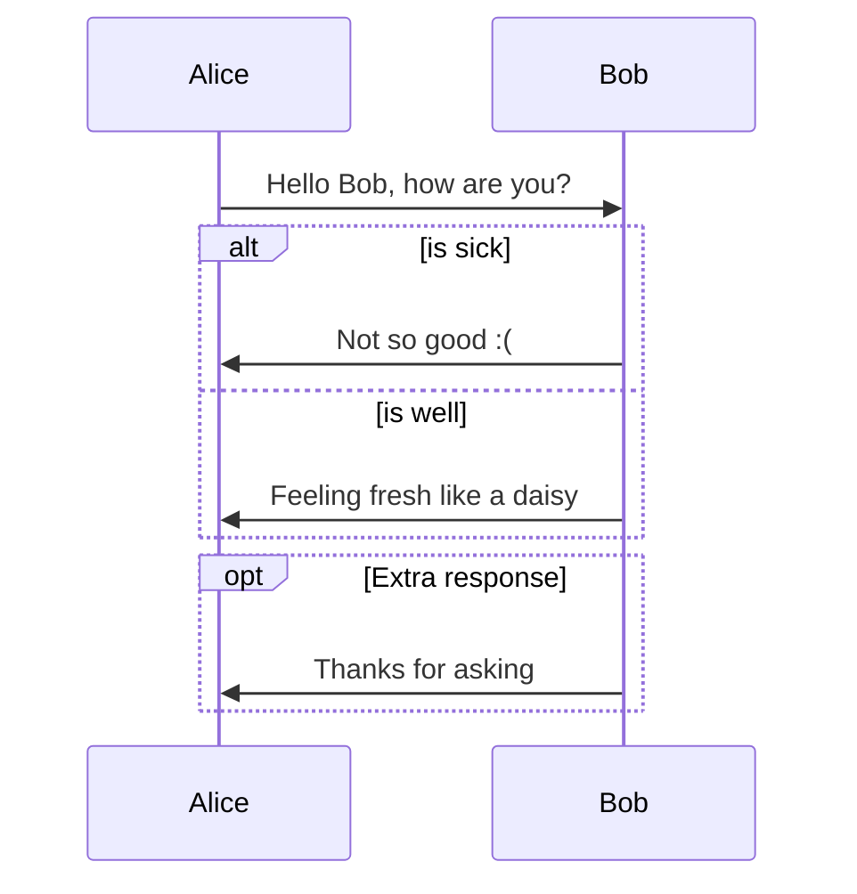
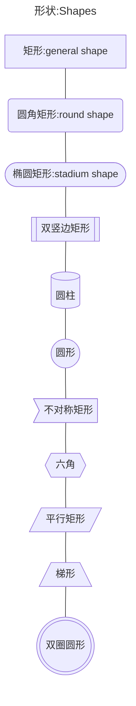
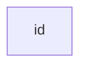

# Mermaid





# 语法:Syntax

## 术语表-Glossary

### table

|  Concepts  |   中文   | definition |
| :--------: | :------: | ---------- |
| flowcharts |  流程图  |            |
|   nodes    |   节点   |            |
|    grap    |          |            |
|     TB     | 从上往下 | top        |
|     TD     | 从上往下 |            |
|     BT     | 从下往上 |            |
|     LR     | 从左往右 |            |
|     RL     | 从右往左 |            |

### list of Glossary

## 速查表:Cheatsheet

### 形状:Shapes

|  Symbols  |       Means       |         中文名称         |
| :-------: | :---------------: | :----------------------: |
|    -->    |       link        |                          |
|   [...]   |     rectangle     |           矩形           |
|   (...)   | rounded rectangle |         圆角矩形         |
|  ([...])  |   stadium shape   | 圆竖边矩形<br />椭圆矩形 |
|  [[...]]  | subroutine shape  |        双竖边矩形        |
|  [(...)]  | cylindrical shape |          圆柱形          |
|  ((...))  |      circle       |           圆形           |
|   >...]   |    asymmetric     |        不对称方形        |
|    {}     |      rhombus      |           菱形           |
|  {{...}}  |      hexagon      |          六边形          |
|  [/.../]  |                   |         平行距形         |
| [\\...\\] |                   |        反平行矩形        |
| [/...\\]  |     Trapezoid     |           梯形           |
| [\\.../]  |                   |          倒梯形          |
| (((...))) |   Double circle   |         双圈圆形         |






## 流程图-FLowchart

> 参考链接
>
> [Flowchart](https://mermaid.js.org/syntax/flowchart.html#flowcharts-basic-syntax)

```markdown
All Flowcharts are composed of **nodes**, the geometric shapes and **edges**, the arrows or lines. The mermaid code defines the way that these nodes and edges are made and interact.

It can also accommodate different arrow types, multi directional arrows, and linking to and from subgraphs.

> Important note: Do not type the word "end" as a Flowchart node. Capitalize all or any one the letters to keep the flowchart from breaking, i.e, "End" or "END". Or you can apply this workaround.
```

所有的流程图都是由 **节点**-*nodes* , 几何形状和 **边框**-*edges*, 箭头或线 组成的. Mermaid代码定义了节点和边缘之间的构成和交互方式.

Mermaid也支持不同的箭头类型, 多向箭头和子图连接

> 重要提示:

```shell
---
title:Node
---
flowchart LR
	节点ID(节点内容)

```

