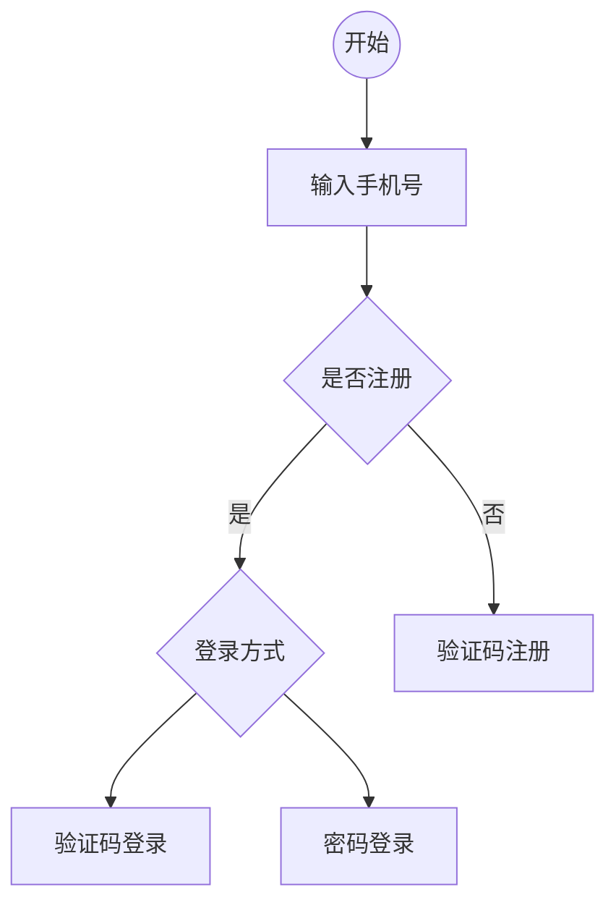

# 参考手册

>Reference Manual

安装配置与使用技巧

#速查表 #quick-reference #cheatsheet #References

#参考文档 #使用手册 #计算机配置技巧

软件使用 软件安装 软件配置

# MacOS

```shell
# 终端设置代理

export {http,https}_proxy='http://127.0.0.1:51085'
export https_proxy=http://127.0.0.1:7890 http_proxy=http://127.0.0.1:7890 all_proxy=socks5://127.0.0.1:7890

# pycharm 英文时输出大写
解决了问题，是Mac特殊键盘的设置问题，在System Preferences里面对keyboard设置，使用中英文切换转换拼音和英文输入，现在已经能输入小写的字母了，但是很奇怪的是为什么问题就出现在这一个软件

# 关闭 界面叮咚声


# time 命令
time python demo.py

# sudo 使用touch ID验证而非密码
编辑 
code /etc/pam.d/sudo
首行加入 
auth       sufficient     pam_tid.so

```

## 特殊技巧

双指double tap Dock图标以查看app expose

### 快速替换文件夹图标

从应用包中的Content/Resources/中提取应用图标, 然后打开要替换文件的Get info界面, 拖拽图标到该界面即可


### 长按输入à(仅自带输入法支持)

### 桌面图标隐藏

开启台前调度(stage manger)模式, 单机桌面即可实现图标显示隐藏切换

## 配置优化

## 推荐字体
SF Pro
SF Mono
Droid Sans Mono

## 常见问题

- vm缩放问题:
    - 取消全屏时不要缩放,
    - full screen : resize the virtual machine to fit screen
- 搜狗输入法中文状态下切换英文时保留英文
    - 选用`caps` 而不是 `return`
- .beacon文件夹
    - icloud备份时产生的文件夹, 用来跟踪任务, 可以随意删除, 不要太过在意


## 快捷键

> [官方文档](https://support.apple.com/zh-cn/HT201236)
>
> [官方符号](https://support.apple.com/zh-cn/guide/mac-help/cpmh0011/mac)
>
> * [符号标识](https://support.apple.com/guide/mac-help/what-are-those-symbols-shown-in-menus-cpmh0011/mac)
> * [Safari快捷键](https://support.apple.com/zh-cn/guide/mac-help/cpmh0011/mac)
> * [Safari](https://support.apple.com/zh-cn/guide/safari/cpsh003/mac)

**一般APP都可以通过菜单栏查看APP所支持的快捷键**

您可以按下某些组合键来实现通常需要鼠标、触控板或其他输入设备才能完成的操作。

要使用键盘快捷键，请按住一个或多个修饰键，然后按快捷键的最后一个键。例如，要使用 Command-C（拷贝），请按住 Command 键并按 C
键，然后同时松开这两个键。Mac
菜单和键盘通常[使用符号来表示某些按键](https://support.apple.com/zh-cn/guide/mac-help/what-are-those-symbols-shown-in-menus-cpmh0011/mac)
，其中包括以下修饰键：

- Command（或 Cmd）􀆔: 命令
- Shift 􀆝: 移位

- Option（或 Alt）􀆕: 选项
- Control（或 Ctrl）􀆍: 控制

- Caps Lock 􀆡:大写锁定
- Fn(Globe/Function)􀆪: 全局/功能

在 Windows PC 专用键盘上，请用 Alt 键代替 Option 键，用 Windows 标志键代替 Command 键。

Apple
键盘上的某些按键具有特殊符号和功能，例如显示屏亮度􀆫、键盘亮度􀻞、调度中心等。如果您的键盘上没有这些功能，您也许可以通过创建自己的键盘快捷键来实现其中的一些功能。要将这些键用作 F1、F2、F3 或其他标准功能键，请将它们与 Fn 键组合使用。

你可以使用按键组合（称为*键盘快捷键*）在 Mac 上更快速执行任务。键盘快捷键包括一个或多个修饰键（如大写锁定键或 Control
键）和最终按键，需要同时按下。例如，你可以按下 Command 键和 N 键，而不用将指针移到菜单栏并选取“文件”>“新建窗口”。

```shell
# 按键命令分类
cmd+[a-z]: 基础命令
cmd+shift+[a-z]: 基础移位命令
cmd+option+[a-z]:扩展命令
cmd+control+[a-z]:
control+[F1-F12]:焦点控制, 系统功能切换

# 自定义命令
control+[F1-F12]: 系统功能控制
option-[F1-F12]:  打开应用(thor launcher配置)
option-[a-z]:打开应用
option-shift-[a-z]: 打开应用
control+option-[a-z]: 打开应用


```


| key          | apple symbols |
| :----------- | :-----------: |
| Command      |       􀆔       |
| Shift        |       􀆝       |
| Option       |       􀆕       |
| Control      |       􀆍       |
| Return       |       􀅇       |
| Delete       |       􀆛       |
| 向后删除键   |       􀆗       |
| 上箭头键     |       􀄨       |
| 下箭头键     |       􀄩       |
| 左箭头键     |       􀄪       |
| 右箭头键     |       􀄫       |
| Page Up      |       ⇞       |
| Page Down    |       ⇟       |
| Top (Home)   |       􀄮       |
| End          |       􀄱       |
| 右制表符     |       􀅂       |
| 左制表符     |       􀅁       |
| Escape (Esc) |       􀆧       |

|     需求     |                     快捷键                      |               描述               |
| :----------: | :---------------------------------------------: | :------------------------------: |
|     变换     |                      shift                      |     切换符号, toggle, switch     |
|     控制     |                     control                     |           控制当前应用           |
|     选项     |                     option                      |         可选项, 更多选项         |
|     命令     |                     command                     |            命令, 操作            |
| 强制关闭引用 |                   cmd-opt-Esc                   |     force quit applications      |
|   切换标签   |                    ctrl+tab                     |         多标签时应用切换         |
|   锁定屏幕   |                   ctrl+cmd+Q                    | 锁定账户,但不会关闭屏幕, esc关闭 |
|   特殊符号   |           <kbd>Alt</kbd>+<kbd>*</kbd>           |      ≠–≥≤¥¶•ª¡™£等特殊符号       |
|   特殊符号   |  <kbd>shift</kbd>+<kbd>Alt</kbd>+<kbd>*</kbd>   |  额外的特殊符号, 通过shift变换   |
|  间隔号`·`   | <kbd>option</kbd>+<kbd>shift</kbd>+<kbd>9</kbd> |            middle dot            |
| 项目符号`•`  |                    option+8                     |              bullet              |

## 特殊键

|   中文   | SF Symbol |                  快捷键                  | 英文                                  |
| :------: | :-------: | :--------------------------------------: | ------------------------------------- |
|  功能键  |     􀆪     |            <kbd>􀆪</kbd>fn+F1             | Globe                                 |
|   首页   |           | <kbd>↖︎</kbd>: <kbd>Fn</kbd>+<kbd>←</kbd> | Home                                  |
|   尾页   |           | <kbd>↘︎</kbd>: <kbd>Fn</kbd>+<kbd>→</kbd> | End                                   |
|  上一页  |           | <kbd>⇞</kbd>: <kbd>Fn</kbd>+<kbd>↑</kbd> | Page Up                               |
|  下一页  |           | <kbd>⇟</kbd>: <kbd>Fn</kbd>+<kbd>↓</kbd> | Page Down                             |
| 向后删除 |     􀆗     | <kbd>⌦</kbd>: <kbd>Fn</kbd>+<kbd>⌫</kbd> | Delete<br />向右擦除<br />向后删除    |
| 向前删除 |     􀆛     |               <kbd>⌫</kbd>               | Backspace<br />向左擦除<br />向前删除 |
| 删除单词 |           |              alt+backspace               |                                       |
|  删除行  |           |              cmd+backspace               |                                       |
|   退出   |     􀆧     |               <kbd>⎋</kbd>               | escape                                |

## 常用快捷键

| 需求              |            | 快捷键                       | 描述 |
| ----------------- | ---------- | ---------------------------- | ---- |
|                   |            |                              |      |
| Insert            |            | Fn-Enter                     |      |
| 再次查找          |            | cmd-G                        |      |
| 隐藏应用          |            | cmd-H                        |      |
| 隐藏其他应用      |            | opt-cmd-H                    |      |
| 最小化            |            | cmd+M                        |      |
| 打开新标签        |            | cmd-T                        |      |
| 关闭当前窗口      |            | cmd-W                        |      |
| 关闭应用所有窗口  |            | cmd-option-Q                 |      |
| 切换应用          |            | cmd-Tab                      |      |
| 当前App窗口间切换 |            | cmd+`                        |      |
| 切换标签          |            | Ctrl+Tab<br />Ctrl+Shift+Tab |      |
| 切换标签          |            | cmd+shift+[<br />cmd+shift+] |      |
| 全屏              |            | cmd+ctrl+F                   |      |
| 偏好设置          |            | cmd-,                        |      |
| 新建文件夹        |            | cmd-shift-N                  |      |
| 强制退出APP       | 􀆔 + 􀆕  + 􀆧 | cmd+option+esc               |      |

## 访达和系统快捷键

> [官方文档](https://support.apple.com/zh-cn/HT201236)

finder and system shortcuts

查找时可以通过➕按钮缩小范围, Name/Kind/Content/Date

若要使用布尔运算符（OR、AND 或 NOT）进行搜索，请按住 Option 键，然后点按出现的按钮⋯

你可以设定条件并指定其中的“任一”、“所有”或“无”条件必须满足。

| 需求          | 快捷键                                          | 描述 |
|-------------|----------------------------------------------|----|
| 预览          | Space<br />cmd+Y                             |    |
| 全屏预览        | option-Space<br />cmd+option+Y               |    |
| 选择多个项目      | 按住cmd                                        |    |
| 选择多个连续项目    | 按住shift                                      |    |
| 显示简介        | <kbd>Cmd</kbd>+<kbd>I</kbd>                  |    |
| 前进          | cmd-]                                        |    |
| 后退          | cmd-[                                        |    |
| 父文件夹        | cmd-up                                       |    |
| 新窗口打开上层文件夹  | cmd+ctrl+up                                  |    |
| 打开          | cmd-down                                     |    |
| 移动项目        | cmd+option+V                                 |    |
| 新窗口打开父文件夹   | cmd-option-up                                |    |
| 打开文件夹       | cmd-down                                     |    |
| 移到废纸篓       | cmd-delete                                   |    |
| 永久删除        | cmd-option-delete                            |    |
| 清倒废纸篓       | cmd-shift-delete                             |    |
| 不提示清倒       | cmd-shift-option-delete                      |    |
| 打开桌面文件夹     | cmd+shift+D                                  |    |
| 打开文稿文件夹     | cmd+shift+O                                  |    |
| 打开最近使用      | cmd+shift+F                                  |    |
| **前往文件夹**   | <kbd>cmd</kbd>+<kbd>shift</kbd>+<kbd>G</kbd> |    |
| 打开icloud文件夹 | cmd+shift+I                                  |    |
| 打开下载文件夹     | cmd+alt+L                                    |    |
| 新建文件夹       | cmd+shift+N                                  |    |
| 新建智能文件夹     | cmd+opt+N                                    |    |
| 显示或隐藏预览面板   | cmd+shift+P                                  |    |
| 显示或隐藏标签栏    | cmd+shift+T                                  |    |
| 添加到边栏       | cmd+ctrl+T                                   |    |
| 显示或隐藏路径栏    | cmd+alt+P                                    |    |
| 显示或隐藏边栏     | cmd+alt+S                                    |    |
| 显示或隐藏状态栏    | cmd+/                                        |    |
| 显示"显示"选项    | cmd+J                                        |    |
| 显示桌面        | fn+H                                         |    |
| 显示dock      | fn+A                                         |    |
| 显示App资源库    | fn+shift+A                                   |    |
| 快速备忘录       | fn+Q                                         |    |
| 打开表情与符号     | fn+E                                         |    |
| 打开菜单栏       | fn+M                                         |    |
| 打开通知中心      | fn+N                                         |    |
| 打开控制中心      | fn+C                                         |    |

## 文稿快捷键

- **Command-B**：以粗体显示所选文本，或者打开或关闭粗体显示功能。
- **Command-I**：以斜体显示所选文本，或者打开或关闭斜体显示功能。
- **Command-K**：添加网页链接。
- **Command-U**：对所选文本加下划线，或者打开或关闭加下划线功能。
- **Command-T**：显示或隐藏“字体”窗口。
- **Command-D**：从“打开”对话框或“存储”对话框内选择“桌面”文件夹。
- **Control-Command-D**：显示或隐藏所选字词的定义。
- **Shift-Command-冒号 (:)**：显示“拼写和语法”窗口。
- **Command-分号 (;)**：查找文稿中拼写错误的字词。
- **Option-Delete**：删除插入点左边的字词。
- **Control-H**：删除插入点左边的字符。也可以使用 Delete 键。
- **Control-D**：删除插入点右边的字符。也可以使用 Fn-Delete。
- **Fn-Delete**：在没有向前删除 键的键盘上向前删除。也可以使用 Control-D。
- **Control-K**：删除插入点与行或段落末尾处之间的文本。
- **Fn-上箭头**：Page Up：向上滚动一页。
- **Fn-下箭头**：Page Down：向下滚动一页。
- **Fn-左箭头：**Home：滚动到文稿开头。
- **Fn-右箭头**：End：滚动到文稿末尾。
- **Command-上箭头**：将插入点移至文稿开头。
- **Command-下箭头**：将插入点移至文稿末尾。
- **Command-左箭头**：将插入点移至当前行的行首。
- **Command-右箭头**：将插入点移至当前行的行尾。
- **Option-左箭头**：将插入点移至上一字词的词首。
- **Option-右箭头**：将插入点移至下一字词的词尾。
- **Shift-Command-上箭头**：选中插入点与文稿开头之间的文本。
- **Shift-Command-下箭头**：选中插入点与文稿末尾之间的文本。
- **Shift-Command-左箭头**：选中插入点与当前行行首之间的文本。
- **Shift-Command-右箭头**：选中插入点与当前行行尾之间的文本。
- **Shift-上箭头**：将文本选择范围扩展到上一行相同水平位置的最近字符处。
- **Shift-下箭头**：将文本选择范围扩展到下一行相同水平位置的最近字符处。
- **Shift-左箭头**：将文本选择范围向左扩展一个字符。
- **Shift-右箭头**：将文本选择范围向右扩展一个字符。
- **Option-Shift-上箭头**：将文本选择范围扩展到当前段落的段首，再按一次则扩展到下一段落的段首。
- **Option-Shift-下箭头**：将文本选择范围扩展到当前段落的段尾，再按一次则扩展到下一段落的段尾。
- **Option-Shift-左箭头**：将文本选择范围扩展到当前字词的词首，再按一次则扩展到下一字词的词首。
- **Option-Shift-右箭头**：将文本选择范围扩展到当前字词的词尾，再按一次则扩展到下一字词的词尾。
- **Control-A**：移至行或段落的开头。
- **Control-E**：移至行或段落的末尾。
- **Control-F**：向前移动一个字符。
- **Control-B**：向后移动一个字符。
- **Control-L**：将光标或所选内容置于可见区域中央。
- **Control-P**：上移一行。
- **Control-N**：下移一行。
- **Control-O**：在插入点后新插入一行。
- **Control-T**：将插入点后面的字符与插入点前面的字符交换。
- **Command-左花括号 ({)**：左对齐。
- **Command-右花括号 (})**：右对齐。
- **Shift-Command-竖线 (|)**：居中对齐。
- **Option-Command-F**：前往搜索栏。
- **Option-Command-T**：显示或隐藏 App 中的工具栏。
- **Option-Command-C**：拷贝样式：将所选项的格式设置拷贝到剪贴板。
- **Option-Command-V**：粘贴样式：将拷贝的样式应用到所选项。
- **Option-Shift-Command-V**：粘贴并匹配样式：将周围内容的样式应用到粘贴在该内容中的项目。
- **Option-Command-I**：显示或隐藏检查器窗口。
- **Shift-Command-P**：页面设置：显示用于选择文稿设置的窗口。
- **Shift-Command-S**：显示“存储为”对话框或复制当前文稿。
- **Shift-Command-减号 (-)**：缩小所选项。
- **Shift-Command-加号 (+)**：放大所选项。Command-等号 (=) 可实现相同的功能。
- **Shift-Command-问号 (?)**：打开“帮助”菜单。

## spotlight

聚集

[官方文档](https://support.apple.com/zh-cn/guide/mac-help/mh26783/13.0/mac/13.0)

|        |                                                   |                                                      |
|--------|---------------------------------------------------|------------------------------------------------------|
| 打开搜索   | <kbd>Cmd</kbd>+<kbd>Space</kbd>                   |                                                      |
| 文件搜索   | <kbd>Cmd</kbd>+<kbd>Option</kbd>+<kbd>Space</kbd> |                                                      |
| 文件路径   | <kbd>Cmd</kbd>                                    | 显示 Mac 上的结果（如文件）<br />路径（如果预览区域已显示，<br />路径会显示在预览底部） |
| 网页搜索   | <kbd>Cmd</kbd>+<kbd>B</kbd>                       | 进入浏览器                                                |
| 定义搜索   | <kbd>Cmd</kbd>+<kbd>L</kbd>                       | define                                               |
| 翻译/词典  | <kbd>Cmd</kbd>+<kbd>D</kbd>                       |                                                      |
| 文件搜索   | <kbd>Cmd</kbd>+<kbd>R</kbd>                       | See a file in an app or the Finder                   |
| wiki搜索 | <kbd>Cmd</kbd>+<kbd>K</kbd>                       |                                                      |
| 进入文件夹  | <kbd>Cmd</kbd>+<kbd>Enter</kbd>                   |                                                      |
| 按项移动   | <kbd>↑</kbd>/<kbd>↓</kbd>                         |                                                      |
| 按域移动   | <kbd>Cmd</kbd>+<kbd>↑</kbd>/<kbd>↓</kbd>          |                                                      |

作为计算器使用

## Safari

[官方文档](https://support.apple.com/zh-cn/guide/safari/cpsh003/mac)

在 Mac 上的 Safari 浏览器 App 
中，你可以使用键盘快捷键和手势快速完成许多任务。请参阅下方的快捷键和手势，以及在[菜单栏](https://support.apple.com/zh-cn/guide/safari/aside/glos33eb8abd/16.1/mac/13.0)
的“Safari 浏览器”菜单中显示的键盘快捷键。在 App
菜单中，键盘快捷键[显示为符号](https://support.apple.com/zh-cn/guide/mac-help/cpmh0011)。

*【注】*App 中的键盘快捷键因你在 Mac 上使用的语言和键盘布局而异。如果下方的快捷键未按预期正常工作，请在菜单栏的 App
菜单中查找以查看正确的快捷键。你还可以[使用虚拟键盘](https://support.apple.com/zh-cn/guide/mac-help/mchlp1015)
查看当前键盘布局，称为*输入法*。

| 操作                                                         | 快捷键或手势                                                 |                          |
| :----------------------------------------------------------- | :----------------------------------------------------------- | ------------------------ |
| 向上、向下、向左或向右滚动                                   | 按下箭头键。                                                 |                          |
| 大幅度滚动                                                   | 按下箭头键时按住 Option 键。                                 |                          |
| 向下滚动屏幕                                                 | Page Down 键空格键                                           |                          |
| 向上滚动屏幕                                                 | Page Up 键Shift-空格键                                       |                          |
| 滚动到网页左上角或左下角                                     | Command-上箭头键Command-下箭头键                             |                          |
| 搜索当前网页                                                 | Command-F                                                    |                          |
| 高亮标记网页上的下一个栏或弹出式菜单                         | Tab 键如果在“键盘”设置中打开了“键盘导航”，Tab 键还会高亮标记按钮和其他控制。 |                          |
| 高亮标记网页上的下一个栏、弹出式菜单或可点按的项目（例如链接） | Option-Tab如果在“键盘”设置中打开了“键盘导航”，Option-Tab 还会高亮标记按钮和其他控制。若要交换 Tab 键和 Option-Tab 的行为，请在 Safari 浏览器设置的“高级”面板中打开“按下 Tab 键以高亮标记网页上的每一项”。 |                          |
| 在[智能搜索栏](https://support.apple.com/zh-cn/guide/safari/aside/glos5a7c4a65/16.1/mac/13.0)中键入时，恢复当前网页地址 | Esc 键                                                       |                          |
| 选择智能搜索栏                                               | Command-L                                                    |                          |
| Google搜索<br />Google Search                                | Option-Command-F                                             |                          |
| 打印当前网页                                                 | Command-P                                                    |                          |
| 拷贝所选项目                                                 | Command-C                                                    |                          |
| 粘贴最近拷贝的项目                                           | Command-V                                                    |                          |
| 显示标签页概览                                               | Shift-Command-\                                              |                          |
| 在新标签页中打开网页                                         | 按住 Command 键点按链接按住 Command 键点按书签在[智能搜索栏](https://support.apple.com/zh-cn/guide/safari/aside/glos5a7c4a65/16.1/mac/13.0)中键入后，按下 Command-Return。 |                          |
| 在新标签页中打开网页，并使该标签页成为活跃标签页             | 按住 Shift-Command 点按链接按住 Shift-Command 点按书签在智能搜索栏中键入后，按下 Shift-Command-Return。 |                          |
| 前往下一个标签页                                             | Control-Tab 或 Shift-Command-]                               |                          |
| 前往上一个标签页                                             | Control-Shift-Tab 或 Shift-Command -[                        |                          |
| 选择前 9 个标签页中的一个                                    | Command-1 到 Command-9                                       |                          |
| 关闭活跃的标签页                                             | Command-W                                                    |                          |
| 关闭全部标签页，只保留其中一个                               | 按住 Option 键点按你要保持打开的标签页上的“关闭”按钮         |                          |
| 重新打开上次关闭的标签页                                     | Shift-Command-T                                              |                          |
| 前往主页                                                     | Shift-Command-H                                              |                          |
| 更改 Safari 浏览器设置                                       | Command-,                                                    |                          |
| **返回上一个网页**                                           | Command-[                                                    |                          |
| **前往下一个网页**                                           | Command-]                                                    |                          |
| 查找                                                         | Control-Command-D                                            | look up & data detectors |
| **按名称查看最近访问网页的列表**                             | 按住工具栏“后退”按钮  或“前进”按钮，直到列表出现             |                          |
| **按网址 (URL) 查看最近访问网页的列表**                      | 按下 Option 键，然后按住“后退” 或“前进” img 按钮，直到列表出现 |                          |
| 退出全屏幕视图                                               | Esc 键                                                       |                          |
| 缩放网站内容                                                 | 按下 Command-加号 (+) 或 Command-减号 (–)                    |                          |
| 缩放网站文本                                                 | 选取“显示”>“使文本变大”或“显示”>“使文本变小”时，按下 Option 键。 |                          |
| 切换到另一个 Safari 浏览器窗口                               | Command-`（Tab 键上方）                                      |                          |
| 重新打开上次关闭的窗口                                       | Shift-Command-T                                              |                          |
| 显示或隐藏阅读列表边栏                                       | Control-Command-2                                            |                          |
| 添加当前网页                                                 | Shift-Command-D                                              |                          |
| 添加链接网页                                                 | 按住 Shift 键点按网页链接。                                  |                          |
| 移除网页                                                     | 按住 Control 键点按边栏中的网页摘要，然后选取“移除项目”。你也可以在网页摘要上向左轻扫，然后点按“移除”。或者，一直向左轻扫直至网页摘要消失。 |                          |
| 打开阅读器                                                   | Shift-Command-R                                              |                          |
| 关闭阅读器                                                   | Esc 键                                                       |                          |
| 将书签添加到“个人收藏”栏                                     | 点按[智能搜索栏](https://support.apple.com/zh-cn/guide/safari/aside/glos5a7c4a65/16.1/mac/13.0)以显示网站的完整地址及其图标，然后将图标拖到“个人收藏”栏 |                          |
| 打开“个人收藏”栏中某个文件夹内的所有书签                     | 按住 Command 键点按“个人收藏”栏中的文件夹                    |                          |
| 在“个人收藏”栏上移动书签                                     | 左右拖移书签                                                 |                          |
| 从“个人收藏”栏移除书签                                       | 将书签拖移到个人收藏栏外                                     |                          |
| 显示或隐藏书签边栏                                           | Control-Command-1                                            |                          |

## 翻译对照表

| 英文                                  | 中文                                                       |
| ------------------------------------- | ---------------------------------------------------------- |
| app expose                            |                                                            |
| stage manager                         | 台前调度                                                   |
| point&click                           | 光标与点按                                                 |
| sticky key                            | 粘滞键                                                     |
| scroll&zoom                           | 滚动缩放                                                   |
| natural scrolling                     | 自然滚动                                                   |
| zoom in or out                        | 放大或缩小                                                 |
| rotate                                | 旋转                                                       |
| smart zoom                            | 智能缩放                                                   |
| mission control                       | 调度中心                                                   |
| launchpad                             | 启动台                                                     |
| swipe between pages                   | 在页面之间轻扫                                             |
| set up                                | 设置                                                       |
| trackpad                              | 触控板                                                     |
| network                               | 网络                                                       |
| Internet                              | 互联网                                                     |
| off/on                                | 关闭/打开                                                  |
| touch ID                              | 触控ID                                                     |
| use A for B                           | 将A用于B                                                   |
| options                               | 选项                                                       |
| preview                               | 预览                                                       |
| advanced                              | 高阶                                                       |
| dock                                  | 程序坞                                                     |
| animate opening screen                | 弹跳打开屏幕                                               |
| minimize&maximize                     | 最小化与最大化                                             |
| privacy&security                      | 隐私与安全性                                               |
| spotlight                             | 聚焦                                                       |
| calendar                              | 日历                                                       |
| calculator                            | 计算器                                                     |
| exchange                              | 交换                                                       |
| general                               | 通用                                                       |
| AirDrop&Handoff                       | 隔空投送与接力                                             |
| transfer or reset                     | 传输或还原                                                 |
| startup disk                          | 启动磁盘                                                   |
| all at once                           | 一次全部                                                   |
| one at a time                         | 一次一个                                                   |
| customize                             | 自定                                                       |
| arrange                               | 整理                                                       |
| full keyboard access                  | 全键盘控制                                                 |
| access                                | 访问                                                       |
| access control                        | 访问控制                                                   |
| Internet access                       | 接入                                                       |
| wake for network access               | 唤醒以供网络访问                                           |
| done                                  | 完成                                                       |
| go                                    | 前往(menu bar)                                             |
| view                                  | 显示                                                       |
| show in enclosing folder              | 在上层文件夹中显示                                         |
| make alias                            | 制作替身                                                   |
| copy                                  | 拷贝                                                       |
| App usage                             | APP 使用时间                                               |
| usage data                            | 用量数据                                                   |
| battery usage history                 | 电池用量历史                                               |
| document                              | 文稿, 文档                                                 |
| quit                                  | 退出                                                       |
|                                       | 悬停文本                                                   |
| Animate opening applications          | 弹跳打开应用程序                                           |
| auto punctuation                      | 自动标点符号                                               |
| globe key                             | 地球仪键                                                   |
| safari profiles<br />Create a Profile | 用户场景<br />用户资料<br />根据不同的用户场景创建用户资料 |

## 安装MacOS到外部盘最佳方案

Mac发布新系统时, 尽量使用移动硬盘安装并迁移所有应用验证软件可行性, 不要轻易安装, 会出现不可预期的错误

几次踩坑经历

安装MacOS14 Sonoma Developer Beta1后, 使用**腾讯柠檬清理**导致系统损坏, 大量软件无法使用, 新系统使用清理工具很危险., 很多软件存在兼容性问题, 导致无法正常工作

升级到Developer Beta2后再次出现问题, clashx pro无法使用, 严重影响正常工作, 同时浪费了大量时间. 


# Ubuntu

## 一键安装

```shell
sudo su root
apt update && apt upgrade
apt install git google-chrome-stable

```

## profile

```shell
# 颜色配置
LS_COLORS='rs=0:di=01;34:ln=01;36:mh=00:pi=40;33:so=01;35:do=01;35:bd=40;33;01:cd=40;33;01:or=01;34;01:mi=00:su=01;34:sg=01;34:ca=01;34:tw=01;34:ow=01;34:st=01;34:ex=01;32:*.tar=01;31:*.tgz=01;31:*.arc=01;31:*.arj=01;31:*.taz=01;31:*.lha=01;31:*.lz4=01;31:*.lzh=01;31:*.lzma=01;31:*.tlz=01;31:*.txz=01;31:*.tzo=01;31:*.t7z=01;31:*.zip=01;31:*.z=01;31:*.dz=01;31:*.gz=01;31:*.lrz=01;31:*.lz=01;31:*.lzo=01;31:*.xz=01;31:*.zst=01;31:*.tzst=01;31:*.bz2=01;31:*.bz=01;31:*.tbz=01;31:*.tbz2=01;31:*.tz=01;31:*.deb=01;31:*.rpm=01;31:*.jar=01;31:*.war=01;31:*.ear=01;31:*.sar=01;31:*.rar=01;31:*.alz=01;31:*.ace=01;31:*.zoo=01;31:*.cpio=01;31:*.7z=01;31:*.rz=01;31:*.cab=01;31:*.wim=01;31:*.swm=01;31:*.dwm=01;31:*.esd=01;31:*.jpg=01;35:*.jpeg=01;35:*.mjpg=01;35:*.mjpeg=01;35:*.gif=01;35:*.bmp=01;35:*.pbm=01;35:*.pgm=01;35:*.ppm=01;35:*.tga=01;35:*.xbm=01;35:*.xpm=01;35:*.tif=01;35:*.tiff=01;35:*.png=01;35:*.svg=01;35:*.svgz=01;35:*.mng=01;35:*.pcx=01;35:*.mov=01;35:*.mpg=01;35:*.mpeg=01;35:*.m2v=01;35:*.mkv=01;35:*.webm=01;35:*.ogm=01;35:*.mp4=01;35:*.m4v=01;35:*.mp4v=01;35:*.vob=01;35:*.qt=01;35:*.nuv=01;35:*.wmv=01;35:*.asf=01;35:*.rm=01;35:*.rmvb=01;35:*.flc=01;35:*.avi=01;35:*.fli=01;35:*.flv=01;35:*.gl=01;35:*.dl=01;35:*.xcf=01;35:*.xwd=01;35:*.yuv=01;35:*.cgm=01;35:*.emf=01;35:*.ogv=01;35:*.ogx=01;35:*.aac=00;36:*.au=00;36:*.flac=00;36:*.m4a=00;36:*.mid=00;36:*.midi=00;36:*.mka=00;36:*.mp3=00;36:*.mpc=00;36:*.ogg=00;36:*.ra=00;36:*.wav=00;36:*.oga=00;36:*.opus=00;36:*.spx=00;36:*.xspf=00;36:';  

```

## 常见问题

### vmware 与有道词典的划词功能冲突

开启后会导致 VMware双击时, 出现输出c字符, 相当于有道词典输出了一个 cmd+c的命令

### dircolors

环境变量 : LS_COLORS

mount类型文件夹显示为绿色背景

```

```

## 阿里云source.list

```ini
deb https : //mirrors.aliyun.com/ubuntu/ trusty main restricted universe multiverse

deb-src https : //mirrors.aliyun.com/ubuntu/ trusty main restricted universe multiverse

deb https : //mirrors.aliyun.com/ubuntu/ trusty-security main restricted universe multiverse

deb-src https : //mirrors.aliyun.com/ubuntu/ trusty-security main restricted universe multiverse

deb https : //mirrors.aliyun.com/ubuntu/ trusty-updates main restricted universe multiverse

deb-src https : //mirrors.aliyun.com/ubuntu/ trusty-updates main restricted universe multiverse

deb https : //mirrors.aliyun.com/ubuntu/ trusty-backports main restricted universe multiverse

deb-src https : //mirrors.aliyun.com/ubuntu/ trusty-backports main restricted universe multiverse

## Not recommended

#deb https://mirrors.aliyun.com/ubuntu/ trusty-proposed main restricted universe multiverse

#deb-src https://mirrors.aliyun.com/ubuntu/ trusty-proposed main restricted universe multiverse

```

## 网络问题

当普通 NAT模式无法正常使用时, 使用 适配器模式的 自定义 特定虚拟网络

- [x] **禁用 Hyper-V的网络适配器, 然后重启**

## 快捷键

### 全局模式

| 中文名       | 快捷键                 | 英文名                                 |
|-----------|---------------------|-------------------------------------|
| 浏览器       | Super + B           | Browser                             |
| 文件管理器     | Super + E           | File Explorer                       |
| 终端        | Ctrl + Alt + T      | Terminal                            |
| 运行命令      | Alt + F2            |                                     |
| 关闭窗口      | Alt + F4            |                                     |
| 切换程序      | Alt + Tab           |                                     |
| 打开窗口菜单    | Alt + Space         |                                     |
| 全屏模式      | Super + F - Alt F10 | Toggle Fullscreen Mode              |
| 打开IPython | Super + I           | Open IPython                        |
| 打开Jupyter | Super + J           | Open Jupyter Notebook               |
| 打开所有应用    | Super + A           |                                     |
| 切换虚拟机     | Ctrl + Alt          | Toggle Virtual Machine To   Windows |
| 全屏        | Ctrl + Alt + Enter  | Toggle VM To Fullscreen             |
| 打开 Code   | Super + C           | Open Code                           |
| 显示 / 隐藏文件 | Ctrl + H            | Show Hidden Files                   |

### Terminal终端 Shell

| 中文                                  | 快捷键                  | 说明                                  |
|-------------------------------------|----------------------|-------------------------------------|
| 自动补全                                | Tab                  | 自动补全                                |
| 光标移动到开始位置                           | Ctrl+a               | 光标移动到开始位置                           |
| 光标移动到最末尾                            | Ctrl+e               | 光标移动到最末尾                            |
| 删除此处至末尾的所有内容                        | Ctrl+k               | 删除此处至末尾的所有内容                        |
| 删除此处至开始的所有内容                        | Ctrl+u               | 删除此处至开始的所有内容                        |
| 删除当前字符                              | Ctrl+d               | 删除当前字符                              |
| 删除当前字符前一个字符                         | Ctrl+h               | 删除当前字符前一个字符                         |
| 删除此处到左边的单词                          | Ctrl+w               | 删除此处到左边的单词                          |
| 粘贴由Ctrl+u， Ctrl+d， Ctrl+w删除的单词      | Ctrl+y               | 粘贴由Ctrl+u， Ctrl+d， Ctrl+w删除的单词      |
| 清除屏幕内容                              | Ctrl+L / Clear       | 相当于clear，即清屏                        |
| 查找历史命令                              | Ctrl+r               | 查找历史命令                              |
| 向回移动光标                              | Ctrl+b               | 向回移动光标                              |
| 向前移动光标                              | Ctrl+f               | 向前移动光标                              |
| 将光标位置的字符和前一个字符进行位置交换                | Ctrl+t               | 将光标位置的字符和前一个字符进行位置交换                |
| 恢复 ctrl+h 或者 ctrl+d 或者 ctrl+w 删除的内容 | Ctrl+&               | 恢复 ctrl+h 或者 ctrl+d 或者 ctrl+w 删除的内容 |
| 暂停屏幕输出                              | Ctrl+S               | 暂停屏幕输出                              |
| 继续屏幕输出                              | Ctrl+Q               | 继续屏幕输出                              |
| 光标移动到上一个单词的词首                       | Ctrl+Left-Arrow      | 光标移动到上一个单词的词首                       |
| 光标移动到下一个单词的词尾                       | Ctrl+Right-Arrow     | 光标移动到下一个单词的词尾                       |
| 向上显示缓存命令                            | Ctrl+p               | 向上显示缓存命令                            |
| 向下显示缓存命令                            | Ctrl+n               | 向下显示缓存命令                            |
| 关闭终端                                | Ctrl+d               | 关闭终端                                |
| 在EOL和当前光标位置移动                       | Ctrl+xx              | 在EOL和当前光标位置移动                       |
| 显示可能hostname补全                      | Ctrl+x@              | 显示可能hostname补全                      |
| 终止进程/命令                             | Ctrl+c               | 终止进程/命令                             |
| 终端上下滚动                              | Shift+上或下            | 终端上下滚动                              |
| 终端上下翻页滚动                            | Shift+PgUp/PgDn      | 终端上下翻页滚动                            |
| 新终端                                 | Ctrl+Shift+n         | 新终端                                 |
| 输入gnome-terminal打开终端                | alt+F2               | 输入gnome-terminal打开终端                |
| 打开新的标签页                             | Shift+Ctrl+T         | 打开新的标签页                             |
| 关闭标签页                               | Shift+Ctrl+W         | 关闭标签页                               |
| 复制                                  | Shift+Ctrl+C         | 复制                                  |
| 粘贴                                  | Shift+Ctrl+V         | 粘贴                                  |
| 切换至对应的标签页                           | Alt+数字               | 切换至对应的标签页                           |
| 打开新的终端窗口                            | Shift+Ctrl+N         | 打开新的终端窗口                            |
| 管壁终端窗口                              | Shift+Ctrl+Q         | 管壁终端窗口                              |
| 左移右移标签页                             | Shift+Ctrl+PgUp/PgDn | 左移右移标签页                             |
| 切换标签页                               | Ctrl+PgUp/PgDn       | 切换标签页                               |
| 打开帮助指南                              | F1                   | 打开帮助指南                              |
| 激活菜单栏                               | F10                  | 激活菜单栏                               |
| 全屏切换                                | F11                  | 全屏切换                                |
| 打开 “文件”   菜单（file）                  | Alt+F                | 打开 “文件” 菜单（file）                    |
| 打开 “编辑”   菜单（edit）                  | Alt+E                | 打开 “编辑” 菜单（edit）                    |
| 打开 “查看”   菜单（view）                  | Alt+V                | 打开 “查看” 菜单（view）                    |
| 打开 “搜索”   菜单（search）                | Alt+S                | 打开 “搜索” 菜单（search）                  |
| 打开 “终端”   菜单（terminal）              | Alt+T                | 打开 “终端” 菜单（terminal）                |
| 打开 “帮助”   菜单（help）                  | Alt+H                | 打开 “帮助” 菜单（help）                    |

## 常见技巧

> 常见技巧 优化技巧 常见问题

### 文件管理器实现地址栏

```shell
# Ctrl + L 显示地址栏

# 直接以 / ~ 为起点输入 实现地址栏
```

### 查看帮助手册

```shell
# 这种方式需要提前安装 pip install tldr
tldr pip

pip --help
pip -h/H
pip help
man pip
```

### 高分辨率缩放

```

### 高分辨缩放

使用gnome-tweaks fonts 中的缩放来进行缩放 一般推荐 为1.25 或 1.50

### 配置环境变量

### 创建快捷方式

​```shell
[Desktop Entry]
Terminal=True
Name=postman
Content=postman
Icon='/home/wwfyde/myapp/Postman/app/resources/app/assets/icon.png'
Exec='/home/wwfyde/myapp/Postman/Postman'  # 命令或者路径
Type=Application
```

### 死机解决办法

`Ctrl + Alt + F1` / `Alt + F4`

### 隐藏顶部栏

[插件地址](https://extensions.gnome.org/)

[安装谷歌插件](https://chrome.google.com/webstore/detail/gnome-shell-integration/gphhapmejobijbbhgpjhcjognlahblep)

```shell
sudo apt-get install chrome-gnome-shell
# then rebo	ot or login out

# search hide top bar

# on 

# see installed extensions
```

### 主题美化

```shell
sudo apt-get install gnome-shell-extensions
```

[图标官网](https://www.opendesktop.org/)

[教程](https://blog.csdn.net/qq_42527676/article/details/91356154)

## 默认中文字体设置

[参考链接](https://www.cnblogs.com/lidp/archive/2009/09/04/1697617.html)

删除 不必要的字体

```shell
# 查看已安装字体列表
fc-list | grep AR PL
# 找到 字体安装路径
cat /etc/fonts/fonts.conf | grep arphic
# 删除
sudo rm -rf /usr/share/fonts/truetype/arphic/
# 清理缓存重载字体 显示正常
sudo fc-cache -fv
```

解决 [搜狗输入法无法输入](https://blog.csdn.net/gymaisyl/article/details/86510349) 3.4版本之后正常了

```shell
# 输入如下代码
# pycharm.sh中

export CLASSPATH


LD_LIBRARY_PATH="$IDE_BIN_HOME:$LD_LIBRARY_PATH"
export LD_LIBRARY_PATH
export GTK_IM_MODULE=fcitx
export QT_IM_MODULE=fcitx
export XMODIFIERS=@im=fcitx

```

修复 中文字符集现实问题

> 英文为主语言的情况下才会出现这样的问题

那么我们手动调整 prefer，即，将中文字形调整到日文字形之前，问题即可解决。
方法：
Noto Sans 与 Noto Sans Mono 分别属 Sans-Serif（无衬线字体）及 Monospace（等宽字体），
故我们更改 sans-serif 组和 monospace 组的 family（字族） prefer。
修改文件 /etc/fonts/conf.avail/64-language-selector-prefer.conf

## Ubuntu安装(真机)

### 常见问题

**制作启动盘**

- 不要用个UtraISO
- 启动模式不要选择EFI/UEFI模式 注意保护用户数据

### 直接安装Ubuntu系统

```shell
Erase disk and install Ubuntu ( 删除数据并安装Ubuntu)、
Encrypt the new Ubuntu installation for security (加密新的Ubuntu安装以确保安全性)、
Use LVM with the new Ubuntu install  ( 将LVM与新的Ubuntu安装一起使用) 、
something else (其他的)
```

- 制作启动盘
    - 创建安装分区
    - 制作启动盘
- 自动挂载磁盘

```shell
# 查看磁盘UUID
$ sudo blkid
# 修改文件 文件位置 /etc/fstab
# <file system> <mount point>   <type>  <options>       <dump>  <pass>
#<设备文件名称> <挂载目录> <文件系统类型> <文件系统参数> <是否备份>  <开机时自检>
# / was on /dev/sdb1 during installation
UUID=ad850ffd-18e1-4167-ab5a-699a8ad79b40 /               ext4    errors=remount-ro 0       1
/swapfile                                 none            swap    sw              0       0
UUID=7808E9F308E9AFF4      /home/wwfyde/mydisk    ntfs         defaults           0          0
```

### [默认]Windows下安装ubuntu

### 系统优化

### 设置语言和软件源

- 添加中文并重启,文件夹不修改为中文名

- 设置软件源为国内网易或阿里

- 更新软件

  ```shell
  sudo apt update
  sudo apt upgrade
  ```

### 设置双屏

```shell
# 查看双屏显示状态
xrandr
# 输出外接显示屏到默认笔记本屏幕的右边 --auto 为显示最大分辨率
xrandr --output VGA-1-1 --right-of eDP-1-1 --auto
```

### 桌面美化 GNOME Tweaks

```shell
# 安装增强工具
sudo apt-get install gnome-tweaks
```

- 关闭动画:Animations
- 主题: Themes
- 字体: Fonts
    - Noto Sans CJK SC Regular 11
- 开机启动: startup

```shell
# 商店搜索 tweaks 
GNOME Tweaks
# 或者Terminal终端输入
sudo apt-get install gnome-tweaks
```

### 截屏工具 Flameshot

- 切换字体大小粗细 Ctrl + middle-roll
- 切换字体颜色 click-right
- 设置快捷键 /usr/bin/flameshot gui

```shell
sudo apt-get install flameshot
```

## Ubuntu安装(VM)

当前版本ubuntu19.04( 推荐使用自定义安装, 稍后安装操作系统)

### 常见问题

- **无法适应屏幕问题**
  一般解决方案是重新安装vm tools 然后重启 vmware 和 windows
  使用命令安装 `apt install open-vm-tools open-vm-tools-desktop`

- **搜狗输入法 乱码问题**

    - 点击右上角键盘 切换简体繁体字体 直到为简体输入法 或者Ctrl + Shift + F 切换 简体换题输入法
    - 添加两个键盘 第一个键盘为英文，第二个键盘为搜狗拼音(这样就不会出现乱码问题)

- **桥接模式 无法联网问题**

    - 需要勾选"复制物理网络连接状态", 以获得联网配置

- 完全隐藏 hyper search

  ```test
  pref.vmplayer.fullscreen.nobar = "TRUE"
  pref.fullScreen.v5 = "TRUE"
  ```

### 安装ubuntu19

使用自定义安装 稍后安装方式

选择 LVM 和安全性

Erase disk and install Ubuntu ( 删除数据并安装Ubuntu)、
Encrypt the new Ubuntu installation for security (加密新的Ubuntu安装以确保安全性)、
Use LVM with the new Ubuntu install  ( 将LVM与新的Ubuntu安装一起使用) 、
something else (其他的)

### VM ware

- 资源分配
    - 4G内存
    - 2个处理器
    - 20G单个磁盘
- 网络模式
    - NAT: 享受主机网络
    - 桥接:并联独立IP
- 共享文件夹设置
- 视图显示设置
    - 关闭状态栏
    - 关闭工具栏

## 软件安装

> 本机文件优先推荐使用apt来完成, 可以完全放弃dpkg

### 字体安装

**[Noto Sans CJK SC](https://github.com/googlefonts/noto-cjk)**

Ubuntu字体安装

也可以使用界面安装方式, 默认安装到本用户 `~/.local/fonts`目录下

```shell
# 创建安装目录
sudo mkdir /usr/share/fonts/truetype/droid-sans-mono/
# 复制字体到相关目录
sudo cp ~/Downloads/*.ttf /usr/share/fonts/truetype/test/
fc-cache -fv	
```

### 配置目录

1. 首次配置

    1. 输入法
    2. 设置配置
    3. 软件源设置
    4. 中文输入法

2. Python环境配置

### VM Tools

> 虚拟机无法复制粘贴 问题

推荐使用apt 安装vmware tools

```shell
# 通过终端安装vmtools 推荐
sudo apt-get install open-vm-tools  open-vm-tools-desktop
# vm-tools-dev 似乎不用安装 下面是第二种方法, 会多安装一个dev
sudo apt-get install open-vm*
```

### SSH Server

```shell
sudo apt install openssh-client openssh-server

# 安装完成后建议进行防火墙配置
```

### 浏览器: Chrome

```shell
# 打开网址下载软件安装包 或者搜索chrome
https://www.google.cn/intl/zh-CN/chrome/

#使用脚本下载 推荐
wget https://dl.google.com/linux/direct/google-chrome-stable_current_amd64.deb
wget https://dl.google.com/linux/direct/google-chrome-stable_current_amd64.rpm

# 使用apt安装 推荐
sudo apt install ./google-*.deb


### 网易云音乐: 

​```shell
# 在网易云音乐官网下载安装包
# 使用下列命令安装
sudo apt install 安装包路径
```

### 搜狗输入法

```
sudo apt install ./sogou*.deb
```

**输入法优化配置**

- 键盘选择: English(US)  //英文(美国)
- 输入法配置界面(configure>> >> input method >> add 取消勾选仅当前语言)
    - 第一个: Keyboard-English(US)  //键盘 - 英语(美国)
    - 第二个: SogouPinyin //搜狗拼音
- 关闭Shift切换中英文 Ctrl + WhiteSpace切换键盘输入法
- 修改为用方括号`[ ] `切换候选列表方式
- 登录个人中心

> 可能遇到输入法乱码问题: 连续按三次Ctrl + Shift + F(切换简体繁体即可)
>
> 出现这种情况的原因一般是未添加英文键盘所致

## 开发环境

### Python基础开发环境

ubuntu默认安装了python3

```shell
# 安装 pip3 Package包管理工具 (不推荐)
sudo apt-get install python3-pip

# 安装 IPython
sudo pip3 install ipython

# 安装 jupyter 方式 jupyter notebook
sudo pip3 install jupyter
# 安装 jupyter插件
sudo pip3 install jupyter_contrib_nbextensions
sudo jupyter contrib nbextension install
#上述代码成功执行后, 执行
jupyter notebook
# 打开 Nbextensions链接安装自己想要的插件
# 自动补全 Hinterland


```

### 集成开发环境IDE:Pycharm

### 文本编辑器: VI/VIM

```shell
# 安装 vim 和推荐环境
sudo apt-get install vim vim-common vim-tiny vim-runtime vim-doc vim-scripts
# 克隆插件源码到本地
git clone https://github.com/VundleVim/Vundle.vim.git ~/.vim/bundle/Vundle.vim

# 编译 YouCompleteMe 插件时需要依赖 cmake 构建 Makefile，且依赖 Python 源码头文件，Ubuntu 系统可以使用以下命令安装相关依赖。
sudo apt-get install build-essential cmake python3-dev
# 将YouCompleteMe复制到本地
# 编译 YouCompleteMe 插件时需要依赖 cmake 构建 Makefile，且依赖 Python 源码头文件，Ubuntu 系统可以使用以下命令安装相关依赖。
# sudo apt-get install build-essential cmake python3-dev clang
clang 是一个面向 C 族语言(C-family languages)的轻量级编译器，YouCompleteMe 插件依赖 clang 实现对 C 族语言的语义补全，可以通过 sudo apt-get install clang 安装，也可以在后续编译 YouCompleteMe 时通过编译选项来自动安装。

# 获取 YouCompleteMe 的相关依赖(可选)
 sudo git submodule update --init --recursive
# 编译 YouCompleteMe 可编译具有C族语言的语义补全功能的 YouCompleteMe 插件
cd ~/.vim/bundle/YouCompleteMe
python ./install.py --all


```

### 版本控制器:Git

```shell
# 官方网站 https://git-scm.com/
sudo apt install git

```

### 插件管理器: Vundle

- 说明: Introduction

  安装前需要依赖 Git 使用 `git clone` 配置Vundle, 克隆到默认位置`~/.vim/bundle/`
  Curl 被需要用于搜索

- 安装 Vundle: Setup Vundle

```shell
git clone https://github.com/VundleVim/Vundle.vim.git ~/.vim/bundle/Vundle.vim
```

- 配置 bundles : Configure bundles

  将文件放置于`~/.vimrc`

```shell
"这是.vimrc文件位于 ~/目录
set nocompatible
filetype off
set rtp+=~/.vim/bundle/Vundle.vim

"请将安装插件的命令放在vundle#begin和vundle#end之间
call vundle#begin()

"让vundle管理插件版本
Plugin 'VundleVim/Vundle.vim'

Plugin 'Valloric/YouCompleteMe'

call vundle#end()
"你的所有插件需要在下面这行之前

filetype plugin indent on


```

### 插件管理常用操作

生成帮助文件的命令

:Helptags

移除不需要的插件

1. 编辑.vimrc文件移除的你要移除的插件所对应的plugin那一行。
2. 保存退出当前的vim
3. 重新打开vim，输入命令`:BundleClean`。

其他常用命令

1. 更新插件`:BundleUpdate`
2. 列出所有插件`:BundleList`
3. 查找插件`:BundleSearch`

### 1. 自动补全:YCM

YouCompleteMe

```shell
# 插件体积较大安装时建议开启代理以增加速度
# Launch vim and run
# 添加一下代码到.vimrc文件中 这个过程会自动
Plugin 'Valloric/YouCompleteMe'
# 进入vim末行模式输入
:PluginInstall
# 这个阶段需要翻墙
# 等待源码下载完成
# To install from command line:
# 不管使用何种方式，在下载完源码后，建议在 源码目录 运行 git submodule update --init --recursive 来获取 YouCompleteMe 的相关依赖 (虽然使用 vundle 或 vim-plug 安装时都会下载所有的依赖)。
git submodule update --init --recursive  # 需要进入该目录一般没必要


```

```shell
# 安装依赖的环境 默认是自动安装依赖环境的
sudo apt install build-essential cmake python3-dev
# 编译 具有C语言语义支持的YCM
# Compiling YCM with semantic support for C-family languages through libclang:
cd ~/.vim/bundle/YouCompleteMe
./install.py --clang-completer
# 编译 YouCompleteMe 所有语义补全

cd ~/.vim/bundle/YouCompleteMe
python3 install.py --all
# 至此，YouCompleteMe 插件已经安装完成并可以正常使用了。


```

### 2. 格式化代码: Autopep8

```shell
# 添加如下代码
Plugin 'valloric/youcompleteme'
# 安装代码
:PluginInstall
# 此外，最新的vim-autopep8插件已经默认取消了在 F8 键上的按键映射，可以在 ~/.vimrc 中增加以下Vim按键映射配置来设置 F8 快键键调用vim-autopep8插件：

    autocmd FileType python noremap <buffer> <F8> :call Autopep8()<CR>


```

### 3. 文件浏览: nerdtree

```shell
#添加如下代码
Plugin 'scrooloose/nerdtree'
# 安装代码
:PluginInstall
# 添加键盘映射
autocmd vimenter * NERDTree
# Ctrl + N 打开文件浏览
map <C-n> :NERDTreeToggle<CR>


```

## 关闭python 端口进程

```shell
ps -aux | lsof -i :5000
kill -9 pid
```

# Windows

使用技巧 配置技巧

`ctrl` 控制应用    `fn` 控制键盘    `win` 控制操作系统命令

```
一、字体在注册表的表现
1.window主题
计算机\HKEY_CURRENT_USER\Control Panel\Desktop\WindowMetrics
中文：Microsoft YaHei UI
英文：segoe UI 

2.字体关系
计算机\HKEY_LOCAL_MACHINE\SOFTWARE\Microsoft\Windows NT\CurrentVersion\Fonts
计算机\HKEY_LOCAL_MACHINE\SOFTWARE\WOW6432Node\Microsoft\Windows NT\CurrentVersion\Fonts

3.初始化字体
计算机\HKEY_LOCAL_MACHINE\SOFTWARE\Microsoft\Windows NT\CurrentVersion\GRE_Initialize
中文：SimSun
英文：无

4.代码页关联字体
计算机\HKEY_LOCAL_MACHINE\SOFTWARE\Classes\MIME\Database\Codepage\936
935中文：SimSun
950繁体：FixedWidthFont=MingLiu，ProportionalFont=New MingLiu
1252英文：FixedWidthFont= Courier New，ProportionalFont=Arial

5.框架字体
MS Shell Dlg=Microsoft Sans Serif
MS Shell Dlg 2=Tahoma->中文实际是宋体，应该有个关联的地方，所以如果中文系统丢失了tahoma字体，程序界面字体可能会变成随机一种字体

6.
计算机\HKEY_LOCAL_MACHINE\SYSTEM\ControlSet001\Control\FontAssoc\Associated DefaultFonts
中文：AssocSystemFont=simsun.ttc，FontPackage=新宋体
英文：无

计算机\HKEY_USERS\S-1-5-21-2337859228-571890551-230831775-1001\Software\Microsoft\Internet Explorer\International\Scripts\26
计算机\HKEY_LOCAL_MACHINE\SOFTWARE\Microsoft\Windows NT\CurrentVersion\FontLink\SystemLink
®
SimSun & NSimSun (TrueType)
宋体 & 新宋体 (TrueType)

系统字体：system
界面字体：中文：宋体,英文：ms shell Dlg (Microsoft Sans Serif)
框架：ms shell Dlg 2(Tahoma)，
主题字体：中文：微软雅黑，英文：Segoe UI


宋体文件：SIMSUN.TTC
Windows Registry Editor Version 5.00

[HKEY_LOCAL_MACHINE\SOFTWARE\Microsoft\Windows NT\CurrentVersion\GRE_Initialize]
"DisableRemoteFontBootCache"=dword:00000000
"GUIFont.CharSet"=dword:00000086
"GUIFont.Facename"="SimSun"
"GUIFont.Height"=dword:00000009
"LastBootTimeFontCacheState"=dword:00000001
"ServicingStackModifiedFonts"=dword:00000002

[HKEY_LOCAL_MACHINE\SOFTWARE\Microsoft\Windows NT\CurrentVersion\GRE_Initialize\LargeFont]
"FIXEDFON.FON"="s8514fix.fon"       ->Fixedsys
"FONTS.FON"="s8514sys.fon"        ->system
"OEMFONT.FON"="s8514oem.fon"     ->Terminal

[HKEY_LOCAL_MACHINE\SOFTWARE\Microsoft\Windows NT\CurrentVersion\GRE_Initialize\SmallFont]
"FIXEDFON.FON"="svgafix.fon"    ->Fixedsys
"FONTS.FON"="svgasys.fon"        ->system
"OEMFONT.FON"="vga936.fon"    ->Terminal

[HKEY_LOCAL_MACHINE\SOFTWARE\Classes\MIME\Database\Codepage\936]
"BodyCharset"="gb2312"
"Description"="@%SystemRoot%\\system32\\mlang.dll,-4648"
"FixedWidthFont"="Simsun"
"Level"=hex:07,07,00,00
"ProportionalFont"="Simsun"
 

微软雅黑：msyh.ttc
msyhbd.ttc
msyhl.ttc

```

## 字体映射

> 干掉宋体, 安装mactype >> 替换默认字体 >> 修改注册的GUIfont

[参考文档](https://www.zhihu.com/question/56056713)

### 常见问题

中文字体小, 是因为部分字体没有缩放比信息(GDI), 所以 需要在字体映射的时候加上缩放比, 通常 所欲的英文字体需要加上 128,96
表示1:1 如果还是

文字间距小甚至重叠 也是同样的解决办法

gui字体 face

### A. 替换默认字体

```shell
# 只替换两个宋体,
HKEY_LOCAL_MACHINE\SOFTWARE\Microsoft\Windows NT\CurrentVersion\Fonts
SimSun & NSimSun == yaheibd_mono.ttf
宋体 & 新宋体 == yaheibd_mono.ttf
# 微软雅黑千万不能替换, 替换了 命令行的字体会显式间距等出现问题
```

### 浏览器字体

苹方字体, 强行

### B. 默认中文字体配置 - GUI字体显示

```shell
# Computer\HKEY_LOCAL_MACHINE\SOFTWARE\Microsoft\Windows NT\CurrentVersion\GRE_Initialize\GUIFont.Facename 
GUIFont.Facename = Microsoft YaHei UI  # 设置GUI软件的菜单栏的默认字体, Explore等
MS shell Dlg 2  设置为 Microsoft YaHei UI
```

当出现字体较小时, 解决方案, 修改 SystemLink

`GDI+`是` `GDI`的下一个版本，它进行了很好的改进，并且易用性更好。GDI是一个中低层API,而GDI+是一个高层的API

需要添加 gdi的参数 缩放因子来解决字体大小不一的问题rege

```shell
# 注意 一定是要添加一行, 兼容旧版的缩放因子问题
MSYH.TTC,Microsoft YaHei UI,128,96  # 添加该行以兼容GDI字体问题
MSYH.TTC,Microsoft YaHei UI  # 全新的默认字体映射, 
```

### 设置 `Droid Sans Mono` 默认字体映射

注意选择添加注册表的类型, 和其他的一样 多字符串值

```shell
MSYH.TTC,Microsoft YaHei UI,128,96
MSYH.TTC,Microsoft YaHei UI
MSJH.TTC,Microsoft Jhenghei UI,128,96
MSJH.TTC,Microsoft Jhenghei UI
MEIRYO.TTC,Meiryo UI,128,96
MEIRYO.TTC,Meiryo UI
MALGUN.TTF,Malgun Gothic,128,96
MALGUN.TTF,Malgun Gothic
YUGOTHB.TTC,Yu Gothic UI Semibold,128,96
YUGOTHB.TTC,Yu Gothic UI Semibold
SEGUISYM.TTF,Segoe UI Symbol
```

### 为常见的字体添加字体映射

```shell
核心是解决中文字体的问题, 添加字体映射了 手动接管, 而不是系统默认
```

### C.MacType安装

<u>悬着 ini/ios.ini 在个人配置文件中替换该配置</u>

### 字体链接fontlink(没字体大小问题就别动)

```shell
# 应该不需要动
HKLM–>Software–>Microsoft–>Windows NT–>CurrentVersion–>Fontlink–>SystemLink
 # 这一行的作用是兼容GDI软件, 避免缩放 1:1
MSYH.TTC,Microsoft YaHei UI,128,96 
MSYH.TTC,Microsoft YaHei UI
```

### 任务栏 左边 太宽

时钟的日期格式设置为 `YY/M/d`

## 清除所有内置应用

```powershell
# win10内置应用清除 只安装store

# 移出
Get-AppxPackage -AllUsers | Remove-AppxPackage

# 安装windowsstore
Get-AppXPackage  *WindowsStore* -AllUsers | Foreach {Add-AppxPackage -DisableDevelopmentMode -Register "$($_.InstallLocation)\AppXManifest.xml"}

# 设置不允许自动更新
```

## 操作系统配置

> 配置一台适合日常办公,休闲娱乐,和编程的全新电脑
>
> 尝试新软件时,建议先使用虚拟机测试
>
> 安装环境
> 日常工作环境

### 防火墙配置允许特定端口

设置允许所有端口

### 开机启动

如果想要实现应用程序在所有的用户登录系统后都能自动启动，就把该应用程序的快捷方式放到“系统启动文件夹”里；

`C:\ProgramData\Microsoft\Windows\Start Menu\Programs\StartUp`

`shell:startup`

### 快捷命令技巧

- 添加一个命令路径到系统变量(非用户变量)的`Path`下,
- 资源管理器输入 `cmd`,会从当前目录打开 `CMD`
- 添加命令集路径`D:\CMD` , 并移动到第一行
- 将要添加的命令(快捷方式)放入该文件夹内, 文件名为命令名称

### 系统安装

> 操作系统--系统激活---系统优化---软件安装

- 系统安装
    - 启动盘 微PE
    - 下载(MSDN,I tell you.)
    - 选择版本(专业版) 一定要安装中文版,才没有盗版软件使用限制
- 系统激活
    - 数字永久激活(优先)
    - KMS激活
- 系统优化
- 计算机名修改
- 音效驱动Dolby安装
- DISM++
- 百度网盘
- 火绒
- 印象笔记
- Xmind
- Office
- 京东读书
- 有道词典

### 系统优化

- Dism++
- 计算机名修改
- 安装MacType
- 在启动盘下用苹方字体(simsun.ttc)替换掉宋体(simsun.ttc)
- Wise Care 365 Pro

### 软件安装

- Office 2019
- VIsio 2019(不推荐)
- 火绒 --安全防护软件
- 印象笔记
    - 截图工具 配置快捷键
- Xmind
- Chrome
- 百度网盘
- Axure RP 9
- [蓝灯lantern](http://github.com/getlantern/download)
- 有道词典
- VLC / Potplayer
- 网易云音乐
- 搜狗输入法
- QQ
- 微信
- 账号登录
- honeyview 图片查看工具

### 搜狗输入法

- 设置默认输入法

- 设置配置习惯
    - 一般习惯
        - 默认英文标点输入法
    - 快捷键
        - 打开特殊符号:Ctrl + Shift + M
    - 字体
    - 候选词数量

  ## 常用技巧

  windows系统壁纸位置

  ```shell
  #系统锁屏壁纸缓存位置
  C:\Users\wwfyde\AppData\Local\Packages\Microsoft.Windows.ContentDeliveryManager_cw5n1h2txyewy\LocalState\Assets
  ```

## 开发环境安装

(不推荐用作开发环境)

## Linux环境设置

gitbash

环境变量 : Path git/bin git/cmd

cmd bash

## Python基础环境

- python64
    - add to path
    - disabled digital limited

## 编辑器

- visual studio code
- typora
- pycharm

## 开发者工具

- Git版本控制管理
- Github Desktop 代码托管

## 框架安装

[常用框架](

## VMWare虚拟机

[Ubuntu使用技巧](Ubuntu使用技巧.md)

### 系统工具箱

### 可选工具

> 不推荐,曾用过 不要折腾

- PS
- HbuilderX
- Pot Player
- 驱动安装 一般不用安装
- 幕布
- 微云同步助手
- QQ音乐

## 全局: Windows快捷键

> 操作技巧 快捷键技巧
> Ctrl: 控制
> Alter: 改变
> Shift: 改变移动替换转换

| 作用        | 快捷键                            |
|-----------|--------------------------------|
|           |                                |
| 返回桌面/还原窗口 | Win + D                        |
| 最大化窗口     | Win + Up / Alt + Space + X     |
| 最小化所有窗口   | Win + M                        |
| 最小化当前窗口   | Alt + Esc                      |
| 任务切换      | Alt + Tab                      |
| 打开任务管理器   | Ctrl+Shift+ESC                 |
| 打开资源管理器   | Win + E                        |
| 前后缩进      | Tab / Shift + Tab              |
| 打开翻译窗口    | Ctrl + Shift + X               |
| 中英标点切换    | Ctrl + .                       |
| 中文模式输入英文  | Enter                          |
| 重命名       | F2                             |
| 查找        | F3 / Ctrl + F                  |
| 关闭当前程序    | Alt + F4                       |
| 窗口列表      | Win + Tab / Alt + Tab          |
| 选中        | Shifit + 方向键/单击                |
| 选择        | 按住Shift + 单击两次(起始 / 结束)        |
| 切换输入方式    | Fn + F12                       |
| 任务试图      | Win + Tab                      |
| 切换桌面      | Ctrl + Win + Left / Right      |
| 新建桌面      | Ctrl + Win + D                 |
| **关闭桌面**  | Ctrl + Win + F4                |
| 窗口控制      | Win + Up / Down / Left / Right |
|           |                                |

## 印象笔记: Evernote

## 编辑器: vscode

### 插件:

- auto file name
- open in browser
- chinese
- python

配置首选项

- 设置为自动保存

! tab 快速插入代码

全局

| 需求说明  | 快捷键                     |
|-------|-------------------------|
| 组合键   | Ctrl + K                |
| 复制当前行 | Alt + Shift + Up / Down |
| 注释    | Ctrl +  /               |
| 放大/缩小 | Ctrl + / =              |
|       |                         |
|       |                         |
|       |                         |
|       |                         |
|       |                         |
|       |                         |
|       |                         |

HTML模式

|                 |                                  |
|-----------------|----------------------------------|
| 快速模板(HTML)      | ! tab                            |
| 快速标签(HTML)      | any + tab                        |
| 列表              | ul>li*5 + tab                    |
| 自定义列表 >嵌套, + 同级 | dl > dt + dd                     |
| 快速写类            | p .cls_name + Tab                |
| 显示可选属性          | :                                |
| 快速创建多个标签        | div.box1+div.box2+div.box3 + Tab |
| 快速标签 并加上逻辑增的文字  | ul>li{文字$}*8 + Tab               |
|                 |                                  |

## 浏览器: Browser

| 说明      | 快捷键                          |
|---------|------------------------------|
| 快速地址栏   | Ctrl + L   /   F6  / Alt + D |
| 快速搜索    | Ctrl + K                     |
| (强制) 刷新 | (Ctrl + ) F5                 |
| 历史记录    | Ctrl + H                     |

## PS: Photoshop

## 原型设计: Axure

## 办公软件: Office

## *WSL*

```shell
# windows访问bash文件
\\wsl$

# bash访问windows文件
/mnt/c/User/wwfyde/
```

# 标准配色(dark)

黑色背景应该满足高对比度: 亮度特别高

标准颜色 和 亮色

<h2 align='center' style='color:#E15'>这是红色 #E15 </h2>
<h2  style='background:#e15'></h2>
<h2 align='center' style='color:#d3e'>这是紫色 #D3E</h2>
<h2  style='background:#d3e'></h2>
<h2 align='center' style='color:#60C'>这是紫色 #60C</h2>
<h2  style='background:#60C'></h2>
<h2 align='center' style='color:#e1c'>这是紫色 #E1C</h2>
<h2  style='background:#e1c'></h2>
<h2 align='center' style='color:#15e'>这是蓝色 #15E</h2>
<h2  style='background:#15e'></h2>
<h2 align='center' style='color:#29F'>这是青蓝 #29F</h2>
<h2  style='background:#29F'></h2>
<h2 align='center' style='color:#0C5'>这是绿色 #0C5</h2>
<h2  style='background:#0C5'></h2>
<h2 align='center' style='color:#5E1'>这是绿色 #5E1</h2>
<h2  style='background:#5E1'></h2>
<h2 align='center' style='color:#2b8'>这是铜绿 #2B8</h2>
<h2  style='background:#2b8'></h2>
<h2 align='center' style='color:#0DB'>这是青色 #0DB</h2>
<h2  style='background:#0db'></h2>
<h2 align='center' style='color:#E70'>这是橙色 #E70</h2>
<h2  style='background:#E70'></h2>
<h2 align='center' style='color:#E31'>这是橙色 #E31</h2>
<h2  style='background:#E31'></h2>
<h2 align='center' style='color:#EB0'>这是黄色 #EB0</h2>
<h2  style='background:#EB0'></h2>
<h2 align='center' style='color:#FC3'>这是黄色 #FC3</h2>
<h2  style='background:#FC3'></h2>
<h2 align='center' style='color:#1be'>这是青蓝 #1BE</h2>
<h2  style='background:#1be'></h2>
<h2 align='center' style='color:#E07'>这是紫红 #E07</h2>
<h2  style='background:#E07'></h2>
<h2 align='center' style='color:#f2f2f2;background:#444'>这是白色 #F2F2F2</h2>
<h2  style='background:#f2f2f2;border:1px solid #222'></h2>
<h2 align='center' style='color:#222222'>这是黑色背景 #222</h2>
<h2  style='background:#222222'></h2>

---

# 标准配色(Light)

配色原理: 加起来为15的倍数, 然后, 等间隔

主色: #60C

高亮色: 黄,蓝

<u>我很难融入</u>**这对大家来说很不错**哈哈 *失败* [这是什么]()FF5501

点缀色: 红, 绿 , 蓝

> 二配色: 加起来等15, 平均7.5 (互补色)
>
> 三配色:加起来等30, 平均10(2色互补, 另外1色不变)

<h2 align='center' style='color:#F35'>这是红色 #F35 </h2>
<h2  style='background:#F35'></h2>
<h2 align='center' style='color:#0CA'>这是绿色 #0CA</h2>
<h2  style='background:#0CA'></h2>
<h2 align='center' style='color:#29F'>这是蓝色 #29F</h2>
<h2  style='background:#29F'></h2>
<h2 align='center' style='color:#F50'>这是橙色 #F50</h2>
<h2  style='background:#F50'></h2>
<h2 align='center' style='color:#0DA'>这是青色 #0DA</h2>
<h2  style='background:#0DA'></h2>
<h2 align='center' style='color:#F0D'>这是紫色 #F0D</h2>
<h2  style='background:#F0D'></h2>
<h2 align='center' style='color:#FC3'>这是黄色 #FC3</h2>
<h2  style='background:#FC3'></h2>

---深色

<h2 align='center' style='color:#60C'>这是深紫色 #60C</h2>
<h2  style='background:#60C'></h2>
<h2 align='center' style='color:#2B2'>这是深绿色 #2B2</h2>
<h2  style='background:#2B2'></h2>
<h2 align='center' style='color:#C23'>这是深红色 #C23</h2>
<h2  style='background:#C23'></h2>
<h2 align='center' style='color:#33E'>这是深蓝色 #33E</h2>
<h2  style='background:#33E'></h2>
<h2 align='center' style='color:#D60'>这是深橙色 #D60</h2>
<h2  style='background:#D60'></h2>
<h2 align='center' style='color:#0BC'>这是青蓝 #0BC</h2>
<h2  style='background:#0BC'></h2>
<h2 align='center' style='color:#4b5'>这是绿色 #4B5</h2>
<h2  style='background:#4b5'></h2>
<h2 align='center' style='color:#2a6'>这是翠绿色 #2a6</h2>
<h2  style='background:#2a6'></h2>
<h2 align='center' style='color:#E1B'>这是紫红 #E1B</h2>
<h2  style='background:#E1B'></h2>
<h2 align='center' style='color:#1be'>这是青蓝 #1BE</h2>
<h2  style='background:#1be'></h2>
<h2 align='center' style='color:#F24'>这是红色 #F24/E15</h2>
<h2  style='background:#F24'></h2>
<h2 align='center' style='color:#03C'>这是蓝色 #03C</h2>
<h2  style='background:#03C'></h2>
<h2 align='center' style='color:#1BE'>这是蓝色2 #1BE</h2>
<h2  style='background:#1BE'></h2>
<h2 align='center' style='color:#f2f2f2;background:#444'>这是白色 #F2F2F2</h2>
<h2  style='background:#f2f2f2;border:1px solid #222'></h2>
<h2 align='center' style='color:#222222'>这是黑色背景 #222</h2>
<h2  style='background:#222222'></h2>

### xmind配色方案

<span style="color:#FC3D39">红色: FC3D39</span> <span style="background:#FC3D39;color:white">红色: FC3D39</span> 

<span style="color:#157EFA">蓝色: 157EFA</span> <span style="background:#157EFA;color:white">蓝色: FC3D39</span>

<span style="color:#FECB2F">黄色: FECB2F</span> <span style="background:#FECB2F;color:white">黄色: FECB2F</span>

<span style="color:#FD9426">橙色: FD9426</span> <span style="background:#FD9426;color:white">橙色: FD9426</span>

<span style="color:#595AD3">紫色: 595AD3</span> <span style="background:#595AD3;color:white">紫色: FC3D39</span>

<span style="color:#60C9F8">青色: 60C9F8</span> <span style="background:#60C9F8;color:white">青色: 60C9F8</span>

# Brew

```shell

# Usage: brew deps [options] [formula|cask ...]
brew deps --tree --installed [...]


```

# BASH

`bash`    `terminal`    `shell`    `tldr`

## 常用快捷键

| 需求               | 快捷键           |                                                             |
| ------------------ | ---------------- | ----------------------------------------------------------- |
| 修改文本           |                  | **Modifying Text**                                          |
|                    |                  |                                                             |
| 删除单词           | Alt + Backspace  |                                                             |
| 撤销删除单词       | Ctrl + Backspace |                                                             |
|                    | Ctrl + U         | Clear the line before the cursor<br/>                       |
| 清空内容           | Ctrl + K         | Clear the line after the cursor<br/>                        |
|                    | ctrl + W         | Delete the word before the cursor                           |
|                    | Ctrl + y         | Paste the last deleted command                              |
| 清除屏幕           |                  |                                                             |
| **导航**           |                  | **Navigation**                                              |
| 光标到行首         | Ctrl + A         | Go to the beginning of the line                             |
| 光标到行末         | Ctrl + E         |                                                             |
| 冻结/挂起终端      | Ctrl + S         |                                                             |
| 解冻/恢复终端      | Ctrl + Q         |                                                             |
| 擦除光标之前的内容 | Ctrl + U         |                                                             |
| 按字符后移         | ctrl + F         |                                                             |
| 按字符前移         | ctrl +B          |                                                             |
| 按单词前移         | alt+B            |                                                             |
| 按单词后移         | Option+F         |                                                             |
| **历史搜索**       |                  | **History**                                                 |
| 继续搜索           | Ctrl + R         | Search history backwards<br/>                               |
| 退出搜索模式       | Ctrl + G         | Escape from history searching mode<br/>                     |
| 前一个命令         | Ctrl + P         | Previous command in history<br/>                            |
| 下一个命令         | Ctrl + N         | Next command in history                                     |
| **进程**           |                  | **Processes**                                               |
| 终止进程           | Ctrl+C           | kill the current process                                    |
| 挂起进程           | Ctrl+Z           | Suspend the current process by sending it to the background |
| 退出               | Ctrl+D           | Log out of the current session (same as typing 'exit'       |
| **其他技能**       |                  | **Miscellaneous**                                           |
| 清除屏幕           | Ctrl + L         | Clean Screen                                                |
| 输出停止           | Ctrl + S         | Stop all output to the screen (XOFF)                        |
| 输出开始           | Ctrl + Q         | Start output to the screen (XON)                            |
| 交换最后两个字符   | Ctrl + T         | Swap the last two characters before the cursor              |

### 隐藏路径前缀

核心思想是修改 PS1 的值

```shell
if [ "$color_prompt" = yes ]; then
    PS1='$ '
    # PS1='${debian_chroot:+($debian_chroot)}\[\033[01;32m\]\u@\h\[\033[00m\]:\[\033[01;34m\]\w\[\033[00m\]\$ '
else
    # PS1='${debian_chroot:+($debian_chroot)}\u@\h:\w\$ '
    PS1='$ '
fi
```

### 向前删除单词 alt + Backspace

```shell
删除刚安装文件的依赖环境
sudo apt-get autoremove -f
```

```shell
# 当前窗口别名
alias pip='usr/bin/pip3'
alias pip='pip3'
alias vi='vim'
# 永久命令
# 打开.
code ~/.bashrc
# 末尾添加
alias pip='pip3'
```

## Gitbash(废弃)

### 乱码问题解决

中文乱码问题

[参考文档](https://blog.csdn.net/u013068377/article/details/52168434)

```shell
# 中文乱码问题解决
export LANG=zh_CN.utf-8
alias ls='ls --show-control-chars --color=auto'
```

sh中文乱码问题解决

[参考文档1](https://blog.csdn.net/wei83523408/article/details/56036332)

[参考文档2](https://gist.github.com/nightire/5069597)

### 配置

设置文件夹

设置快捷键 使用

```shell
# 设置调用快捷键  (autohotkeys scripts)
^!T::Run gitbash.exe

# 自定义命令
# 创建.bashrc文件
code ~/.bashrc

# 设置别名
alias python3='/c/Users/wwfyde/AppData/Local/Programs/Python/Python37/python.exe'
```

# Typora

> 这是描述文档 - 索引文档 - 关键字
>
> 大纲规范, 风格规范, 笔记规范
>
> 标签: `Typora`    `Markdown`    `技巧`

## 官方文档

[HTML Support in Typora](https://support.typora.io/HTML/)

## 快捷键

- [Back](https://support.typora.io/)

## Shortcut Keys

### Summary

You can use shortcut keys to quickly insert or modify styles or do other operations supported by Typora.

You can find shortcut keys in the right side of each menu items from menu bar.

### Frequently Used Shortcut Keys

#### Autocomplete

On macOS, you can press `Esc` key to open inline preview for inline math, auto-complete for emoji, etc.

#### File

| Function            | Hotkey (Windows/Linux) | Hotkey (macOS)      |
|:--------------------|:-----------------------|---------------------|
| New                 | Ctrl + N               | Command + N         |
| New Window          | Ctrl + Shift + N       | Command + Shift + N |
| New Tab             | *(Not Supported)*      | Command + T         |
| Open                | Ctrl + O               | Command + O         |
| Open Quickly        | Ctrl + P               | Command + Shift + O |
| Reopen Closed File  | Ctrl + Shift + T       | Command + Shift + T |
| Save                | Ctrl + S               | Command + S         |
| Save As / Duplicate | Ctrl + Shift + S       | Command + Shift + S |
| Preference          | Ctrl + ,               | Command + ,         |
| Close               | Ctrl + W               | Command + W         |

#### Edit

| Function                                   | Hotkey (Windows/Linux)     | Hotkey (macOS)                      |
|:-------------------------------------------|:---------------------------|-------------------------------------|
| New Paragraph                              | Enter                      | Enter                               |
| New Line                                   | Shift + Enter              | Shift + Enter                       |
| Cut                                        | Ctrl + X                   | Command + X                         |
| Copy                                       | Ctrl + C                   | Command + C                         |
| Paste                                      | Ctrl + V                   | Command + V                         |
| Copy As Markdown                           | Ctrl + Shift + C           | Command + Shift + C                 |
| Paste As Plain Text                        | Ctrl + Shift + V           | Command + Shift + V                 |
| Select All                                 | Ctrl + A                   | Command + A                         |
| Select Line/Sentence Select Row (in table) | Ctrl + L                   | Command + L                         |
| Delete Row (in table)                      | Ctrl + Shift + Backspace   | Command + Shift + Backspace         |
| Select Style Scope Select Cell (in table)  | Ctrl + E                   | Command + E                         |
| Select Word                                | Ctrl + D                   | Command + D                         |
| Delete Word                                | Ctrl + Shift + D           | Command + Shift + D                 |
| Jump to Top                                | Ctrl + Home                | Command + ↑                         |
| Jump to Selection                          | Ctrl + J                   | Command + J                         |
| Jump to Bottom                             | Ctrl + End                 | Command + ↓                         |
| Find                                       | Ctrl + F                   | Command + F                         |
| Find Next                                  | F3 / Enter                 | Command + G / Enter                 |
| Find Previous                              | Shift + F3 / Shift + Enter | Command + Shift + G / Shift + Enter |
| Replace                                    | Ctrl + H                   | Command + H                         |

### Paragraph

| Function               | Hotkey (Windows/Linux) | Hotkey (macOS)            |
|:-----------------------|:-----------------------|---------------------------|
| Heading 1 to 6         | Ctrl + 1/2/3/4/5/6     | Command + 1/2/3/4/5/6     |
| Paragraph              | Ctrl + 0               | Command + 0               |
| Increase Heading Level | Ctrl + =               | Command + =               |
| Decrease Heading Level | Ctrl + -               | Command + -               |
| Table                  | Ctrl + T               | Command + Option + T      |
| Code Fences            | Ctrl + Shift + K       | Command + Option + C      |
| Math Block             | Ctrl + Shift + M       | Command + Option + B      |
| Quote                  | Ctrl + Shift + Q       | Command + Option + Q      |
| Ordered List           | Ctrl + Shift + [       | Command + Option + O      |
| Unordered List         | Ctrl + Shift + ]       | Command + Option + U      |
| Indent                 | Ctrl + [ / Tab         | Command + [ / Tab         |
| Outdent                | Ctrl + ] / Shift + Tab | Command + ] / Shift + Tab |

### Format

| Function     | 功能   | Hotkey (Windows/Linux) | Hotkey (macOS)        |
|:-------------|:-----|------------------------|:----------------------|
| Strong       | 粗体   | Ctrl + B               | Command + B           |
| Emphasis     | 斜体   | Ctrl + I               | Command + I           |
| Underline    | 下划线  | Ctrl + U               | Command + U           |
| Code         | 代码块  | Ctrl + Shift + `       | Control + `           |
| Strike       | 删除线  | Alt + Shift + 5        | Control + Shift + `   |
| Hyperlink    | 超链接  | Ctrl + K               | Command + K           |
| Image        | 图片   | Ctrl + Shift + I       | Command + Control + I |
| Clear Format | 清除格式 | Ctrl + \               | Command + \           |

### View

| Function                        | Hotkey (Windows/Linux) | Hotkey (macOS)        |
|:--------------------------------|:-----------------------|-----------------------|
| Toggle Sidebar                  | Ctrl + Shift + L       | Command + Shift + L   |
| Outline                         | Ctrl + Shift + 1       | Command + Control + 1 |
| Articles                        | Ctrl + Shift + 2       | Command + Control + 2 |
| File Tree                       | Ctrl + Shift + 3       | Command + Control + 3 |
| Source Code Mode                | Ctrl + /               | Command + /           |
| Focus Mode                      | F8                     | F8                    |
| Typewriter Mode                 | F9                     | F9                    |
| Toggle Fullscreen               | F11                    | Command + Option + F  |
| Actual Size                     | Ctrl + Shift + 0       | *(Not Supported)*     |
| Zoom In                         | Ctrl + Shift + =       | *(Not Supported)*     |
| Zoom Out                        | Ctrl + Shift + -       | *(Not Supported)*     |
| Switch Between Opened Documents | Ctrl + Tab             | Command + `           |
| Toggle DevTools                 | Ctrl + Shift + I       | -                     |

## Markdown语法

[English Original Version](https://support.typora.io/Markdown-Reference/)

[Help Improve the Translation](https://github.com/typora/wiki-website)

### 块元素

#### 段落和换行符

段落只是一行或多行连续的文本。在 markdown 源代码中，段落由多个空行分隔。在Typora中，您只需按下 `Return` 即可创建新段落。

按 `Shift` + `Return` 可创建单个换行符。但是，大多数 markdown 解析器将忽略单行中断，要使其他 markdown
解析器识别您的换行符，可以在行尾留下两个空格，或者插入 `<br/>`.

#### 标题

标题在行的开头使用1-6个＃字符，对应于标题级别1-6。例如：

```
# 这是一级标题

## 这是二级标题

###### 这是六级标题
```

**粗体**

*斜体*
~~删除文字~~
<u>下划线</u>

---

<code>代码块</code>知道吗
$$
内联公司
$$

<del>删除线1</del>

~~delete~~

在typora中，输入’＃’后跟标题内容，按下 `Return` 键将创建标题。

#### 引用文字

Markdown 使用电子邮件样式>字符进行块引用。它们表示为：

```
> 这是一个有两段的块引用。这是第一段。
>
> 这是第二段。Vestibulum enim wisi, viverra nec, fringilla in, laoreet vitae, risus.


> 这是另一个只有一个段落的块引用。有三个空行分隔两个块引用。
```

在typora中，只需输入’>’后跟引用内容即可生成块引用。Typora将为您插入正确的“>”或换行符。通过添加额外级别的“>”允许在块引用内嵌入另一个块引用。

#### 列表

输入 `* list item 1` 将创建一个无序列表，该 `*` 符号可以替换为 `+` 或 `-`.

输入 `1. list item 1` 将创建一个有序列表，其 markdown 源代码如下：

```
## 无序列表
*   红色
*   绿色
*   蓝色

## 有序列表
1.  红色
2. 	绿色
3.	蓝色
```

#### 任务列表

任务列表是标记为[ ]或[x]（未完成或完成）的项目的列表。例如：

```
- [ ] 这是一个任务列表项
- [ ] 需要在前面使用列表的语法
- [ ] normal **formatting**, @mentions, #1234 refs
- [ ] 未完成
- [x] 完成
```

您可以通过单击项目前面的复选框来更改完成/未完成状态。

#### （栅栏式）代码块

Typora仅支持 Github Flavored Markdown 中的栅栏式代码块。不支持 markdown 中的原始代码块。

使用栅栏式代码块很简单：输入```之后输入一个可选的语言标识符，然后按`return`键后输入代码，我们将通过语法高亮显示它：

~~~gfm
这是一个例子：

```
function test() {
  console.log("notice the blank line before this function?");
}
```

语法高亮：
```ruby
require 'redcarpet'
markdown = Redcarpet.new("Hello World!")
puts markdown.to_html
```
~~~

#### 数学公式块

您可以使用 **MathJax** 渲染 *LaTeX* 数学表达式。

输入 `$$`, 然后按“return”键将触发一个接受*Tex / LaTex*源代码的输入区域。以下是一个例子： **V**1×**V**2=∣∣∣∣∣∣**i**∂X∂u∂X∂v
**j**∂Y∂u∂Y∂v**k**00∣∣∣∣∣∣V1×V2=|ijk∂X∂u∂Y∂u0∂X∂v∂Y∂v0|

在 markdown 源文件中，数学公式块是由’$$’标记包装的 *LaTeX* 表达式：

```
$$
\mathbf{V}_1 \times \mathbf{V}_2 =  \begin{vmatrix} 
\mathbf{i} & \mathbf{j} & \mathbf{k} \\
\frac{\partial X}{\partial u} &  \frac{\partial Y}{\partial u} & 0 \\
\frac{\partial X}{\partial v} &  \frac{\partial Y}{\partial v} & 0 \\
\end{vmatrix}
$$
```

#### 表格

输入 `| First Header | Second Header |` 并按下 `return` 键将创建一个包含两列的表。

创建表后，焦点在该表上将弹出一个表格工具栏，您可以在其中调整表格，对齐或删除表格。您还可以使用上下文菜单来复制和添加/删除列/行。

可以跳过以下描述，因为表格的 markdown 源代码是由typora自动生成的。

在 markdown 源代码中，它们看起来像这样：

```
| First Header  | Second Header |
| ------------- | ------------- |
| Content Cell  | Content Cell  |
| Content Cell  | Content Cell  |
```

您还可以在表格中包括内联 Markdown 语法，例如链接，粗体，斜体或删除线。

最后，通过在标题行中包含冒号：您可以将文本定义为左对齐，右对齐或居中对齐：

```
| Left-Aligned  | Center Aligned  | Right Aligned |
| :------------ |:---------------:| -----:|
| col 3 is      | some wordy text | $1600 |
| col 2 is      | centered        |   $12 |
| zebra stripes | are neat        |    $1 |
```

最左侧的冒号表示左对齐的列; 最右侧的冒号表示右对齐的列; 两侧的冒号表示中心对齐的列。

#### 脚注

```
您可以像这样创建脚注[^footnote].

[^footnote]: Here is the *text* of the **footnote**.
```

将产生：

您可以像这样创建脚注[1](https://support.typora.io/zh/Markdown-Reference/#fn:footnote).

鼠标移动到‘footnote’上标中查看脚注的内容。

#### 水平线

输入 `***` 或 `---` 在空行上按 `return` 键将绘制一条水平线。

------

#### YAML Front Matter

Typora 现在支持 [YAML Front Matter](http://jekyllrb.com/docs/frontmatter/) 。 在文章顶部输入 `---` 然后按 `Enter`
键将引入一个，或者从菜单中插入一个元数据块。

#### 目录 (TOC)

输入 `[toc]` 然后按 `Return` 键将创建一个“目录”部分，自动从文档内容中提取所有标题，其内容会自动更新。

#### 图表 (Sequence, Flowchart and Mermaid)

Typora 支持, [sequence](https://bramp.github.io/js-sequence-diagrams/), [flowchart](http://flowchart.js.org/)
and [mermaid](https://knsv.github.io/mermaid/#mermaid), 使用前要先从偏好设置面板启用该功能。

详细信息请参阅此 [文档](http://support.typora.io/Draw-Diagrams-With-Markdown/)

### Span 元素

在您输入后Span元素会被立即解析并呈现。在这些span元素上移动光标会将这些元素扩展为markdown源代码。以下将解释这些span元素的语法。

#### 链接

Markdown 支持两种类型的链接：内联和引用。

在这两种样式中，链接文本都写在[方括号]内。

要创建内联链接，请在链接文本的结束方括号后立即使用一组常规括号。在常规括号内，输入URL地址，以及可选的用引号括起来的链接标题。例如：

```
This is [an example](http://example.com/ "Title") inline link.

[This link](http://example.net/) has no title attribute.
```

将产生：

This is [an example](http://example.com/"Title") inline
link. (`<p>This is <a href="http://example.com/" title="Title">`)

[This link](http://example.net/) has no title attribute. (`<p><a href="http://example.net/">This link</a> has no`)

#### 内部链接

**您可以将常规括号内的 href 设置为文档内的某一个标题**，这将创建一个书签，允许您在单击后跳转到该部分。例如：

Command(在Windows上：Ctrl) + 单击 [此链接](https://support.typora.io/zh/Markdown-Reference/#块元素) 将跳转到标题 `块元素`
处。 要查看如何编写，请移动光标或按住 `⌘`键单击以将元素展开为 Markdown 源代码。

#### 参考链接

参考样式链接使用第二组方括号，在其中放置您选择的标签以标识链接：

```
This is [an example][id] reference-style link.

然后，在文档中的任何位置，您可以单独定义链接标签，如下所示：

[id]: http://example.com/  "Optional Title Here"
```

在typora中，它们将呈现为：

This is [an example](http://example.com/) reference-style link.

隐式链接名称快捷方式允许您省略链接的名称，在这种情况下，链接文本本身将用作名称。只需使用一组空的方括号，例如，将“Google”一词链接到google.com网站，您只需写下：

```
[Google][]
然后定义链接：

[Google]: http://google.com/
```

在typora中单击链接将其展开以进行编辑，command + 单击将在 Web 浏览器中打开超链接。

#### URL网址

Typora允许您将 URL 作为链接插入，用 `<`括号括起来`>`。

`<i@typora.io>` 成为 [i@typora.io](mailto:i@typora.io).

Typora也将自动链接标准URL。例如： www.google.com.

#### 图片

图像与链接类似， 但在链接语法之前需要添加额外的 `!` 字符。 图像语法如下所示：

```


```

您可以使用拖放操作从图像文件或浏览器来插入图像。并通过单击图像修改 markdown 源代码。如果图像在拖放时与当前编辑文档位于同一目录或子目录中，则将使用相对路径。

有关图像的更多提示，请阅读 http://support.typora.io//Images/

#### 强调（斜体）

Markdown 将星号 (`*`) 和下划线(`_`) 视为强调的指示。用一个 `*` or `_` 包裹文本将使用HTML `<em>` 标签包裹文本。例如：

```
*单个星号*

_单个下划线_
```

输出：

*单个星号*

*单个下划线*

GFM将忽略单词中的下划线，这通常用在代码和名称中，如下所示：

> wow_great_stuff
>
>   do_this_and_do_that_and_another_thing.

要在用作强调分隔符的位置生成文字星号或下划线，可以用反斜杠转义：

```
\*这个文字被文字星号包围\*
```

Typora建议使用 `*` 号.

#### 粗体

用两个 * 或 _ 包裹的文本将使用HTML `<strong>` 标签包裹，例如：

```
**双星号**

__双重下划线__
```

输出：

**双星号**

**双重下划线**

Typora 建议使用 `**` 号。

#### 代码

要指示代码范围，请使用反引号（`）进行包裹。与预格式化的代码块不同，代码跨度表示正常段落中的代码。例如：

```
使用`printf()`函数。
```

将产生：

使用 `printf()` 函数。

#### 删除线

GFM通过添加语法来创建删除线文本，标准的Markdown中缺少该文本。

`~~错误的文字。~~` 变成 ~~错误的文字。~~

#### 下划线

下划线由原始HTML提供支持。

`<u>下划线</u>` 变成 下划线

#### 表情符号 :smile:

输入表情符号的语法是 `:smile:`

用户可以通过 `ESC`
按键触发表情符号的自动完成建议，或者在偏好设置面板里启用后自动触发表情符号。此外，还支持直接从 `Edit` -> `Emoji & Symbols`
菜单栏输入UTF8表情符号字符。

#### 内联数学公式

要使用此功能，首先，请在 `偏好设置` 面板 -> `Markdown扩展语法` 选项卡中启用它。然后使用 `$`
来包裹TeX命令，例如： `$\lim_{x \to \infty} \exp(-x) = 0$` 将呈现为LaTeX命令。

要触发内联公式的预览提示功能：输入“$”, 然后按 `ESC` 键, 然后输入TeX命令, 预览工具提示将如下所示：


#### 下标

要使用此功能，首先，请在 `偏好设置` 面板 -> `Markdown扩展语法` 选项卡中启用它。然后用 `~`
来包裹下标内容，例如： `H~2~O`, `X~long\ text~`/

#### 上标

要使用此功能，首先，请在 `偏好设置` 面板 -> `Markdown扩展语法` 选项卡中启用它。然后用 `^` 来包裹上标内容，例如： `X^2^`。

#### 高亮

要使用此功能，首先，请在 `偏好设置` 面板 -> `Markdown扩展语法` 选项卡中启用它。然后用 `==`
来包裹高亮内容，例如： `==highlight==`。

### HTML

您可以使用HTML来设置纯 Markdown 不支持的内容，例如， `<span style="color:red">this text is red</span>` 用于添加红色文本。

#### 嵌入内容

有些网站提供基于iframe的嵌入代码，您也可以将其粘贴到Typora中，例如：

```Markdown
<iframe height='265' scrolling='no' title='Fancy Animated SVG Menu' src='http://codepen.io/jeangontijo/embed/OxVywj/?height=265&theme-id=0&default-tab=css,result&embed-version=2' frameborder='no' allowtransparency='true' allowfullscreen='true' style='width: 100%;'></iframe>
```

#### 视频

您可以使用 `<video>` HTML标记嵌入视频，例如：

```Markdown
<video src="xxx.mp4" />
```

#### 其他 HTML 支持

你可以在 [这里](http://support.typora.io/HTML/)找到细节。

1. Here is the *text* of the **footnote**. [↩](https://support.typora.io/zh/Markdown-Reference/#fnref:footnote)

[Get Typora](https://store.typora.io/) / [Help Improve our documents](https://github.com/typora/wiki-website)

## 初始化配置

### 主题导入

### 图片设置

- [ ] 网络图片赋值到本地, 路径存储方式 自动转为相对路径, 本地图片也复制到指定目录

## HTML支持

<kbd>command</kbd>+<kbd>o</kbd>

```Markdown
<iframe height='265' scrolling='no' title='Fancy Animated SVG Menu' src='http://codepen.io/jeangontijo/embed/OxVywj/?height=265&theme-id=0&default-tab=css,result&embed-version=2' frameborder='no' allowtransparency='true' allowfullscreen='true' style='width: 100%;'></iframe>
```

<iframe height='265' scrolling='no' title='Fancy Animated SVG Menu' src='http://codepen.io/jeangontijo/embed/OxVywj/?height=265&theme-id=0&default-tab=css,result&embed-version=2' frameborder='no' allowtransparency='true' allowfullscreen='true' style='width: 100%;'></iframe>

## 笔记风格

### 笔记结构

1. 记录描述文档信息 目录 目标 问题 标签 索引等信息
2. 笔记目录 笔记大纲
3. 辅助文档 比如 [测试本地文件](D:\wwfyde\Markdown\Flask框架.md)

### markdown转xmind失真

不肯能不失真

1. **关于内容[正文应该明确在标题下]**
2. 使用三级标题
3. 三级标题以后不推荐使用正文
4. 三级以后使用正文应该怎么办呢
    1. 直接不用换行符
5. **一级标题和二级标题下 不要使用有序列表和无序列表**
6. 无序列表下的正文书写方法(两次 enter 换回
7. 根据

### MD 转Xmind 总结

- 三级标题+ 无序列表
- 无序列表的正文 前不应该有任何符号 但是要大换行
- 无序列表和次级列表之间不能有正文
- 只有最后一行才能写正文

### 整体风格

- 标签间使用`Tab` 间隔
- 字号选择 21 --对应普通16号字体
- 字体选择: 非衬线字体(抵制宋体) 微软雅黑, Noto Sans CJK SC(安卓), 思源黑体, 苹方PingFang SC(苹果)
- 段落间使用`Enter` 键 换行使用 `Shift + Enter` 键
- [可选] 拒绝中文标点符号  (`Ctrl + .`切换中英文标点)

### 大纲 - 标题规范

```markdown
[使用序号]`1`     `1.1`    ` 1.1.1`对大纲进行标记

# 文档名称用一级标题 也方便将多个文档整合到一个文档

## 章和块 大标题 用二级标题

### 小标题用三级标题

- 四级标题用无序列表
-
    - 五级标题
      重点- 标注 - 提示 用粗题 **我爱梅西**
```

### 关于图床

图床类型

1. 自建服务器
2. 免费/付费图床 miao.su
3. 可公开相册

图片上传规范([推荐]豆瓣相册, 微博相册,Github,)

标准Markdown规范


这是html代码模式 设置图片大小和比例


## 文本处理快捷键 及 对应纯文本模式

readable&writable 阅读模式和书写模式 所想即所见 及时渲染

| 功能     | 快捷键(视图)             | 纯文本                  |
|--------|---------------------|----------------------|
| 创建目录   |                     | [TOC]                |
| 插入删除链接 | Crtl + K            | `[测试](#)`            |
| 插入图片   | Ctrl + Shift + I    | ``         |
| 粗体     | Ctrl + B            | `**这是粗体**`           |
| 斜体     | Ctrl + I            | `*这是斜体*`             |
| 下划线    | Ctrl + U            | `<u>这是下划线</u>`       |
| 删除线    | Alt + Shift + 5     | `~~这是删除线~~`          |
| 分割线    |                     | `---`                |
| 插入表格   | Ctrl + T            | `                    | 内容1 | 内容2 |`  |
| 有序列表   | Ctrl + Shift + [    | `1. 这是有序列表`          |
| 无序列表   | Ctrl + Shift + ]    | `- 这是无序列表`           |
| 插入引用   | Ctrl + Shift + Q    | `> 这是引用`             |
| 设置标题   | Ctrl + 1 / 2 / 3 /4 | `## 这是标题`            |
| 插入代码块  | Ctrl + Shift + K    | \```python <br />``` |
| 插入公式   | Ctrl + Shift + M    | `$$\n$$`             |
| 插入任务列表 |                     | `- [ ] `末尾加空格        |

## 控制及显示快捷键

| 功能       |               | 快捷键                  |
|----------|---------------|----------------------|
| 切换导航窗格   |               | Ctrl + Shift + L     |
| 显示文档列表   |               | Ctrl + Shift + 2     |
| 显示大纲视图   |               | Ctrl + Shift + 1     |
| 显示树视图    |               | Ctrl + Shift +3      |
|          |               | Ctrl + Tab           |
| 源代码模式    |               | Ctrl + /             |
| 查找       |               | Ctrl + F             |
| 打开       | cmd+O         |                      |
| **快速打开** | **cmd+opt+O** |                      |
| 替换       |               | Ctrl + H             |
| 放大 / 缩小  |               | Ctrl + Shift + - / = |
| 默认尺寸     |               | Ctrl + Shift + 9     |
| 切换全屏     | cmd+ctrl+F    | F11                  |
| 专注模式     |               | F8                   |
| 打字机模式    |               | F9                   |
| 全域搜索     |               | Ctrl + Shift + F     |

## 数学公式-Latex

> [更多参考数学](数学.md#LaTeX)

```markdown
<!--行内公式-->
$\frac{a}{b}$
<!--块公式-->
$$
\frac{a}{b}
$$
```

<!--行内公式-->
$\frac{a}{b}+a_5+a^6$
<!--块公式-->
$$
\frac{a}{b}
$$

### 符号意义

|   |     |                                                                                                                 |
|---|-----|-----------------------------------------------------------------------------------------------------------------|
| ^ | 上标  | ^ is used to indicate exponents;<br /> used to indicate superscripts;<br /> used for limits on large operators. |
| _ | 下标  |                                                                                                                 |
| % | 注释  | 注释indicates comments in the source                                                                              |
| & | 分隔符 | 分隔符                                                                                                             |
|   |     |                                                                                                                 |

### 语法

```latex
% 上标 superscripts
a^5
% 下标 subscripts
a_5
% 分式 fractions
\frac{a}{b}

% 下大括号 
\underbrace
```

### 数学公式LaTeX

x^2^=5~2~

H~2~O, X~long\ text~

行内公式

$\lim_{x \to \infty} \exp(-x) = 0$

[参考文档 - 利用服务器生成图片](https://www.jianshu.com/p/054484d0892a)


## 格式转换-导入与导出

> 安装pandoc插件

- PDF文档
- Word文档
- HTML代码
- EPUB电子档案阅读 - 电子书出版(不推荐)
- OPML大纲格式 转思维导图
- PNG 转为手机图片 width=640px

## 图片显示问题

**配置Typora设置**

本地显示 相对路径

将网络图片转换到本地

github显示

```text
[https://raw.githubusercontent.com]/wwfyde/Markdown/[master]/images/1573030586281.png
```

## 其他高级技巧

### 注释和TODO
[//]: # ( TODO  待完成)

<!-- 注释内容 -->


### 修改代码块中的字体

系统安装目录中的C:\Program Files\Typora\resources\app\style\base.css 不推荐

或者用户配置(设置, 高级设置)中的monospace字体由null, 改为"Microsoft YaHei UI"

### 折叠显示

```html

<details>
    <summary>详情折叠展示</summary><br><b>
    <!-- 不要出现空行 -->
        被折叠的信息
    </b>
</details>
```

<details open>
  <summary>
  详情折叠展示
  </summary>
  被折叠的信息
</details>

<details>
    <summary>详情折叠展示</summary><br><b>
        被折叠的信息
    </b>
</details>

### 高亮显示文本

<mark>高亮展示</mark>
==高亮展示== 需要设置中开启

::高亮::

==测试==


```markdown
<mark>高亮展示</mark>
==高亮展示==
```

### 支持的链接

[链接](https://www.google.com)

[链接本地文件](file:///Users/wwfyde/Temp/demo)  支持绝对路径和相对路径使用`file://`时, 用默认应用程序打开

[链接本地文件](/Users/wwfyde/Temp/demo)  支持绝对路径和相对路径 不使用时用typora打开

[链接本地文件夹](/Users/wwfyde/Temp)

[链接至标题](#Typora)  internal links 标题跳转

使用 # id/name 页内跳转 <a id='source' href='#target'>跳转A</a>

```html
<a id="anchor"></a> Anchor

<a href="#anchor">Link to Anchor</a>


<!-- 双向跳转-->
<a id="source" href="#target"></a> Anchor

<a id="target" href='#source'>Link to Anchor</a>
```

[引用链接][id1]

[id1]: https://www.baidu.com
<www.baidu.com> becomes www.baidu.com

### 链接本地文件

```markdown
[Readme1](Readme1.md)

[Readme2](../Docs/Readme2.markdown)

[Readme3](Readme3)

[Readme4](/User/root/Docs/Readme1.md)

[Readme4](C:/Develop/Docs/Readme1.md)

[Readme4](file:///User/root/Docs/Readme1.md)
```

<a id='target' href='#source'>跳转B</a>

### 插入视频链接

```text
插入视频链接
<video src="D:\BTDownload\進擊的巨人\1080P\進擊的巨人02 1080P.mkv" />
```

<video src="D:\Myvideos\美波「カワキヲアメク」MV-0YF8vecQWYs.mkv" />

### 标签文字

<span style='color:#E15'>这是</span><span style='color:#33e'>这是</span><span style='color:#00c'>这是</span>

<font color='#F35'>WWFYDE - Asa - 吴方圆</font><br><font color='#D0F'>WWFYDE - Asa - 吴方圆</font>

<span style="color:#F0F;">中文</span>

<s style='color:#E15'>这是</s>

自定义标签不支持

<s style='color:#E15'>这是</s>


```html
<span style='color:#E15'>这是</span>
<span style='color:#0CA'>这是</span>
<span style='color:#EB0'>这是</span>
```

### 跳转

<a name='目标路径'>目标路径</a>

[跳转到别的文件的标题](Python开发笔记.md/#问题解决)

[**跳转到标题**](#PyCharm)

[点击跳转 - 方法一 markdown风格](#目标路径)

<a href='Python开发笔记.md/#目标路径'>方法二标准html模式</a>


为标题指定ID `### 标题 {#hello}` 不支持

`<a href='#hello'>跳转到标题ID</a>` 

<a href='#Typora'>跳转到标题ID</a>

```html
<p name="demo"></p>
<p id="demo"></p>
<a href="#demo">跳转</a>

[跳转到别的文件的标题](Python开发笔记.md/#问题解决)

[**跳转到标题**](#PyCharm)

[点击跳转 - 方法一 markdown风格](#目标路径)

<a href='Python开发笔记.md/#目标路径'>方法二标准html模式</a>

```

### 标题居中

```html
<h1 align='center'>这是html代码段</h1>
```

### 其他特殊格式使用html标签属性修饰

```html
# 比如为标题添加颜色
<h1 align='center' style='color:#e04'>这是html代码段</h1>


```

### [插入分页符](https://support.typora.io/Page-Breaks/)

```html
<!-- 适用于PDF输出时使用 -->
<div style="page-break-after:always"></div>
```

### 格式化文档粘贴技巧

- 表格格式化(配合 Excel tab)
- 插件安装pandoc 支持更多格式转换

### 脚注

You can create footnotes like this[^footnote].

[^footnote]: Here is the **text** of the ***\*footnote\****.

```text
You can create footnotes like this[^footnote].

[^footnote]: Here is the *text* of the **footnote**.
```

### 支持拖拽图片到文档

### (程序)流程图

- Markdown语法规则(部分)

  ```text
  markdown流程图语法规则 
  序号+ 文本 + 箭头 + 序号 + 文本
  序号及标记:  A B C 1 2 3
  id1 : 表示唯一(用于分支)
  [] : 表示矩形文本
  () : 表示圆角矩形
  >] : 表示不对称矩形
  || : 表示条件
  {} : 表示菱形文本
  (()) : 表示圆形文本
  
  连接方式
  --> 流向箭头
  --- 不带箭头
  --描述--> 添加描述
  ```

- 示例: 手机登录/注册验证流程图



### 主题美化

修改标题为居中, 修改加粗标签颜色等等

- 修改CSS代码
- 关闭拼写检查
- 为代码块添加序号

# PyCharm

> `技巧`    `pycharm教程`    `tutorials`

问题记录

创建项目 会默认

自定义快捷键 : `Alt + *` | `Ctrl + Alt + Shift + *`

## 配置优化1

```shell
# 字体优化: `droid sans mono`

# 方法分割线: 
settings >> Editor >> Appearance >> show method separators

# 修改主题颜色 (不推荐)
添加 插件 Darcula Darker theme
# 主题优化: 注意备份 配置文件

# 代码检查优化 inspect
去掉重复代码 优化 duplicated
去掉拼写错误 typo

# 显示代码中的成员, project状态栏
project >> settings >> show members
settings >> View >> Appearance >> show members

# Python console 屏幕清理
File | Settings | Search | Clear All | add keyboard shortcut(Ctrl + L or whatever you'd like)

# 设置SQL语句Tab size =4 
settings | Editor | Code Style | SQL | general | Tabs and indents | use tab character


# 自定义文件关联类型, 可以选择何种方式打开文件
# 使用外部应用(associated application)打开文件类型
File | File Properties | associate with file type


# 每行最大长度限制
File→Settings→Code Style→Right margin (columns)

# 修改html默认注释方式
settings -> language and framework > Template language > None

# 不显示project window中的project path
Actions search(cmd+shift+a) -> registry -> project.tree.structure.show.url -> save -> restart ide
```

## 高级技巧

灵活使用书签 功能

光标跳转

最近历史

git历史

最近文件

查看django项目结构

```shell
# 查看django项目结构
settings | Languages & Frameworks | Structure
```

### debug JavaScript  session

使用 built-in server 调试 url

cmd+shift+ click(url)

## 常见问题解决

### Pycharm提示设置

标记为根目录source root（导包路径提示， 与代码本身没关系）

### [上下文根](https://www.jetbrains.com/help/idea/content-roots.html) Content roots

默认情况下, 顶级目录被 pycharm 识别为 `content roots` 上下文环境的启动目录,

PyCharm 使用这个 `根源` - `source root` 作为 导入起点 来*解决导包*问题.

### 注释技巧

＃ 后面加上一个字符然后换行会自动添加＃

### 删除所有注释

```
F5复制代码
Ctrl + R 
勾选 regex
正则表达式: ^# .*\nf
Replace all
```

### py文件被识别成text文件

```shell
Pycharm—>Preferences—>Editor—>File Types —>选到Text
在Registered Patterns中找到变灰文件名的后缀,点击删除后保存就可以了
```

### 当修改inspections后自动刷新较慢

code inspection 较慢 甚至不自动检查 跟inspections被修改了有关

## 中英翻译对照

翻译对照根据官方语言包 Chinese Language Pack 插件

| 英文                   | 中文      | 场景                               |
|----------------------|---------|----------------------------------|
| File                 | 文件      | menu bar                         |
| edit                 | 编辑      |                                  |
| view                 | 视图      |                                  |
| navigate             | 导航      |                                  |
| code                 | 代码      |                                  |
| refactor             | 重构      |                                  |
| tool                 | 工具      |                                  |
| git                  | VCS     |                                  |
| Window               | 窗口      |                                  |
| help                 | 帮助      |                                  |
| project              | 项目      |                                  |
| new                  | 新建      |                                  |
| invalidate caches    | 清除缓存    |                                  |
| action               | 操作      |                                  |
| symbol               | 符号      |                                  |
| item                 | 条目      |                                  |
| path                 | 路径      |                                  |
| reference            | 引用      |                                  |
| usage                | 用法      | 用法, 用量, 使用                       |
| caret                | 光标      |                                  |
| extend               | 扩展      |                                  |
| shrink               | 收缩      |                                  |
| selection            | 选区      |                                  |
| toggle               | 切换      |                                  |
| case                 | 大小写     | toggle case                      |
| fill                 | 填充      |                                  |
| paragraph            | 段落      |                                  |
| sort                 | 排序      | sort lines                       |
| reverse              | 反转      | reverse lines                    |
| transpose            | 转置      |                                  |
| indent               | 缩进      |                                  |
| unindent             | 取消缩进    |                                  |
| convert              | 转换      |                                  |
| occurrence           | 匹配项     | rename all occurrence            |
| appearance           | 外观      |                                  |
| hierarchy            | 层次结构    |                                  |
| console              | 控制台     | python console                   |
| Package              | 软件包     | Python Packages                  |
| interpreter          | 解释器     |                                  |
| compact              | 紧凑      | compact mode 紧凑模式                |
| presentation         | 演示      | presentation mode                |
| distraction          | 打扰      | distraction free mode<br />免打扰模式 |
| quick Switch scheme  | 快速切换方案  |                                  |
| back                 | 后退      |                                  |
| forward              | 前进      |                                  |
| search everywhere    | 随处搜索    |                                  |
| call                 | 调用      |                                  |
| folding              | 折叠      |                                  |
| expand               | 展开      |                                  |
| collapse             | 收起      |                                  |
| override             | 重写      |                                  |
| implement            | 实现      |                                  |
| code completion      | 代码补全    |                                  |
| inspect code         | 检查代码    |                                  |
| code cleanup         | 代码清理    |                                  |
| surround             | 包围      | surround with                    |
| unwrap/remove        | 解包/移除   | code>uwrap/remove                |
| comment              | 注释      |                                  |
| reformat             | 重写格式化   | reformat code                    |
| line                 | 行       |                                  |
| start                | 首       | line start                       |
| end                  | 尾       | line end                         |
| optimize             | 优化      |                                  |
| show context actions | 显示上下文操作 |                                  |

## 快捷键-mac

| 功能                         |                            快捷键                            | 备注                                               |
| :--------------------------- | :----------------------------------------------------------: | :------------------------------------------------- |
| 重构<br />refactor           |                     cmd + ctrl + alt + R                     | refactor                                           |
|                              |                                                              |                                                    |
| 移动光标到上/下一个单词      |           <kbd>Alt</kbd>+<kbd>←</kbd>/<kbd>→</kbd>           |                                                    |
| 扩大/收缩选区                |           <kbd>Alt</kbd>+<kbd>↑</kbd>/<kbd>↓</kbd>           |                                                    |
| 移动光标到行首/行末          |           <kbd>Cmd</kbd>+<kbd>←</kbd>/<kbd>→</kbd>           | fn-L/R  page up/down                               |
| 快速复制文件                 |                        <kbd>F5</kbd>                         |                                                    |
| 转到行                       |                 <kbd>Cmd</kbd>+<kbd>L</kbd>                  |                                                    |
| 切换标签页                   |         <kbd>control</kbd>+<kbd>←</kbd>/<kbd>→</kbd>         | toggle tab                                         |
|                              |                                                              |                                                    |
| **切换到上/下一个方法**      |                          Ctrl + U/D                          | previous method                                    |
| 移动到上/下个emmet编辑点     |                       ctrl + alt + L/R                       | previous emmet edit point<br />html5/xml中的节点区 |
| **切换上/下一个更改**        | <kbd>ctrl</kbd>+<kbd>alt</kbd>+<kbd>shift</kbd>+<kbd>↑</kbd>/<kbd>↓</kbd> | Previous/next Change<br />配合git使用很有效        |
| **后退/前进**                |                cmd+<kbd>[</kbd>/<kbd>]</kbd>                 | Back/Forward<br />光标位置移动                     |
| **跳转到导航栏**             |                          cmd + U/D                           | jump to navigation bar                             |
| 移动光标到行首/行尾          |                          cmd + L/R                           | move caret to line start/end                       |
| 查找下次(上次)出现           |                        cmd-(shift)-G                         | previous occurrence                                |
| 增加再次出现的选区           |                            ctrl+G                            | add selection for<br /> next occurrence            |
| **选中所有匹配项**           |                          ctrl+cmd+g                          | select all occurrence<br />可用于相同变量同时编辑  |
| [包名]自动导入包             |                       Option + return                        |                                                    |
| **切换跳转位置(自定义)**     |                                                              |                                                    |
| **进入声明/详情处**          |                     cmd-B<br />cmd-Click                     | Go to declarations or usages                       |
| 进入实现                     |                         cmd-option-b                         |                                                    |
| 上下移动语句                 |                       cmd-opt-up/down                        | Move Statement Up/Down                             |
| 上下移动行                   |                       opt-sft-up/down                        | Move Line Up/Down                                  |
| 查看函数的定义               |                     Option-Space<br />⌥                      | Definition                                         |
| 查看外部文档                 |                                                              |                                                    |
| **查看快速文档**             |                      Control-J<br />F1                       | quick document                                     |
| 查看/切换最近文档            |                            cmd-E                             |                                                    |
| 查看提示信息                 |                                                              |                                                    |
| 查看参数信息                 |                            cmd-P                             | Parameter info                                     |
| 查看类型信息(变量类型)       |                       control-shift-P                        | type info                                          |
| 快速自定义代码片             |                                                              |                                                    |
| 直接换行(无论光标在任何位置) |                                                              |                                                    |
| 上方换行(无论光标在任何位置) |                                                              |                                                    |
| **查看对象定义**             |                                                              |                                                    |
| 包围代码                     |                            􀆔+􀆕+T                             | surround and unwrap code fragments                 |
| 注释代办任务                 |                                                              |                                                    |
| 删除当前行                   |                                                              |                                                    |
| 剪切/复制/粘贴               |                                                              |                                                    |
| 单步执行                     |                                                              |                                                    |
| 查看描述(Documentation)      |                                                              |                                                    |
| 查找/替换                    |                           cmd-F/G                            |                                                    |
| 全局查找/替换                |                        cmd-shift-F/G                         |                                                    |
| 打开终端                     |                                                              |                                                    |
| 打开导航                     |                                                              |                                                    |
| 定位到错误                   |                                                              |                                                    |
| 退出控制台                   |                                                              |                                                    |
| 修改变量名                   |                                                              |                                                    |
| 多行编辑                     |                                                              |                                                    |
| 快速选中(多次重复)           |                                                              |                                                    |
| **快速模板**                 |                                                              |                                                    |
| 调整代码格式                 |                                                              |                                                    |
| 双击代码                     |                                                              |                                                    |
| 新建文件                     |                                                              |                                                    |
| 重命名rename                 |                           Shift-F6                           |                                                    |
| 三击代码                     |                                                              |                                                    |
| 搜索技巧                     |                                                              |                                                    |
| 搜索一切                     |                         Double shift                         | Search anywhere                                    |
| 搜索任何文件                 |                                                              |                                                    |
| 搜索任何功能                 |                                                              |                                                    |
| id(a).print    =print(id(a)) |                                                              |                                                    |
| 查看现有模板                 |                                                              |                                                    |
| 快速注释多行                 |                                                              |                                                    |
| 注释                         |                                                              |                                                    |
| 缩进                         |                                                              |                                                    |
| 换行                         |                                                              |                                                    |
| 编译                         |                                                              |                                                    |
| 查看路径                     |                                                              |                                                    |
| 在下方新建行但不移动光标     |                                                              |                                                    |
| 格式化代码                   |                                                              |                                                    |
| 快速复制当前行               |                                                              |                                                    |
| 展开/收缩所有的代码块        |                                                              |                                                    |
| 高级查找                     |                                                              |                                                    |
| 查找项目中的任何文件         |                                                              |                                                    |
| 调试                         |                                                              |                                                    |
| 执行当前程序                 |                                                              |                                                    |
| 中断后重新开始Resume         |                                                              |                                                    |
| 在已更改代码处切换           |                                                              |                                                    |
| 打开Django命令               |                           option-R                           | Run manage.py Task                                 |
| **新窗口打开-code**          |                           shift-F4                           | open source in new window                          |
| 显示代码详情                 |                                                              | show Details in tree view                          |
|                              |                                                              |                                                    |
| 命令行相关                   |                                                              |                                                    |
| 使用IDE运行高亮命令          |                     cmd-return<br /> ⌘⏎                      | run highlight command using IDE                    |
| debug命令                    |                       cmd-shift-return                       | debug                                              |
| **打开菜单**                 |                        control-return                        | 使用触摸板双击也可以                               |
| **文件路径**                 |                       **cmd-opt-F12**                        | **file path**                                      |
| 文件结构                     |                           cmd-F12                            | file structure<br />文件包含的函数和方法           |
| 寻找一切                     |                         double shift                         | search everywhere                                  |
| 查找转到类                   |                 <kbd>cmd</kbd>+<kbd>O</kbd>                  | go to class                                        |
| 查找转到文件                 |                                                              | go to file                                         |
| 查找转到符号                 |                                                              | go to symbol                                       |
| 连接行                       |                         ctrl+shift+J                         | 将下一行连接到本行                                 |

自定义-mac

| 功能     | 快捷键                                                     |                           |
| -------- | ---------------------------------------------------------- | ------------------------- |
| 代码详情 | view>appearance                                            | show detials in tree view |
| 搜索一切 | <kbd>Cmd</kbd>+<kbd>ctrl</kbd>+<kbd>alt</kbd>+<kbd>A</kbd> | search everywhere         |
| 快速文档 | ctrl+J                                                     | quick documentation       |
| 外部文档 | cmd+ctrl+J                                                 | external documentation    |
| 自动换行 | option+shift+Z                                             | auto wrap / soft-wrap     |

快捷键-win

| 功能                               | mac                  | 快捷键                                                       |
|----------------------------------|----------------------|-----------------------------------------------------------|
| 重构                               | cmd + ctrl + alt + R |                                                           |
| 按单词移动光标                          |                      | Ctrl + Left / Right                                       |
| 单词                               | option + L/R         |                                                           |
| 快速复制文件                           | F5                   | F5                                                        |
| 转到行                              | Cmd + Line           | Ctrl + G                                                  |
| toggle tab                       | Ctrl + L/R           |                                                           |
| previous emmet edit point        | ctrl + alt + L/R     |                                                           |
| previous change                  | ctrl+alt+shift+U/D   |                                                           |
| previous method                  | Ctrl + U/D           |                                                           |
| previous occurrence              | cmd + G              |                                                           |
| previous occurrence              | alt + cmd + U/D      |                                                           |
| select next occurrence           | ctrl+G               |                                                           |
| select all occurrence            | ctrl+cmd+g           |                                                           |
| [包名]自动导入包                        | alt + return         | Alt + Enter                                               |
| [函数]根据函数                         |                      | Alt + Enter                                               |
| 切换打开的文件                          |                      | Alt + Left / Right                                        |
| **切换跳转位置(自定义)**                  |                      | Alt/Ctrl + Shift + Left / Right                           |
| **进入原函数位置**                      |                      | Ctrl + 鼠标左键    Ctrl + B                                   |
| 上下移动代码(块)                        |                      | ctrl + Shift + Up / Down                                  |
| 查看变量类型(Type)                     |                      | Ctrl + Shift + P                                          |
| 查看函数的定义Definition                |                      | Ctrl + Shift + I                                          |
| 查看外部文档                           |                      | Shift + F1                                                |
| 查看最近文档                           |                      | Ctrl + E dobule                                           |
| 查看提示信息                           |                      | 按住Ctrl + 鼠标悬浮                                             |
| 查看参数信息Parameter info             |                      | Ctrl + P                                                  |
| 快速自定义代码片                         |                      | Live Templates                                            |
| 直接换行(无论光标在任何位置)                  |                      | Shift + Enter                                             |
| 上方换行(无论光标在任何位置)                  |                      | Ctrl + Enter                                              |
| **查看对象定义**                       |                      | Ctrl + B / F4                                             |
| 注释代办任务                           |                      | \#   TODO(name) 注释的内容                                     |
| 删除当前行                            |                      | Ctrl + Y                                                  |
| 剪切/复制/粘贴                         |                      | Ctrl + X / C / V                                          |
| 单步执行                             |                      | F8 /F7                                                    |
| F8                               |                      | 单步执行, 但是不执行子函数                                            |
| F7                               |                      | 单步执行, 但是会执行子函数                                            |
| 查看描述(Documentation)              |                      | Ctrl + Q                                                  |
| 查找/替换                            |                      | Ctrl+ F/R                                                 |
| 全局查找/替换                          |                      | Ctrl + Shift + F / R                                      |
| 打开终端                             |                      | Alt + F12                                                 |
| 打开导航                             |                      | Alt + 1                                                   |
| 定位到错误                            |                      | F2     Shift + F2                                         |
| 退出控制台                            |                      | Shift +Esc                                                |
| 修改变量名                            |                      | Shift + F6 (rename)                                       |
| 多行编辑                             |                      | 按住 Alt,点击鼠标左键就                                            |
| 快速选中(多次重复)                       |                      | Ctrl + W  选择一个单词 选中一行    选中代码块                            |
| **快速模板**                         |                      | live templates     打完关键字符(命令)时 用tab 表示  用于快速产生代码    快速敲代码 |
| 调整代码格式                           |                      | 自动缩进两格,增加空格                                               |
| 双击代码                             |                      | 选中单词                                                      |
| 新建文件                             |                      | Fn+ Alt +Insert                                           |
| 重命名rename                        |                      | Shift + F6                                                |
| 三击代码                             |                      | 选中整行                                                      |
| 搜索技巧                             |                      |                                                           |
| 搜索一切                             |                      | double shift                                              |
| 搜索任何文件                           |                      | Ctrl + Shift + N                                          |
| 搜索任何功能                           |                      | Ctrl + Shift + A                                          |
| id(a).print    =print(id(a))     |                      |                                                           |
| 查看现有模板                           |                      | Ctrl + J                                                  |
| 快速注释多行                           |                      | ctrl + '/'                                                |
| 注释                               |                      | 选中后 Ctrl + /                                              |
| 缩进                               |                      | Tab / Tab+shift                                           |
| 换行                               |                      | shift + enter                                             |
| 编译                               |                      | Ctrl+shift+F10                                            |
| 查看路径                             |                      | ctrl+l (或在终端输入pwd)                                        |
| 在下方新建行但不移动光标                     |                      | Ctrl + Enter                                              |
| 格式化代码                            |                      | Ctrl + Alt + L                                            |
| 快速复制当前行                          |                      | Ctrl + D  或者 Ctrl + C 然后 Ctrl + V                         |
| 展开/收缩所有的代码块                      |                      | Ctrl + Shift + +/-                                        |
| 高级查找                             |                      | Ctrl + Shift + F                                          |
| 查找项目中的任何文件                       |                      | Ctrl + Shift + N                                          |
| 调试                               |                      | Shift + F9                                                |
| 执行当前程序                           |                      | Ctrl + Shift + F10                                        |
| 中断后重新开始Resume                    |                      | F9                                                        |
| 在已更改代码处切换                        |                      | Ctrl + Shift + Alt + Up / Down                            |
| 打开Django命令                       |                      | Ctrl + Alt + R                                            |
| **新窗口打开-project**                |                      | **Shift + Enter**                                         |
| **新窗口打开-code**                   |                      | **Shift + F4 / Alt + N**                                  |
| 现实代码详情<br />Details in tree view |                      | Shift + Alt + \                                           |
| 上一个改变<br />Previous Change       |                      | Ctrl + Shift + Alt + Up                                   |
| 下一个改变<br />Next Change           |                      | Ctrl + Shift + Alt + Down                                 |

## 效率技巧

- 移动文件修改相对路径 使用拖拽的方式 (案例移动html文件)
- 打开documention tool window
- 先`Ctrl + W` 选中 代码 然后 直接按 `'` / `(` 添加符号

## 实用工具

- 实用 menu |tools | html client 替代postman
    - 或者实用 requests , httpx 登录接口

## 调试模式

> `debug`    `debugger`    `调试器`

| 功能           |                      | 快捷键              |
|--------------|----------------------|------------------|
| 调试模式         | Debug                | Shift + F9       |
| 中断后继续(重新开始)  | **Resume**           | F9               |
| 显示执行指针       | Show Execution Point | Alt + Shift + 0  |
| 单步执行(不进入函数)  | Step Over            | F8               |
| 逐步执行         | Step Into            | F7               |
| 逐步执行当前代码     | Step Into My Code    | Alt + Shift + F7 |
| 逐步跳出         | Step Out             | Shift + F8       |
| 执行到光标处       | Run To Cursor        | Alt + Shift + 9  |
| 评估语句(添加代码碎片) | Evaluate Expression  | Alt + Shift + 8  |

**评估表达式(控制台)**

计算表达式

作用类似于控制台, 临时添加代码碎片, 即时需求, 根据自己需求来执行需要的代码

作用:

1. 直接显示结果
2. 辅助查询
3. 打印到控制台(console)
4. 临时添加代码段

## pycharm theme主题配置

### 黑色主题(参考Monica)

file > color schema python / language Defaults

背景色 default Text background # 333333 75%黑

文档注释 #AAAAAA

关键字 # FF2266

字符串 # FFFF55

数字 # FF00FF

变量 # F2F2F2

self # ff2266

参数 parameter #FFBB22

主色 F2F2F2

背景色 333333

点缀色 00FFFF

红色  : FF2266 关键字

紫色: FF00FF 数字

黄色: FFFF55 字符串

青色: 00FFFF 符号/操作符(.,:)

白色: F2F2F2 主体色

黑色: 333333 背景色

橙色: FFBB22 参数

------

### 白色主题 (参考 github)

普通变量: 黑色字体,

字符串/注释: 蓝色字体

- 红色  : EE0044 关键字
- 紫色: FF00FF 数字
- 蓝色: 3399DD 字符串
- 橙色: FFBB22 字符/操作符
- 黑色: 333333 主体色
- 白色: F2F2F2 背景色

# GoLand

> 更多参考 pycharm

## 最佳实践

- 为源文件快速创建test文件, `⌘N`
-

# DataGrip

## 常见需求和问题

### 占用内存过高

清空数据库缓存, Database | Database Tool | Forget Cached Schemas

# Vscode

[官方配置](https://code.visualstudio.com/docs/getstarted/settings)

## 正则替换

[官方文档](https://docs.microsoft.com/en-us/visualstudio/ide/using-regular-expressions-in-visual-studio?view=vs-2022)

> 通过正则表达式对文本进行批量替换

正则匹配 $1表示位置

正则：(.\*)(程序员)(.\*)
替换为：$1工程师$3

```re
^(.*?)\t(.*?)\t(.*?)\t(.*?)\t(.*?)\t(.*?)\t(.*?)$

update T_STUDY t set modality='$1',patient_name='$2',accessionnumber='$3',patient_hosid='$4',patient_SEX='$5',patient_birthday='$6',institutionname='$7' where study_instanceuid='$7';
```

## 文本处理

正在替换

`ctrl + H / R`

一般情况参考普通正则表达式

以行为基本单位处理数据

把数据当做一个个的组块section cell 来处理

```shell
# 使用位置参数
匹配规则 : (.*?) -- (.*?)
替换字符串: $1 -- $2


# python oracle 等 实用 \1 来标记位置参数  
```

## 效率技巧

- ctrl + shift + p : 键入 `?` 快速 现实命令
- 代码片段

## 快捷键

| Shortcuts                 | jetbrains   | 中文说明         | Descriptions     |
|---------------------------|-------------|--------------|------------------|
| Cmd+Shift + P             | cmd+shift+A | 快速命令         | Show all Command |
| **Ctrl + Button 1 click** |             | **查看代码文档提示** |                  |
| Ctrl + Q                  |             | 查看提示         | Show Hover       |
| Shift + Alt + Left/Right  |             | 扩展/收缩选区      | Expand Selection |

## 自定义快捷键

## 配置

## 插件

### General

- vscode-icons: 图标主题
- wwfyde: 颜色主题
- Monokai: 颜色主题
- draw.io - 流程图工具
- setting sync - 配置同步工具
- Codelf - 命名工具

### Python

- Python - 插件
- IntelliJ IDEA - 快捷键映射
- Markdown all in one - Markdown工具
- TabNine - 自动补齐神器

### Vue

[官方教程-Microsoft](https://code.visualstudio.com/docs/nodejs/vuejs-tutorial)

- **vetur**: 官方插件, emmet已经包含在内
- **eslint**: 智能提示, 代码检查, 自动补全
- npm intelligence
- **path intelligence**: 路径提示

- Auto Rename Tag
- Emmet : 不需要安装, 在 vue 中添加配置
- Vue 2 Snippets - Vue高亮显示插件 可选

默认文件名: 设置

### Linux设置为默认编辑器

```shell
xdg-mime default code.desktop text/plain
sudo update-alternatives --set editor /usr/bin/code
```

### 主题 -

[定制化主题](https://code.visualstudio.com/docs/getstarted/themes#_customizing-a-color-theme)

```
# path >> resources >> app >> extensions >> theme-Monokai >> 文件夹内的替换
备份路径: D:/wwfyde/windows/Vscode

.vscode

# ubuntu
/usr/share/code/resources/app/extensions/

# 切换主题 为 Monokai 
```

自定义主题操作记录

```shell
npm install -g yo generator-code  # 主题创建工具


```

### Emmet效率技巧

### 快捷键 - 自定义

方案: IntelliJ IDEA Key Bindings

运行 Ctrl + F5

配置 ctrl + shift + f10 直接运行代码: run python file in Terminal

| 功能       | 快捷键                |
|----------|--------------------|
| 显示函数列表   | Ctrl + Shift + O   |
| 到任何地方    | Ctrl + Shift + P   |
| 合并当前行    |                    |
| 全局搜索/替换  | Ctrl + Shift + F/R |
| 以单词为单位移动 |                    |

### 默认换行风格

```
setting >>editor.eol
```

### 禁止插件[自动更新](https://zhuanlan.zhihu.com/p/62719143)

```shell
settings | Feature | Extensions | auto update
```

### 外部函数库提示

[参考链接](https://blog.csdn.net/qq799028706/article/details/100831197)

## JavaScript

[智能提示-vsocde](https://code.visualstudio.com/docs/languages/javascript#_intellisense)

## Vue开发环境

### settings

```jsonc
{
    "sync.gist": "41d1eb42858f586358e65c4253584862",
    "workbench.statusBar.visible": true,
    "workbench.colorTheme": "wwfyde",
    "editor.fontFamily": "'Droid Sans Mono',Consolas, 'Courier New', monospace",
    "editor.fontSize": 16,
    "editor.formatOnSave": true,
    "files.autoSave": "afterDelay",
    "files.associations": {
        "*.html": "html"
    },
    "eslint.validate": [
        "javascript",
        "javascriptreact",
        "vue",
        "html"
    ],
    "emmet.includeLanguages": {
        "vue-html": "html",
        "javascript": "javascriptreact",
        "vue": [
            "html",
            "javascript"
        ],
        "plaintext": "pug"
    },
    "terminal.integrated.shell.windows": "C:\\Program Files\\Git\\bin\\bash.exe",
    "vetur.format.options.tabSize": 4,
    "workbench.iconTheme": "vscode-icons",
    "eslint.nodePath": "C:\\Users\\wwfyde\\AppData\\Roaming\\npm\\node_modules",
    "eslint.probe": [
        "typescript",
        "typescriptreact",
        "vue",
        "markdown",
        "html",
        "vue-html"
    ],
    "eslint.codeActionsOnSave.mode": "problems",
    "eslint.packageManager": "yarn",
    "editor.detectIndentation": false,
    "[vue]": {
        // "editor.defaultFormatter": "esbenp.prettier-vscode"
        // "editor.defaultFormatter": "esbenp.prettier-vscode"
        "editor.defaultFormatter": "octref.vetur"
        // "editor.defaultFormatter": "dbaeumer.vscode-eslint"
    },
    "html.autoClosingTags": false,
    "[html]": {
        "editor.defaultFormatter": "vscode.html-language-features"
    },
    "vetur.format.styleInitialIndent": true,
    "[javascript]": {
        "editor.defaultFormatter": "esbenp.prettier-vscode"
        // "editor.defaultFormatter": "dbaeumer.vscode-eslint"
    },
    "eslint.alwaysShowStatus": true,
    "eslint.codeAction.disableRuleComment": {},
    "eslint.codeAction.showDocumentation": {
        "enable": true
    },
    "eslint.lintTask.enable": true,
    "eslint.options": {
        "extensions": [
            ".js",
            ".jsx",
            ".vue"
        ]
    },
    "emmet.triggerExpansionOnTab": true,
    "workbench.activityBar.visible": true,
    "workbench.startupEditor": "newUntitledFile",
    "window.menuBarVisibility": "default",
    "editor.renderControlCharacters": true,
    "npm.packageManager": "yarn",
    "npm-intellisense.importQuotes": "\"",
    "npm-intellisense.importLinebreak": "",
    "open-in-browser.default": "chrome",
    "eslint.format.enable": true,
    "prettier.packageManager": "yarn",
    "files.eol": "\n",
    "[jsonc]": {
        "editor.defaultFormatter": "esbenp.prettier-vscode"
    },
    "prettier.printWidth": 120,
    "prettier.semi": false,
    "prettier.tabWidth": 4,
    "prettier.trailingComma": "all",
    "window.zoomLevel": 0,
    "explorer.confirmDelete": false,
    "prettier.vueIndentScriptAndStyle": true,
    "vetur.format.defaultFormatter.html": "js-beautify-html",
    "editor.formatOnType": true,
    "vetur.format.scriptInitialIndent": true
}

```

### Vetur

```shell
# formatter 优先使用内置的

支持 .prettier对其进行配置

```

### ESlint

```shell
yarn global add eslint
```

一定要安装 `eslint-plugin-vue` [[link](https://eslint.vuejs.org/)]

[官方链接](https://eslint.vuejs.org/)

全局安装

```shell
# 全局安装了似乎才可以生效
yarn global upgrade eslint-plugin-vue@next  
```

安装

```shell
vue add @vue/cli-plugin-eslint  # recommend 推荐
```

配置生效

```js
// eslintrc.js

```

```js
module.exports = {
    root: true,

    env: {
        node: true,
    },

    extends: [
        "eslint:recommended",
        "plugin:vue/strongly-recommended",
        "plugin:vue/recommended",
        "prettier",
        "prettier/vue",
    ],

    parserOptions: {
        parser: "babel-eslint",
    },

    rules: {
        "no-console": process.env.NODE_ENV === "production" ? "warn" : "off",
        "no-debugger": process.env.NODE_ENV === "production" ? "warn" : "off",
        "vue/html-indent": [
            "error",
            4,
            {
                attribute: 1,
                baseIndent: 1,
                closeBracket: 0,
                alignAttributesVertically: true,
                ignores: [],
            },
        ],
        "vue/script-indent": [
            "error",
            4,
            {
                baseIndent: 1,
                switchCase: 0,
                ignores: [],
            },
        ],
        "vue/html-self-closing": [
            "error",
            {
                html: {
                    void: "never",
                    normal: "never",
                    component: "never",
                },
                svg: "always",
                math: "always",
            },
        ],
    },

    overrides: [
        {
            files: ["**/__tests__/*.{j,t}s?(x)", "**/tests/unit/**/*.spec.{j,t}s?(x)"],
            env: {
                jest: true,
            },
        },
        {
            files: ["**/__tests__/*.{j,t}s?(x)", "**/tests/unit/**/*.spec.{j,t}s?(x)"],
            env: {
                jest: true,
            },
        },
    ],
}

```

### Prettier

[官方链接](https://prettier.io/docs/en/options.html#vue-files-script-and-style-tags-indentation)

vue[缩进问题](https://github.com/prettier/prettier/issues/3888)

script初始化缩进 : 设置中支持 首行缩进

```js
// .prettierrc.js
// prettier.config.js or .prettierrc.js
module.exports = {
    trailingComma: "all",
    tabWidth: 4,
    semi: false,
    singleQuote: false,
    printWidth: 120,
    useTabs: false,
    quoteProps: "as-needed",
    jsxSingleQuote: "false",
    jsxBracketSameLine: false,
    bracketSpacing: true,
    arrowParens: "always",
    htmlWhitespaceSensitivity: "css",
    vueIndentScriptAndStyle: "true",
    endOfLine: "lf",
}

```

### Emmet

> 该插件默认不用安装

允许 vue, vue-html 文件域中使用 html用户片段

```jsonc
{
    "emmet.includeLanguages": {
        "vue-html": "html",
        "javascript": "javascriptreact",
        "vue": [
            "html",
            "javascript"
        ],
        "plaintext": "pug"
    },
    "emmet.triggerExpansionOnTab": true,
    //按tab键补全
    // 文件类型 : 扩展html支持
    // 使得vue文件可以支持ul>li等写法
    "emmet.includeLanguages": {
        "vue-html": "html",
        "javascript": "javascriptreact",
        "vue": [
            "html",
            "javascript"
        ],
        "plaintext": "pug"
    }
}

```

### ~~vue 2 snippets~~

不推荐, 片段就那么多

可以用, 尤其是在 `html` 中

### ~~eslint-config-prettier~~

废弃, 使用 eslint作为格式化工具时有效

作用 : 解决一些 默认格式化时, 自定义的配置 **推荐**

### ~~*Prettier 一定不要用*~~

不用, vetur已经集成, 且 自由度更高

### Ant Design Vue Helper

获得提示的方法 vue文件下, 且 以 `<a-` 开头 注意 一定要 `<`

# Draw.io

```shell
# show layer window 
control+shift+L
```

# Dash

|          |               |                     |
| :------: | :-----------: | ------------------- |
| 查找过滤 |      􀆔F       |                     |
| 内容导航 | 􀆕 + up / down | contents navigation |
|          |               |                     |


# SSH

## 初始配置

### 安装和生成密钥对

```shell
# ssh客户端和服务器
sudo apt install openssh-client openssh-server

# 本地生成密钥对
ssh-keygen -t rsa -b 4096 -C "wwfyde@163.com"

# 使用git bash  ssh-copy-id 复制本地ssh 到远程主机
# 作用: 免密码登录远程主机 -i表示指定公钥地址
# 发送本机公钥到远程主机, 远程主机信任该主机
ssh-copy-id -i -p2324 wwfyde@192.168.33.138


sudo ufw allow 22


# mac 运行远程登录 系统设置开启


# 登录时携带密码

sshpass -p your_password ssh user@hostname

```

### 修改端口号并配置防火墙

```shell
# 打开sshd_config文件，修改端口为2222
[root@itcast ~]# vim /etc/ssh/sshd_config
Port 2222

# 需要ufw防火墙允许该端口被远程访问

# 重启sshd服务
[root@itcast ~]# systemctl restart sshd
```

### windows安装ssh服务器/客户端

> 默认未安装ssh服务器,因此无法通过ssh访问windows

[参考文档](https://docs.microsoft.com/zh-cn/windows-server/administration/openssh/openssh_install_firstuse)

[配置默认shell](https://docs.microsoft.com/zh-cn/windows-server/administration/openssh/openssh_server_configuration)

```cmd
#设置为 git bash >> C:\Program Files\Git\bin\bash.exe
New-ItemProperty -Path "HKLM:\SOFTWARE\OpenSSH" -Name DefaultShell -Value "C:\Program Files\Git\bin\bash.exe" -PropertyType String -Force


# 设置为wsl-bash C:\Windows\System32\bash.exe

New-ItemProperty -Path "HKLM:\SOFTWARE\OpenSSH" -Name DefaultShell -Value "C:\Windows\System32\bash.exe" -PropertyType String -Force

# 设置为powershell
New-ItemProperty -Path "HKLM:\SOFTWARE\OpenSSH" -Name DefaultShell -Value "C:\Windows\System32\WindowsPowerShell\v1.0\powershell.exe" -PropertyType String -Force

```

gitbash 中文乱码

[解决办法](https://blog.csdn.net/u013068377/article/details/52168434)

[解决办法2](https://blog.csdn.net/linsongbin1/article/details/48262733)

```ini
# /Git/etc/bash_bashrc

export LANG = "zh_CN.UTF-8"
export LC_ALL = "zh_CN.UTF-8"

#  %GIT_HOME%/etc/vimrc
et fileencodings = utf-8,ucs-bom,cp936,big5
set fileencoding = utf-8

set termencoding = utf-8
set encoding = utf-8


```

# VIM

mac/linux系统配置文件位置: ~/.vimrc

**快速配置VIM**
到google上搜 `github vimrc` 有很多配置, 一般下面都会附上效果图, 找一个自己喜欢的就行

**插件管理器vundle**

首选vundle

插件查找地方 vimawesome

| 需求            | 快捷键         | 说明                          |
| --------------- | -------------- | ----------------------------- |
| 退出(软件/工具) | :q             | 退出上个模式                  |
| 命令模式        | Esc            | 其他模式退回到命令模式        |
| 输入模式        | i              | 从当前光标输入                |
|                 | o              | 光标所在行输入新的一行        |
| **可视模式**    | v              | 使用光标移动选中文本          |
| 光标移动        | h  j  k  l     | 分别对应左下上右 或者方向键   |
| 进入首行        | gg             |                               |
|                 |                |                               |
| 进入末行        | G = Shift + G  |                               |
| 上一页          | Ctrl + B       |                               |
| 下一页          | Ctrl + F       |                               |
| 光标位置-中     | zz             |                               |
| 光标- 顶部      | zt             | top                           |
| 光标-底部       | zb             | bottom                        |
| 下移n行         | n + < Enter >  |                               |
|                 | Ctrl + F / B   | 或者 [Page Down/Up]           |
| 显示/隐藏行号   | :set nu / nonu | 默认不显示行号                |
| **搜索模式**    | / ?            | 使用(shift + )n下一个 N上一个 |
| 删除行          | dd             |                               |
| 删除n行         | dnd            |                               |
| 撤销            | u              | oldest change                 |
| 反撤销          | Ctrl +  R      | newest change                 |
| 剪切行          | cc             |                               |
| 粘贴行          | p              |                               |
| 复制行          | y              |                               |
| 到行末          | shift + 4($)   |                               |
| 到行首          | shift + 6(^)   |                               |
| 写入数据        | :w             | 将数据写入硬盘 :wq 保存并退出 |
| 退出VIM         | :q             | :q!强制退出                   |

## VIM编辑器

### VIM简介

> VIM: Visual Interface Improved (可视化界面增强版) --一个文本编辑器
> VIM的特点: 没有菜单, 只有命令, 且命令繁多.

**vim环境的变更**
:set nu  
显示行号，设定之后，会在每一行的前缀显示该行的行号
`:set nonu`  取消行号！

#### 三种模式

- 命令模式:
    - 通过 命令 对文件进行常规的编辑操作，例如：定位、翻页、复制、粘贴、删除……
    - 进入输入模式: a i o 等键
    - 进入末行模式: `:` 键
    - 退出非命令模式: ESC键
- 编辑模式：
    - i --insert
- 末行模式:  —— 执行 **保存**、**退出** 等操作
    - **末行模式** 是 `vi` 的 **出口**
    - wq --write & quit
    - terminal中 输入 vi命令会直接进入vim

**命令行模式**:

```
该模式下从键盘上输入的任何字符都被当做编辑命令来解释,若输入的字符是合法的VI命令,则VI在接受用户命令之后完成相应的动作. 
所输入的命令并不在屏幕上显示出来. 若输入的字符不是VI的合法命令,VI会响铃报警. 
不管用户处于何种模式, 只要按一下ESC键, 即可使VI进入命令模式
```

**文本输入模式**

| 命令  | 含义                        |
|-----|---------------------------|
| i和I | i在光标前插入, I在行首插入           |
| a和A | a在光标后插入,A在行末插入            |
| o和O | o在光标所在行下一行插入, O在光标所在上一行插入 |

**末行模式**

| 命令 |      英文      | 功能              |
|:--:|:------------:|-----------------|
| w  |    write     | 保存              |
| q  |     quit     | 退出，如果没有保存，不允许退出 |
| q! |     quit     | 强行退出，不保存退出      |
| wq | write & quit | 保存并退出           |
| x  |              | 保存并退出           |

### VIM的特点：

- **没有图形界面** 的 **功能强大** 的编辑器
- 只能是编辑 **文本内容**，不能对字体、段落进行排版
- **不支持鼠标操作**
- **没有菜单**
- **只有命令**
- `vi` 的核心设计思想 —— **让程序员的手指始终保持在键盘的核心区域，就能完成所有的编辑操作**
- `vi` 编辑器在 **系统管理**、**服务器管理** 编辑文件时，具备很强大的优势,其功能永远不是图形界面的编辑器能比拟的
- `vim` 是从 `vi` 发展出来的一个文本编辑器，支持 **代码补全**、**编译** 及 **错误跳转** 等方便编程的功能特别丰富，在程序员中被广泛使用，被称为
  **编辑器之神**

## VIM简介

### 学习 `vi` 的目的

- 在工作中，要对 **服务器** 上的文件进行 **简单** 的修改，可以使用 `ssh` 远程登录到服务器上，并且使用 `vi` 进行快速的编辑即可
- 常见需要修改的文件包括：
    - **源程序**
    - **配置文件**，例如 `ssh` 的配置文件 `~/.ssh/config`

> - 在没有图形界面的环境下，要编辑文件，`vi` 是最佳选择！
> - 每一个要使用 Linux 的程序员，都应该或多或少的学习一些 `vi` 的常用命令

### 1.2 vi 和 vim

- 在很多 `Linux` 发行版中，直接把 `vi` 做成 `vim` 的软连接

#### vi

- `vi` 是 `Visual interface` 的简称，是 `Linux` 中 **最经典** 的文本编辑器
- `vi` 的核心设计思想 —— **让程序员的手指始终保持在键盘的核心区域，就能完成所有的编辑操作**


- `vi` 的特点：
    - **没有图形界面** 的 **功能强大** 的编辑器
    - 只能是编辑 **文本内容**，不能对字体、段落进行排版
    - **不支持鼠标操作**
    - **没有菜单**
    - **只有命令**
- `vi` 编辑器在 **系统管理**、**服务器管理** 编辑文件时，**其功能永远不是图形界面的编辑器能比拟的**

#### `vim`

**vim = vi improved**

- `vim` 是从 `vi` 发展出来的一个文本编辑器，支持 **代码补全**、**编译** 及 **错误跳转** 等方便编程的功能特别丰富，在程序员中被广泛使用，被称为
  **编辑器之神**

#### 查询软连接命令（知道）

- 在很多 `Linux` 发行版中直接把 `vi` 做成 `vim` 的软连接

```shell
# 查找 vi 的运行文件

$ which vi
$ ls -l /usr/bin/vi
$ ls -l /etc/alternatives/vi
$ ls -l /usr/bin/vim.basic

# 查找 vim 的运行文件
$ which vim
$ ls -l /usr/bin/vim
$ ls -l /etc/alternatives/vim
$ ls -l /usr/bin/vim.basic 
```

### 打开和新建文件

- 在终端中输入 `vi` **在后面跟上文件名** 即可

```shell
$ vi 文件名
```

- 如果文件已经存在，会直接打开该文件
- 如果文件不存在，会新建一个文件

### 打开文件并且定位行

- 在日常工作中，有可能会遇到 **打开一个文件，并定位到指定行** 的情况
- 例如：在开发时，**知道某一行代码有错误**，可以 **快速定位** 到出错代码的位置
- 这个时候，可以使用以下命令打开文件

```shell
$ vi 文件名 +行数
```

> 提示：如果只带上 `+` 而不指定行号，会直接定位到文件末尾

### 异常处理

- 如果 `vi` 异常退出，在磁盘上可能会保存有 **交换文件**
- 下次再使用 `vi` 编辑该文件时，会看到以下屏幕信息，按下字母 `d` 可以 **删除交换文件** 即可

> 提示：按下键盘时，注意关闭输入法

## 三种工作模式

- `vi` 有三种基本工作模式：
    1. **命令模式**
        - **打开文件首先进入命令模式**，是使用 `vi` 的 **入口**
        - 通过 **命令** 对文件进行常规的编辑操作，例如：**定位**、**翻页**、**复制**、**粘贴**、**删除**……
        - 在其他图形编辑器下，通过 **快捷键** 或者 **鼠标** 实现的操作，都在 **命令模式** 下实现
    2. **末行模式** —— 执行 **保存**、**退出** 等操作
        - 要退出 `vi` 返回到控制台，需要在末行模式下输入命令
        - **末行模式** 是 `vi` 的 **出口**
    3. **编辑模式** —— 正常的编辑文字

> 提示：在 `Touch Bar` 的 Mac 电脑上 ，按 `ESC` 不方便，可以使用 `CTRL + [` 替代

### 末行模式命令

| 命令 |      英文      | 功能              |
|:--:|:------------:|-----------------|
| w  |    write     | 保存              |
| q  |     quit     | 退出，如果没有保存，不允许退出 |
| q! |     quit     | 强行退出，不保存退出      |
| wq | write & quit | 保存并退出           |
| x  |              | 保存并退出           |

## 常用命令

### 文本查找

`:%s /csp gateway/ /gn`

*正则匹配* : `:%s /expression/ /gn`

### 命令线路图

0. 重复次数
    - 在命令模式下，**先输入一个数字**，**再跟上一个命令**，可以让该命令 **重复执行指定次数**
1. 移动和选择（**多练**）
    - `vi` 之所以快，关键在于 **能够快速定位到要编辑的代码行**
    - **移动命令** 能够 和 **编辑操作** 命令 **组合使用**
2. 编辑操作
    - **删除**、**复制**、**粘贴**、**替换**、**缩排**
3. 撤销和重复
4. 查找替换
5. 编辑

#### 学习提示

1. `vi` 的命令较多，**不要期望一下子全部记住**，个别命令忘记了，只是会影响编辑速度而已
2. 在使用 `vi` 命令时，注意 **关闭中文输入法**

### 4.1 移动（基本）

- 要熟练使用 `vi`，首先应该学会怎么在 **命令模式** 下样快速移动光标
- **编辑操作命令**，能够和 **移动命令** 结合在一起使用

#### 1) 上、下、左、右

| 命令 | 功能 | 手指  |
|:--:|----|:---:|
| h  | 向左 | 食指  |
| j  | 向下 | 食指  |
| k  | 向上 | 中指  |
| l  | 向右 | 无名指 |


#### 2) 行内移动

| 命令 |  英文  | 功能              |
|:--:|:----:|-----------------|
| w  | word | 向后移动一个单词        |
| b  | back | 向前移动一个单词        |
| 0  |      | 行首              |
| ^  |      | 行首，第一个不是空白字符的位置 |
| $  |      | 行尾              |

#### 3) 行数移动

|  命令  | 英文 | 功能          |
|:----:|:--:|-------------|
|  gg  | go | 文件顶部        |
|  G   | go | 文件末尾        |
| 数字gg | go | 移动到 数字 对应行数 |
| 数字G  | go | 移动到 数字 对应行数 |
| :数字  |    | 移动到 数字 对应行数 |

#### 4) 屏幕移动

|    命令    |   英文    | 功能   |
|:--------:|:-------:|------|
| Ctrl + b |  back   | 向上翻页 |
| Ctrl + f | forward | 向下翻页 |
|    H     |  Head   | 屏幕顶部 |
|    M     | Middle  | 屏幕中间 |
|    L     |   Low   | 屏幕底部 |

### 4.2 移动（程序）

#### 1) 段落移动

- `vi` 中使用 空行 来区分段落
- 在程序开发时，通常 **一段功能相关的代码会写在一起** —— 之间没有空行

| 命令 | 功能  |
|:--:|-----|
| {  | 上一段 |
| }  | 下一段 |

#### 2) 括号切换

- 在程序世界中，`()`、`[]`、`{}` 使用频率很高，而且 **都是成对出现的**

| 命令 | 功能      |
|:--:|---------|
| %  | 括号匹配及切换 |

#### 3) 标记

- 在开发时，某一块代码可能**需要稍后处理**，例如：编辑、查看
- 此时先使用 `m` 增加一个标记，这样可以 **在需要时快速地跳转回来** 或者 **执行其他编辑操作**
- **标记名称** 可以是 `a~z` 或者 `A~Z` 之间的任意 **一个** 字母
- 添加了标记的 **行如果被删除**，**标记同时被删除**
- 如果 **在其他行添加了相同名称的标记**，**之前添加的标记也会被替换掉**

| 命令 |  英文  | 功能                              |
|:--:|:----:|---------------------------------|
| mx | mark | 添加标记 x，x 是 a~z 或者 A~Z 之间的任意一个字母 |
| 'x |      | 直接定位到标记 x 所在位置                  |

### 4.3 选中文本（可视模式）

- 学习 `复制` 命令前，应该先学会 **怎么样选中 要复制的代码**
- 在 `vi` 中要选择文本，需要先使用 `Visual` 命令切换到 **可视模式**
- `vi` 中提供了 **三种** 可视模式，可以方便程序员选择 **选中文本的方式**
- 按 `ESC` 可以放弃选中，返回到 **命令模式**

|    命令    | 模式    | 功能                |
|:--------:|-------|-------------------|
|    v     | 可视模式  | 从光标位置开始按照正常模式选择文本 |
|    V     | 可视行模式 | 选中光标经过的完整行        |
| Ctrl + v | 可视块模式 | 垂直方向选中文本          |

- **可视模式**下，可以和 **移动命令** 连用，例如：`ggVG` 能够选中所有内容

### 4.4 撤销和恢复撤销

- 在学习编辑命令之前，先要知道怎样撤销之前一次 **错误的** 编辑动作！

|    命令    |  英文  | 功能      |
|:--------:|:----:|---------|
|    u     | undo | 撤销上次命令  |
| CTRL + r | redo | 恢复撤销的命令 |

### 4.5 删除文本

|   命令    |   英文   | 功能                  |
|:-------:|:------:|---------------------|
|    x    |  cut   | 删除光标所在字符，或者选中文字     |
| d(移动命令) | delete | 删除移动命令对应的内容         |
|   dd    | delete | 删除光标所在行，可以 ndd 复制多行 |
|    D    | delete | 删除至行尾               |

> 提示：如果使用 **可视模式** 已经选中了一段文本，那么无论使用 `d` 还是 `x`，都可以删除选中文本

- 删除命令可以和 **移动命令** 连用，以下是常见的组合命令：

```
* dw        # 从光标位置删除到单词末尾
* d0        # 从光标位置删除到一行的起始位置
* d}        # 从光标位置删除到段落结尾
* ndd       # 从光标位置向下连续删除 n 行
* d代码行G   # 从光标所在行 删除到 指定代码行 之间的所有代码
* d'a       # 从光标所在行 删除到 标记a 之间的所有代码
```

### 4.6 复制、粘贴

- `vi` 中提供有一个 **被复制文本的缓冲区**
    - **复制** 命令会将选中的文字保存在缓冲区
    - **删除** 命令删除的文字会被保存在缓冲区
    - 在需要的位置，使用 **粘贴** 命令可以将缓冲区的文字插入到光标所在位置

|   命令    |  英文   | 功能               |
|:-------:|:-----:|------------------|
| y(移动命令) | copy  | 复制               |
|   yy    | copy  | 复制一行，可以 nyy 复制多行 |
|    p    | paste | 粘贴               |

**提示**

- 命令 `d`、`x` 类似于图形界面的 **剪切操作** —— `CTRL + X`
- 命令 `y` 类似于图形界面的 **复制操作** —— `CTRL + C`
- 命令 `p` 类似于图形界面的 **粘贴操作** —— `CTRL + V`
- `vi` 中的 **文本缓冲区同样只有一个**，如果后续做过 **复制、剪切** 操作，之前缓冲区中的内容会被替换

**注意**

- `vi` 中的 **文本缓冲区** 和系统的 **剪贴板** 不是同一个
- 所以在其他软件中使用 `CTRL + C` 复制的内容，不能在 `vi` 中通过 `P` 命令粘贴
- 可以在 **编辑模式** 下使用 **鼠标右键粘贴**

### 4.7 替换

| 命令 |   英文    | 功能          | 工作模式 |
|:--:|:-------:|-------------|------|
| r  | replace | 替换当前字符      | 命令模式 |
| R  | replace | 替换当前行光标后的字符 | 替换模式 |

- `R` 命令可以进入 **替换模式**，替换完成后，按下 `ESC` 可以回到 **命令模式**
- **替换命令** 的作用就是不用进入 **编辑模式**，对文件进行 **轻量级的修改**

### 4.8 缩排和重复执行

| 命令 | 功能     |
|:--:|--------|
| >> | 向右增加缩进 |
| << | 向左减少缩进 |
| .  | 重复上次命令 |

- **缩排命令** 在开发程序时，**统一增加代码的缩进** 比较有用！
    - 一次性 **在选中代码前增加 4 个空格**，就叫做 **增加缩进**
    - 一次性 **在选中代码前删除 4 个空格**，就叫做 **减少缩进**
- 在 **可视模式** 下，缩排命令只需要使用 **一个** `>` 或者 `<`

> 在程序中，**缩进** 通常用来表示代码的归属关系
>
> - 前面空格越少，代码的级别越高
> - 前面空格越多，代码的级别越低

### 4.9 查找

#### 常规查找

|  命令  | 功能     |
|:----:|--------|
| /str | 查找 str |

- 查找到指定内容之后，使用 `Next` 查找下一个出现的位置：
    - `n`: 查找下一个
    - `N`: 查找上一个
- 如果不想看到高亮显示，可以随便查找一个文件中不存在的内容即可

#### 单词快速匹配

| 命令 | 功能           |
|:--:|--------------|
| *  | 向后查找当前光标所在单词 |
| #  | 向前查找当前光标所在单词 |

- 在开发中，通过单词快速匹配，可以快速看到这个单词在其他什么位置使用过

### 4.10 查找并替换

- 在 `vi` 中查找和替换命令需要在 **末行模式** 下执行
- 记忆命令格式：

```
:%s///g
```

#### 1) 全局替换

- **一次性**替换文件中的 **所有出现的旧文本**
- 命令格式如下：

```
:%s/旧文本/新文本/g
```

#### 2) 可视区域替换

- **先选中** 要替换文字的 **范围**
- 命令格式如下：

```
:s/旧文本/新文本/g
```

#### 3) 确认替换

- 如果把末尾的 `g` 改成 `gc` 在替换的时候，会有提示！**推荐使用！**

```
:%s/旧文本/新文本/gc

```

1. `y` - `yes` 替换
2. `n` - `no` 不替换
3. `a` - `all` 替换所有
4. `q` - `quit` 退出替换
5. `l` - `last` 最后一个，并把光标移动到行首
6. `^E` 向下滚屏
7. `^Y` 向上滚屏

### 4.11 插入命令

- 在 `vi` 中除了常用的 `i` 进入 **编辑模式** 外，还提供了以下命令同样可以进入编辑模式：

| 命令 |   英文   | 功能          | 常用  |
|:--:|:------:|-------------|:---:|
| i  | insert | 在当前字符前插入文本  | 常用  |
| I  | insert | 在行首插入文本     | 较常用 |
| a  | append | 在当前字符后添加文本  |     |
| A  | append | 在行末添加文本     | 较常用 |
| o  |        | 在当前行后面插入一空行 | 常用  |
| O  |        | 在当前行前面插入一空行 | 常用  |

### 分屏命令

- 属于 `vi` 的高级命令 —— 可以 **同时编辑和查看多个文件**

### 5.1 末行命令扩展

**末行命令** 主要是针对文件进行操作的：**保存**、**退出**、**保存&退出**、**搜索&替换**、**另存**、**新建**、**浏览文件**

|   命令   |  英文   | 功能                      |
|:------:|:-----:|-------------------------|
|  :e .  | edit  | 会打开内置的文件浏览器，浏览要当前目录下的文件 |
| :n 文件名 |  new  | 新建文件                    |
| :w 文件名 | write | 另存为，但是仍然编辑当前文件，并不会切换文件  |

> 提示：切换文件之前，必须保证当前这个文件已经被保存！

- 已经学习过的 **末行命令**：

|    命令    |      英文      | 功能              |
|:--------:|:------------:|-----------------|
|    :w    |    write     | 保存              |
|    :q    |     quit     | 退出，如果没有保存，不允许退出 |
|   :q!    |     quit     | 强行退出，不保存退出      |
|   :wq    | write & quit | 保存并退出           |
|    :x    |              | 保存并退出           |
| :%s///gc |              | 确认搜索并替换         |

> 在实际开发中，可以使用 `w` 命令 **阶段性的备份代码**

### 5.2 分屏命令

- 使用 **分屏命令**，可以 **同时编辑和查看多个文件**

|     命令     |       英文       | 功能     |
|:----------:|:--------------:|--------|
| :sp [文件名]  |     split      | 横向增加分屏 |
| :vsp [文件名] | vertical split | 纵向增加分屏 |

#### 1) 切换分屏窗口

> 分屏窗口都是基于 `CTRL + W` 这个快捷键的，`w` 对应的英文单词是 `window`

| 命令 |   英文    | 功能                      |
|:--:|:-------:|-------------------------|
| w  | window  | 切换到下一个窗口                |
| r  | reverse | 互换窗口                    |
| c  |  close  | 关闭当前窗口，但是不能关闭最后一个窗口     |
| q  |  quit   | 退出当前窗口，如果是最后一个窗口，则关闭 vi |
| o  |  other  | 关闭其他窗口                  |

#### 2) 调整窗口大小

> 分屏窗口都是基于 `CTRL + W` 这个快捷键的，`w` 对应的英文单词是 `window`

| 命令 | 英文 | 功能     |
|:--:|:--:|--------|
| +  |    | 增加窗口高度 |
| -  |    | 减少窗口高度 |
| >  |    | 增加窗口宽度 |
| <  |    | 减少窗口宽度 |
| =  |    | 等分窗口大小 |

> 调整窗口宽高的命令可以和数字连用，例如：`5 CTRL + W +` 连续 5 次增加高度

### vimrc

- `vimrc` 是 `vim` 的配置文件，可以设置 vim 的配置，包括：**热键**、**配色**、**语法高亮**、**插件** 等
- `Linux` 中 `vimrc` 有两个位置，**家目录下的配置文件优先级更高**

```
/etc/vim/vimrc
~/.vimrc


```

- 常用的插件有：
    - 代码补全
    - 代码折叠
    - 搜索
    - Git 集成
    - ……
- 网上有很多高手已经配置好的针对 `python` 开发的 `vimrc` 文件，可以下载过来直接使用，或者等大家多 `Linux` 比较熟悉后，再行学习！

## *配置*

立即重新加载/刷新文件  `:e`

设置为自动加载 `:set autoread`

设置航航 `:set number`  | `:set nonumber`

| 命令                 | 切换               | 说明      |
|--------------------|------------------|---------|
| :set nosmartindent | :set smartindent | 智能缩进    |
| :set noautoindent  | :set autoindent  | 自动缩进    |
| :set number        | :set nonumber    | 显示行号    |
| :set autoread      |                  | 自动重新加载  |
| :e                 |                  | 刷新/重载文件 |

# Oracle

## 安装 Oracle 18c XE

下载安装包

设置环境变量

```shell
ORACLE_SID=XE
PATH=C:\app\wwfyde\product\18.0.0\dbhomeXE\bin
```

### Linux 安装 sqlplus and instant client

[参考文档](https://www.oracle.com/database/technologies/instant-client/linux-x86-64-downloads.html)

## 连接数据库

### python连接Oracle for ubuntu

参考文档[cx_Oracle](https://cx-oracle.readthedocs.io/en/latest/)

#### 安装cx_Oracle

```
pip install -U cx_oracle
```

#### 安装libaio

```shell
sudo apt install libaio || sudo apt install libaio1
```

安装 instant client

```shell
mkdir -p /opt/oracle
cd /opt/oracle
unzip instantclient-basic-linux.x64-19.3.0.0.0dbru.zip
```

### 安装pyodbc

```shell
sudo apt install python3-dev unixodbc-dev gcc g++

# python2  需要 python-dev
pip install pyodbc
```

设置库

```shell
# 注意修改安装路径 尤其是安装版本不一样
sudo sh -c "echo /opt/oracle/instantclient_18_5 > /etc/ld.so.conf.d/oracle-instantclient.conf"
sudo ldconfig

```

python连接oracle脚本

```python
import abc as cx_Oracle

with cx_Oracle.connect("userName", "password", "dbhost.example.com/orclpdb1",
                       encoding="UTF-8") as connection:
    cursor = connection.cursor()
    cursor.execute("insert into SomeTable values (:1, :2)",
                   (1, "Some string"))
    connection.commit()
```

执行python脚本文件1

```python
__doc__ = "连接测试"

import abc as cx_Oracle

# 语法格式 connect('用户名', '密码','数据库')
connection = cx_Oracle.connect('hospital', 'test123', '192.168.30.243/hospital', encoding="UTF-8")

print(connection.version)
# 创建游标对象
cursor = connection.cursor()

# 执行数据库代码 获取数据
cursor.execute("""
    select * from all_tables;
    """)

```

## 设置环境变量

ORACLE_HOME -- 通过配置path实现

TNS_ADMIN -- 监听程序配置

ORACLE_SID --

配置文件

### 暂存

```shell
sudo apt install oracle-xe=11.2.0-2
```

windows 连接数据库需要安装驱动[client](https://www.oracle.com/database/technologies/112010-win64soft.html)

## PL/SQL

## 安装

[参考链接](https://blog.csdn.net/Alex_81D/article/details/81739107)

```
plsql注册码：永久有效
Product Code：4t46t6vydkvsxekkvf3fjnpzy5wbuhphqz
serial Number：601769

password：xs374ca
```

## 软件配置

字体 droid sans mono 10px

注释快捷键设置 Ctrl /

修改执行会话快捷键 F8 -> F5

TODO: 搜索 pl/sql 使用技巧

### 连接数据库

> 目标是选择好连接驱动 需要安装客户端, 或者XE版本数据库

设置环境变量

> 设置到系统环境变量
>
> 目的是指定监听配置

```shell
TNS_ADMIN=C:\app\wwfyde\product\18.0.0\dbhomeXE\network\admin
```

使用 tnsnames.ora 配置多个数据库快捷连接

```shell
$root_driver_path >> network >> admin >> tnsnames.ora
alias:
instant_name
host
port
```

configure >> preferences >> connection >> oracle home

登录

username:

password:

配置快捷键

```shell
configure >> preferences >> key configure

# ctrl + / comment 使用过滤查找
```

# Redis

## 安装

```shell
# 下载安装包到本地
wget http://download.redis.io/releases/redis-5.0.5.tar.gz
# 解压到当前目录
tar xzf redis-5.0.5.tar.gz
# 移动文件夹
# sudo mv redis-5.0.5 /usr/local/redis/
# 切换到目录
# cd /usr/local/redis
# 生成
sudo make
# [可选]测试
sudo make test

# 安装tcl8.6
cd  ./unix/
sudo ./configure
sudo make
sudo make install 

# 安装
sudo make install
# 安装服务器
sudo utils/install_server.sh
# 查看命令
cd /usr/local/bin
ls -all
```

```shell
# Ubuntu

sudo add-apt-repository ppa:redislabs/redis
sudo apt-get update
sudo apt-get install redis

```

## 配置

```shell
# 复制配置文件到/etc目录
sudo cp /usr/local/redis/redis.conf /etc/redis/
# 修改配置文件
sudo vim /etc/redis/redis.conf
# 当需要远程访问时注释本行或修改
bind 0.0.0.0
# 端口, 默认为6379
port 6379
# 守护进程
# 是否以守护进程运行
# 如果以守护进程运行，则不会在命令行阻塞，类似于服务
# 如果以非守护进程运行，则当前终端被阻塞
# 设置为yes表示守护进程，设置为no表示非守护进程
# 推荐设置为yes
daemonize yes
# 数据文件
dbfilename dump.rpb

```

配置信息

```text
Selected config:
Port           : 6379
Config file    : /etc/redis/6379.conf
Log file       : /var/log/redis_6379.log
Data dir       : /var/lib/redis/6379
Executable     : /usr/local/bin/redis-server
Cli Executable : /usr/local/bin/redis-cli

```

## 使用

```shell
# 启用服务器 如果不加配置文件路径 默认会使用 /etc/redis/redis.conf作为配置
sudo redis-server /etc/redis/6379.conf

# 使用shell 客户端
redis-cli
```

# Go

```shell
# go 代理 
go env -w GOPROXY=https://goproxy.cn,direct  # 推荐 1.13以上
export GOPROXY=https://mirrors.aliyun.com/goproxy/  # 阿里云
export GOPROXY=https://goproxy.cn
export GOPROXY=https://goproxy.io,direct

# 写入到profile
echo "export GOPROXY=https://goproxy.cn" >> ~/.profile
source ~/.profile
```

```shell
# code ~/.profile
# 不推荐现在
export PATH=$PATH:/usr/local/go/bin  # GOROOT
export GOPATH=/home/wwfyde/go  # GOPATH
export PATH=$PATH:$(go env GOPATH)/bin  # GOBIN depreated
export GOBIN=$GOPATH/bin  # GOBIN

# source ~/.profile
```

# Python

## Mac安装python

```shell
# 安装指定版本
brew install python@3.10

#python2
/usr/bin/python

# python3 系统自带版本
/usr/bin/python3

```

## python安装

> 推荐使用官方安装方式, 如果没法安装再使用源码安装方式

```shell
# apt安装 for ubuntu18/19
sudo apt update && sudo apt upgrade && sudo apt autoremove
sudo apt install python3 python3.7

# 使用源码安装
sudo apt install zlibc
sudo apt install zlib* libffi-devel

# 配置, 编译, 安装
./configure  --enable-optimizations
make clean
make
make test
sudo make install
--prefix=/usr/local/  # 可选参数, 一般默认就是在这里
sudo make && sudo make install


# 添加命令到环境变量


# 可能因为gccversion版本过低导致

```

**windows版本不建议for all users 安装**, launcher 也不要为所有人安装, 位置也需要重新选择

### 虚拟环境venv

> 正常情况下, 是一个项目一个虚拟环境, 在项目中创建 `.venv`虚拟环境, 并将其加入 `.ignorefile` 中

```shell
# 创建虚拟环境规范
python3.7 -m venv ~/venv/项目名

```

## centos 源码安装

依赖包

```shell
yum install zlib-devel bzip2-devel openssl-devel ncurses-devel sqlite-devel readline-devel tk-devel gcc make libffi-devel

openssl-devel  # 必须的

```

```shell

(1/2): libstdc++-devel-4.8.5-44.el7.x86_64.rpm                                                                                         | 1.5 MB  00:00:01     
(2/2): gcc-c++-4.8.5-44.el7.x86_64.rpm       

Downloading packages:
(1/2): zlib-devel-1.2.7-19.el7_9.x86_64.rpm                                                                                            |  50 kB  00:00:00     
(2/2): zlib-static-1.2.7-19.el7_9.x86_64.rpm                                                                                           |  58 kB  00:00:00     
--------------------------------------------------------------------------------------------------------------------------------------------------------------
Total                                                                                                                         301 kB/s | 108 kB  00:00:00     
Running transaction check
Running transaction test
Transaction test succeeded
Running transaction
  Installing : zlib-devel-1.2.7-19.el7_9.x86_64                                                                                                           1/2 
  Installing : zlib-static-1.2.7-19.el7_9.x86_64                                                                                                          2/2 
  Verifying  : zlib-devel-1.2.7-19.el7_9.x86_64                                                                                                           1/2 
  Verifying  : zlib-static-1.2.7-19.el7_9.x86_64                                                                                                          2/2 

Installed:
  zlib-devel.x86_64 0:1.2.7-19.el7_9                                            zlib-static.x86_64 0:1.2.7-19.el7_9       
```

## 常见问题

## 安装setuptools是 No module named '_ctypes'

libffi-dev 未安装, 相关的依赖不存在

# Jupyter Notebook

**%time**:  show CPU times and wall time

%%time: show CPU times

Jupyter项目是一个非盈利的开源项目，源于2014年的ipython项目，因为它逐渐发展为支持跨所有编程语言的交互式数据科学和科学计算

- Jupyter Notebook，原名IPython Notebook，是IPython的加强网页版，一个开源Web应用程序
- 名字源自Julia、Python 和 R（数据科学的三种开源语言）
- 是一款程序员和科学工作者的**编程/文档/笔记/展示**软件
- **.ipynb**文件格式是用于计算型叙述的**JSON文档格式**的正式规范


## 为什么使用Jupyter Notebook?

- 传统软件开发：工程／目标明确
    - 需求分析，设计架构，开发模块，测试
- 数据挖掘：艺术／目标不明确
    - 目的是具体的洞察目标，而不是机械的完成任务
    - 通过执行代码来理解问题
    - 迭代式地改进代码来改进解决方法

实时运行的代码、叙事性的文本和可视化被整合在一起，方便使用代码和数据来讲述故事

## Jupyter Notebook的使用-helloworld

### 3.1 界面启动、创建文件

- 界面启动

环境搭建好后，本机输入jupyter notebook命令，会自动弹出浏览器窗口打开Jupyter Notebook

```shell
# 输入命令
jupyter
notebook

# 安装 jupyter 方式 jupyter notebook
sudo
pip3
install
jupyter
# 安装 jupyter插件
sudo
pip3
install
jupyter_contrib_nbextensions
sudo
jupyter
contrib
nbextension
install
# 上述代码成功执行后, 执行
jupyter
notebook
# 打开 Nbextensions链接安装自己想要的插件
# 自动补全 Hinterland
```

本地notebook的默认URL为：http://localhost:8888

想让notebook打开指定目录，只要进入此目录后执行命令即可


- 新建notebook文档
    - notebook的文档格式是`.ipynb`


- 内容界面操作-helloworld


标题栏：点击标题（如Untitled）修改文档名 菜单栏

- 导航-File-Download as，另存为其他格式
- 导航-Kernel
    - Interrupt，中断代码执行（程序卡死时）
    - Restart，重启Python内核（执行太慢时重置全部资源）
    - Restart & Clear Output，重启并清除所有输出
    - Restart & Run All，重启并重新运行所有代码

### 3.2 cell操作

什么是cell？

**cell**：一对In Out会话被视作一个代码单元，称为cell

Jupyter支持两种模式：

- 编辑模式（Enter）
    - 命令模式下`回车Enter`或`鼠标双击`cell进入编辑模式
    - 可以**操作cell内文本**或代码，剪切／复制／粘贴移动等操作
- 命令模式（Esc）
    - 按`Esc`退出编辑，进入命令模式
    - 可以**操作cell单元本身**进行剪切／复制／粘贴／移动等操作

#### 3.2.1 鼠标操作


#### 3.2.2 快捷键操作

- 两种模式通用快捷键
    - **Shift+Enter，执行本单元代码，并跳转到下一单元**
    - **Ctrl+Enter，执行本单元代码，留在本单元**

cell行号前的 * ，表示代码正在运行

- 命令模式

  ：按ESC进入

    - `Y`，cell切换到Code模式
    - `M`，cell切换到Markdown模式
    - `A`，在当前cell的上面添加cell
    - `B`，在当前cell的下面添加cell
    - `双击D`：删除当前cell
    - `Z`，回退
    - `L`，为当前cell加上行号 <!--
    - `Ctrl+Shift+P`，对话框输入命令直接运行
    - 快速跳转到首个cell，`Crtl+Home`
    - 快速跳转到最后一个cell，`Crtl+End` -->

- 编辑模式

  ：按Enter进入

    - 多光标操作：`Ctrl键点击鼠标`（Mac:CMD+点击鼠标）
    - 回退：`Ctrl+Z`（Mac:CMD+Z）
    - 重做：`Ctrl+Y`（Mac:CMD+Y)
    - 补全代码：变量、方法后跟`Tab键`
    - 为一行或多行代码添加/取消注释：`Ctrl+/`（Mac:CMD+/）
    - 屏蔽自动输出信息：可在最后一条语句之后加一个分号

### 3.3 markdown演示

掌握标题和缩进即可


## 【拓展】 —— Jupyter Notebook中自动补全代码等相关功能拓展

效果展示：


4.1 安装jupyter_contrib_nbextensions库

安装该库的命令如下：

```shell
python -m pip install jupyter_contrib_nbextensions
```

然后执行：

```shell
jupyter contrib nbextension install --user --skip-running-check
```

在原来的基础上勾选： “Table of Contents” 以及 “Hinterland”

部分功能：


## 小结

- 为什么要使用jupyter
    - 用于数据探索过程
- 是什么
    - 是一个ipython的web加强版
- 怎么用
    - 1.通过jupyter notebook 就可以使用
    - 2.保存文件是.ipynb
    - 3.每个内容,都对应的是一个cell
- 快捷键
    - Shift+Enter，执行本单元代码，并跳转到下一单元
    - Ctrl+Enter，执行本单元代码，留在本单元
- jupyter模式
    - 命令模式:(enter, 或者鼠标点击进入)
        - Y，cell切换到Code模式
        - M，cell切换到Markdown模式
        - A，在当前cell的上面添加cell
        - B，在当前cell的下面添加cell
        - 双击D：删除当前cell
    - 编辑模式(esc)


# 滴答清单

快速添加任务设置

| 需求                    | 命令 |
| ----------------------- | ---- |
| 设置日期                | *    |
| 设罝优先级              | !    |
| 设置标签                | #    |
| 添加/移动任务到指定清单 | ~/^  |
| 指派任务给共享成员@     | @    |


# Github技巧

github 现在支持免费私有

[搜索技巧](https://www.zhihu.com/question/20026151)

## 搜索原理

所有的 `空格` 会自动转换为 `+`

## 图片显示

```shell
# 使用相对路径 推荐 - 但是这种做法也存在一个缺陷是, 非vpn模式时无法正常加载图片
# 或者把项目当做跟目录
# 或者使用网络链接 -> 会被转换
```

## 搜索技巧

仓库, 代码, 提交, 问题

搜索语法

条件之间用空格分隔

| 搜索条件     | 说明      | 用法示例                   |
|----------|---------|------------------------|
| location | 地区      | location:china         |
| language | 编程语言    | socket language:python |
| stars    | 星标 收藏   | stars:>=500            |
| fork     | 分叉 派生   |                        |
| awesome  | 优秀的资源列表 | awesome python vim     |
| user     | 指定用户    | user:wwfyde            |
| path     | 指定路径    |                        |
| file     | 按文件名搜索  | socket in:file         |
|          | 按路径搜索   | socket in:path,path    |

用法示例

| 运算符          |                 |      |
|--------------|-----------------|------|
| =, >, <, >=, | stars:>=50      |      |
| ..           | 2..10, 100..*   |      |
| NOT          |                 |      |
|              | hello NOT world |      |

```git

```

### 代码搜索

```text
You can't use the following wildcard characters as part of your search query: . , : ; / \ ` ' " = * ! ? # $ & + ^ | ~ < > ( ) { } [ ]. The search will simply ignore these symbols.
```

精确匹配 需要 配合 google

```
"wwfyde" site:github.com
```

一般需要限定仓库

# Google&Chrome

> Google Search API

- List of Chrome URLs:= chrome://restart/

## Search Parameters
> Safari浏览器因为智能搜索栏的原因, 可以选择使用google **高级搜索** advanced search

&lr=lang_zh-CN&cr=countryCN


示例: https://www.google.com/search?q=demo&cr=countryCN&lr=lang_zh-CN

错误示例, 必须加上`https://`: www.google.com/search?q=demo&cr=countryCN&lr=lang_zh-CN  

示例: https://www.google.com/search?q=demo&lr=lang_zh-CN

示例: https://www.google.com/search?q=demo&cr=countryCN

关于gl和hl, 登录google账号时, 可以通过设置设定 

关于cr和lr, cr表示限定网站发布国, lr表示限定网站文档语言


| 参数  | 英文                | 中文     | 描述                    |
|-----|-------------------|--------|-----------------------|
| q   | query             | 查询内容   | demo                  |
| cr* | country restrict  | 限定中文网站 | countryCN, countryUS  |
| gl  | country           | 所在区域   | 指定位置,而不是默认定位 cn,us,uk |
| hl  | interface         | 界面语言   | zh-cn,en,zh-tw        |
| lr* | Language restrict | 限定文档语言 | 限定中文网页lang_zh-CN      |

| 符号             | 语义                  | 中文  |
|----------------|---------------------|-----|
| "" space       |                     | 与   |
| ""             |                     | 英文与 |
| -              |                     | 非   |
| "OR"           | 搜索结果至少包含多个关键字中的任意一个 | 或   |
| *              |                     | 通配符 |
| inurl/allinurl | 搜索的关键字包含在 URL 链接中   |     |
| intitle        | 搜索的关键字包含在网页标题中      |     |
|                |                     |     |

| 搜索运算符     |                                                                                                                                                                                                                                                                                                 |                         |
|-----------|-------------------------------------------------------------------------------------------------------------------------------------------------------------------------------------------------------------------------------------------------------------------------------------------------|-------------------------|
| site:     | 仅从特定网站或网域获得搜索结果                                                                                                                                                                                                                                                                                 | site:chongbuluo.com     |
| link:     | 查找链接到某个特定网页的网页                                                                                                                                                                                                                                                                                  | link:chongbuluo.com     |
| related:  | 查找与该网站相似的网站                                                                                                                                                                                                                                                                                     | related:chongbuluo.com  |
| cache:    | 查看网页在Google上的缓存                                                                                                                                                                                                                                                                                 | cache:chongbuluo.com    |
| info:     | 同时查看某网站以上4种信息                                                                                                                                                                                                                                                                                   | info:chongbuluo.com     |
| inurl:    | 查找在URL地址里有搜索关键词的页面                                                                                                                                                                                                                                                                              | inurl:chongbuluo        |
| intitle:  | 查找在网页标题里有搜索关键词的页面                                                                                                                                                                                                                                                                               | intitle:chongbuluo      |
| inanchor: | 查找特定关键词的锚文本链接                                                                                                                                                                                                                                                                                   | inanchor:chongbuluo     |
| intext:   | 查找你想要搜索的内容出现在网页正文里面                                                                                                                                                                                                                                                                             | intext:chongbuluo       |
| filetype: | 查找pdf,xml,xls,txt,doc,csv等特定格式的结果                                                                                                                                                                                                                                                               | filetype:pdf chongbuluo |
| define:   | 快速查询关键词的定义                                                                                                                                                                                                                                                                                      | define:chongbuluo       |
| 混合运算符     | 你可以混合使用搜索运算符，试试 [site:chongbuluo.com OR site:baidu.com "apple" -iphone](https://www.google.com/search?q=site%3Achongbuluo.com+OR+site%3Abaidu.com+"apple"+-iphone&oq=site%3Achongbuluo.com+OR+site%3Abaidu.com+"apple"+-iphone&aqs=chrome..69i57j69i58j69i59.1241j0j7&sourceid=chrome&ie=UTF-8) |                         |

指定文件类型

```shell
# 指定文件类型
搜索内容 filetype:md

# 指定搜索站点
sum site:docs.python.org/zh-cn/3/

# 查看 缩写含义 stands for / meaning / definition
ssh stands for
# 使用 https://www.abbreviations.com/网站

# 搜索完整匹配
"Microsoft Loves Python"
```

使用搜索运算符 优化搜索结果

[官方帮助](https://support.google.com/websearch/answer/2466433)

研究这个词，在英文中是`research`，我把它理解为`re-search`，实际上各种语言是相通的，所谓`re-search`
其实就是“反复搜索”，就是“上下求索”（路漫漫其修远兮，吾将*上下*而*求索*
）。所以，如果你想学点什么，就要善于搜索。而在这个时代里，最好的搜索工具就是 [Google](http://www.google.com/)。

搜索引擎之所以迷人，就是因为它就好像望远镜一样：

> **能让你看到你原本完全看不到的东西……**

互联网就好像那浩瀚的宇宙，里面几乎什么都有，只要你肯用“望远镜”去看、用搜索引擎去搜……

搜索引擎是公开的，人人都可以用的，可偏偏大多数人不用、不会用，甚至错误地用…… 于是人与人之间的差异多了另外一个不断延展的维度。在这个维度上你不如人家你能怪谁？

最烂的提问是：“我连不上 Google 怎么办呀？” 答案是“自己想办法” —— 如果你在乎，你就肯花时间自己解决这个问题，如果你不在乎，就不用在乎了。

## 常见技巧

- 限制中文网页 `&lr=lang_zh-CN`

### 1 使用“本尊”

最好使用 http://www.google.com/ncr `NCR: No Country Redirection`，而不是`http://www.google.com.hk`
；有时，直接输入`http://www.google.com`也会被自动转到“本地Google”，比如，我用日本的
VPN，浏览器就会把我转到`http://www.google.co.jp`……

### 2 优先使用英文关键字搜索

这是个好习惯。别说不会英文，不会就学，没那么难。

### 3 基本技巧

Google
搜索引擎也许是世界上最简单的应用界面，只有一个输入框和一个按钮。然而，用好它还是需要花点时间去学习的。[Google 有帮助文档](http://support.google.com/websearch/?hl=en)
，还专门设计了个学习网站 [A Google A Day](http://www.agoogleaday.com/)

#### 3.a 加号

在 Google 的输入框里，所有的空格都被 Google 理解为加号`+`。如果你输入的是 `purpose of education`那么 Google
返回的文章里既有“purpose”存在，也有“education”存在，但不一定有“purpose of
education”存在。另外，过分常用的、单独存在没有意义的词汇往往被忽略掉，比如冠词“a”、“the”；介词“of”、“in”、“on”、“at”、“to”；连词“and”、“or”、“but”；从属连词“that”、“which”、“when”；代词“my”、“his”、“them”等等。

#### 3.b 引号

如果你想要找含有“purpose of education”这个词组的文章，那么你必须输入`"purpose of education"`。现在的 Google 已经可以处理
utf-8 大字符集了，所以，即便你在输入的时候使用的是全角字符（不是半角字符的`"`而是`“`或者`”`
）Google也照样能够正确处理。比较一下两种输入返回的结果：`purpose of education` vs.`“purpose of education”`
。再试试 `the most important benefit of education` 和 `“the most important benefit of education”`
。这就是引号（“……”）的作用——返回“完整匹配”的结果。

#### 3.c 减号

为了进一步筛选搜索结果，还需要学会另外一个符号——减号`-`
。比如，`“the most important benefit of education” – “united states”`要求Google返回含有“the most important benefit of
education”但不存在“united states”的文章。

#### 3.d 星号

另外一个威力无穷的符号是星号`*`。Google 支持通配符搜索，即搜索字符串中可以包含星号`*`
，用来替代任意字符串。比如，`“the most * examples of censorship”`将会返回含有类似“the most outrageous examples of
censorship”、“the most brazen examples of censorship”、“the most heinous examples of censorship”、“the most stupidest
examples of censorship”、“the most dangerous examples of censorship”、“the most egregious examples of censorship”、“the
most prolific examples of censorship”、“the most absurd examples of censorship”……

#### 3.e 波浪号

还有一个运用相当灵活、经常带来意外收获的符号是波浪号`~`。把波浪号`~`加在某个单词前面，是在告诉
Google：除了给出的关键字之外，还要搜索与波浪号`~`后面的那个单词相关的词汇。比如，搜索`the importance of ~censorship`
的结果中包含着“the importance of censorship”，也包含着与censorship相关的另外一个词汇“propaganda”——“the importance of
propaganda”。

### 4 高级技巧

#### 4.a 站内搜索

再学一个在指定网站中搜索的语法“site:”。比如，`“the purpose of education” site:http://www.time.com/`就是要求 Google
只返回 [http://www.time.com](http://www.time.com/) 这个网站里的含有“the purpose of education”的文章。

#### 4.b 定制搜索

2006年，Google 推出了“co-op”服务（自定义搜索引擎）。其中最常用的功能之一就是可以指定 Google 搜索一个或者若干个指定的网站——相当于前面提到的
Google 语法“site:”的扩展。比如，我就曾经为我的学生定制了一个 Google cse（Custom Search
Engine）——[Search News Media](http://www.google.com/coop/cse?cx=017195234153172777936:rprimc6muy0)
。不妨看看在这个自定义搜索引擎上搜索`censorship`返回的结果（GRE/SAT 的作文考试中，都有很多关于“censorship”的作文题）。这个
cse 只搜索以下10个网站：


