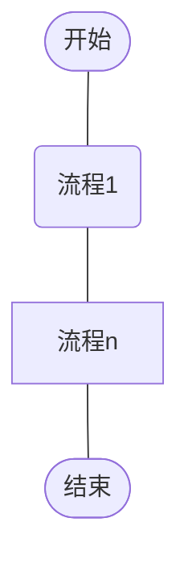
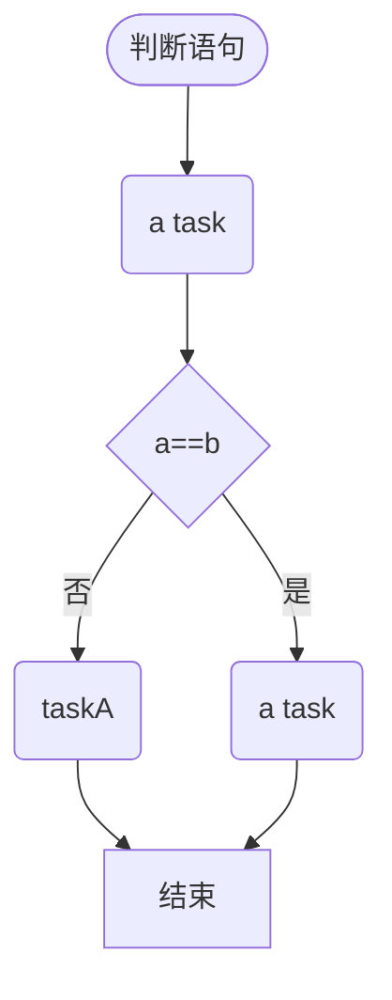
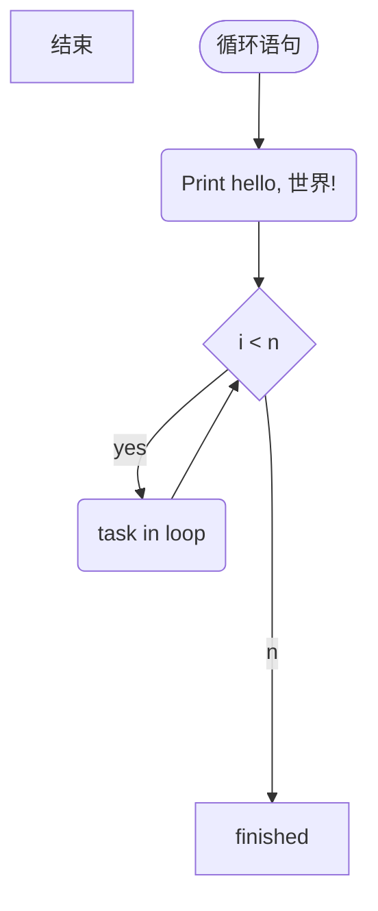

# 设计·Design

> 方法论
>
> 界面设计, 图表设计
>
> 系统设计
>
> 设计语言
>
> UI 设计
>
> 视觉设计/平面设计: visual design
>
> 图形设计/平面设计: graphic design


# 	工具列表

# 

# 设计理论

## 比例

### 1:1

### φ1.618

$φ=\frac{1+\sqrt{5}}{2}$

### 2:1

### 5:3

### 16:9 = 

### 

# 思维工具

模型, 框架, 范式, 模式

思维范式, 认知范式

模块化思维

封装思维

结构化思维

分类思维

	* 模块化思维(模块化开发)
	* 结构化思维
	* 模型化思维
	
		* 漏斗模型(金字塔模型)
	* 分类思维
	* 图表化思维
	* 逻辑思维
	
		* 归纳总结
		* 演绎推理(大前提,小前提,结论)
		* 自我反省,自我否定
		* 极限思维
	* 逻辑推理
	
		* 演绎-用来决定结论 
		* 归纳-用来决定规则
		* 溯因-用来决定前提
	* 自我反省-否定结论
### 技术创新


## 架构能力

思维导图重要紧急四象限分析方法论 分析思维工具SWOT分析、五力模型、波士顿矩阵、平衡计分表等等，都是基于“结构化思维”，建立在MECE法则的基础之上的战略分析工具。高等数学思维工具函数思维 极限思维 微分思维，积分思维

## 分析方法论

 研究方法论 分析方法


* 视觉观察,直觉判断
* 想象力,深度思考
* 问题引导,需求引导,动机引导
* 简化抽象,分解思维
* 模型化思维,模仿,模拟,类比
* 层次思维,测试实验
* 归纳总结,因果分析
* 体验感受,多维度认知
* 感同身受,预测分析
* 训练强化,转换性思维
* 局限性思维,颠覆性思维
* 变量控制,假设验证
* 相关性研究,调查研究
* 因果分析
* 发散与聚合思维


## 八大思维工具

[参考链接](http://www.360doc.com/content/16/0712/14/29487391_574963210.shtml)

### 一、系统思维　　

(1)概念　　

系统是一个概念，反映了人们对事物的一种认识论，即系统是由两个或两个以上的元素相结合的有机整体，系统的整体不等于其局部的简单相加。这一概念揭示了客观世界的某种本质属性，有无限丰富的内涵和处延，其内容就是系统论或系统学。系统论作为一种普遍的方法论是迄今为止人类所掌握的最高级思维模式。　　系统思维是指以系统论为思维基本模式的思维形态，它不同于创造思维或形象思维等本能思维形态。系统思维能极大地简化人们对事物的认知，给我们带来整体观。　　按照历史时期来划分，可以把系统思维方式的演变区分为四个不同的发展阶段：古代整体系统思维方式——近代机械系统思维方式——辩证系统思维方式——现代复杂系统思维方式。　　

(2)方法　　

A 整体法　　是在分析和处理问题的过程中，始终从整体来考虑，把整体放在第一位，而不是让任何部分的东西凌驾于整体之上。　　整体法要求把思考问题的方向对准全局和整体、从全局和整体出发。如果在应该运用整体思维进行思维的时候，不用整体思维法，那么无论在宏观或是微观方面，都会受到损害。　　

B 结构法　　进行系统思维时，注意系统内部结构的合理性。系统由各部分组成，部分与部分之间组合是否合理，对系统有很大影响。这就是系统中的结构问题。　　好的结构，是指组成系统的各部分间组织合理，是有机的联系。　　

C 要素法　　每一个系统都由各种各样的因素构成，其中相对具有重要意义的因素称之为构成要素。要使整个系统正常运转并发挥最好的作用或处于最佳状态，必须对各要素考察周全和充分，充分发挥各要素的作用。　　

D 功能法　　是指为了使一个系统呈现出最佳态势，从大局出发来调整或是改变系统内部各部分的功能与作用。在此过程中，可能是使所有部分都向更好的方面改变，从而使系统状态更佳，也可能为了求得系统的全局利益，以降低系统某部分的功能为代价。

### 二、辩证思维　　

(1)概念　　辩证思维是指以变化发展视角认识事物的思维方式，通常被认为是与逻辑思维相对立的一种思维方式。在逻辑思维中，事物一般是“非此即彼”、“非真即假”，而在辩证思维中，事物可以在同一时间里“亦此亦彼”、“亦真亦假”而无碍思维活动的正常进行。　　辨证思维模式要求观察问题和分析问题时，以动态发展的眼光来看问题。　　辩证思维是唯物辩证法在思维中的运用，唯物辩证法的范畴、观点、规律完全适用于辩证思维。辩证思维是客观辩证法在思维中的反映，联系、发展的观点也是辩证思维的基本观点。对立统一规律、质量互变规律和否定之否定规律是唯物辩证法的基本规律，也是辩证思维的基本规律，即对立统一思维法、质量互变思维法和否定之否定思维法。　　

(2)方法　　

A联系　　就是运用普遍联系的观点来考察思维对象的一种观点方法，是从空间上来考察思维对象的横向联系的一种观点。　　

B发展　　就是运用辩证思维的发展观来考察思维对象的一种观点方法，是从时间上来考察思维对象的过去、现在和将来的纵向发展过程的一种观点方式。　　

C全面　　就是运用全面的观点去考察思维对象的一种观点方法，即从时空整体上全面地考察思维对象的横向联系和纵向发展过程。换言之，就是对思维对象作多方面、多角度、多侧面、多方位的考察的一种观点方法。

### 三、逻辑思维　　

(1)概念　　逻辑思维是指符合某种人为制定的思维规则和思维形式的思维方式，我们所说的逻辑思维主要指遵循传统形式逻辑规则的思维方式。常称它为“抽象思维”或“闭上眼睛的思维”。　　逻辑思维是人脑的一种理性活动，思维主体把感性认识阶段获得的对于事物认识的信息材料抽象成概念，运用概念进行判断，并按一定逻辑关系进行推理，从而产生新的认识。逻辑思维具有规范、严密、确定和可重复的特点。　　

(2)特征　　

概念的特征：内涵和外延。　　

判断的特征：一是判断必须对事物有所断定；二是判断总有真假。　　

推理的特征：演绎推理的逻辑特征是：如果前提真，那么结论一定真，是必然性推理；非演绎推理的逻辑特征是：虽然前提是真的，但不能保证结论是真的，是或然性推理。　　

(3)方法　　

A定义　　是揭示概念内涵的逻辑方式。是用简洁的语词揭示概念反映的对象特有属性和本质属性。定义的基本方法是“种差”加最邻近的“属”概念。定义的规则：一是定义概念与被定义概念的外延相同；二是定义不能用否定形式；三是定义不能用比喻；四是不能循环定义。　　

B划分　　是明确概念全部外延的逻辑方法，是将“属”概念按一定标准分为若干种概念。划分的逻辑规则，一是子项外延之和等于母项的外延；二是一个划分过程只能有一个标准；三是划分出的子项必须全部列出；四是划分必须按属种关系分层逐级进行，不可以越级。

四、批判性思维   

(1)概念  

​	批判性思维（criticalthinking）是一种基于充分的理性和客观（批判性思维基于充分的理性和事实、而非感性和传闻来进行理论评估与客观评价的能力与意愿。）事实而进行理论评估与客观评价的能力与意愿，它不为感性和无事实根据的传闻所左右。具有批判性思维的人能在辩论中发现漏洞，并能抵制毫无根据的想法。他们认为，批评一种观点并不等于批评持有此种观点的人。他们非常热衷于进行激烈的辩论，以探明一种观点的合理性。不过批判性思维也并非仅仅是一种否定性思维，它还具有创造性和建设性的能力——能够对一件事情给出更多可选择的解释，思考研究结果的意义，并能运用所获得的新知识来解决社会和个人问题。  

我们把批判性思维理解为具有目的、自我调校的判断，这一判断形成解释、分析、评价和推论，以及对判断所基的证据、概念、方法、标准或语境的考量的解释。批判性思维本质上是探究的工具。为此，批判性思维是解放教育的力量，是人作为个人和公民的生活中的强力资源。批判性思维并非好的思维的同义词，但却是无处不在的、自我矫正的人类现象。理想的批判性思考者惯于探寻，见多识广，相信理性，思维开放，惯于调整，评价公道，诚对偏见，审慎判断，乐于三思，清醒面对问题，序理复杂事端，勤查相关信息，合理选择标准，聚焦探究，恒于在主体和条件允许下追查最精确的结果。因此，培养优秀的批判性思考者即是朝此方向努力。它融合发展批判性思维能力与培育这些素养，这些素养持续形成有用的悟性，也是理性和民主社会的基石。   

(2)特征  

求真（渴望探求真；勇于提问；诚实客观地探究）  

思想开放（容忍不同意见；理解他人的见解；考虑自己可能有偏见）  

分析性（对潜在问题的机敏；预见后果；重视利用理由和证据）  

系统性（有序处理复杂问题；勤于寻找相关信息；注意力集中于当下问题）  

好奇性（广泛的好奇心；消息灵通）  

明智（评价推理的公正性；改变判断的审慎性；达到所允许的精确性）   

(3)方法  

A．解释（归类、理解意义、澄清含义）  

B．分析（审查观念、识别论证、分析论证）  

C．评价（评价主张、评价论证）  

D．推论（寻找论据、推论不同可能、得出结论）  

E．说明（陈述结果、证明程序的正当性、表达论证）  

F．自我校准（self-regulation）（自我审检、自我校正）

### 五、逆向思维　　

(1)概念　　逆向思维是一种比较特殊的思维方式，它的思维取向总是与常人的思维取向相反，比如人弃我取，人进我退，人动我静，人刚我柔等等。这个世界上不存在绝对的逆向思维模式，当一种公认的逆向思维模式被大多数人掌握并应用时，它也就变成了正向思维模式。　　逆向思维并不是主张人们在思考时违逆常规，不受限制地胡思乱想，而是训练一种小概率思维模式，即在思维活动中关注小概率可能性的思维。　　逆向思维是发现问题、分析问题和解决问题的重要手段，有助于克服思维定势的局限性，是决策思维的重要方式。　　

(2)特性　　

A反向性　　反向性是逆向思维的重要特点,也是逆向思维的出发点,逆向思维离开了它也就不存在。　　

B异常性　　逆向思维总是采取特殊的方式来解决问题，这是它的异常性。　　

C“悖论”　　反向性和异常性的存在，使得逆向思维在实践中常给人“悖论”的特性。牛顿的物理学、相对论和量子力学，其中就包含了对立物共存和互相作用的逆向思维观念。　　

(3)类别　　

A反向思维　　通常对普遍接受的信念或做法进行质疑，然后察看它的反面是什么。如果对立面是有道理的，那么就朝对立面方向进行。　　在如下情况下，可以进行反向思维：一是考虑要做某种相反的事情；二是考虑用其对立面来取某物；三是如果意识到别人是错的，而你是正确的，但你仍然认为对方错误的观点中也有值得肯定的地方。　　

B雅努斯式思维　　在人的大脑里构想或引入事物的正反两个方面，并使它们同时并存于大脑里，考虑它们之间的关系，相似之处、正与反、相互作用等，然后创造出新事物。这种双面思维相当艰难，因为它要求保持两个对立面并存在你的大脑中,是一种大脑技能。　　

C黑格尔式思维　　采取一种观念，容纳它的反面，然后试着把两者融合成第三种观念，即变成一种独立的新观念。这种辩证的过程需要三个连续的步骤：论题、反题以及合题。　　

(4)方法　　

A怀疑法　　有一种敢于怀疑的精神，打破习惯，反过来想一下，这种精神越强烈越好。习惯性做法并不总是对的，对一切事物都报有怀疑之心是逆向思维所需要的。　　

B对立互补法　　以把握思维对象的对立统一为目标。要求人们在处理问题时既要看到事物之间的差异，也要看到事物之间因差异的存在而带来的互补性。　　

C悖论法　　就是对一个概念、一个假设或一种学说，积极主动从正反两方面进行思考，以求找出其中的悖论之处。　　

D批判法对言论、行为进行分辩、评断、剖析，以见正理。以批判法来进行逆向思维仍然需要以一般性的思维技能为基础，比如比较、分类、分析、综合、抽象和概括等。这是批判性思维方式的一种运用。　　

E反事实法在心理上对已经发生了的事件进行否定并表征其原本可能出现而实际未出现的结果的心理活动，是人类意识的一个重要特征。这就是反事实思维。主要有加法式、减法式、替代式三种类型。

### 六、发散思维　　

(1)概念　　发散思维是指大脑在思维时呈现的一种扩散状态的思维模式，比较常见，它表现为思维视野广阔，思维呈现出多维发散状。　　发散思维又称辐射思维、放射思维、扩散思维或求异思维。　　

(2)特性　　

A流畅性　　就是观念的自由发挥。指在尽可能短的时间内生成并表达出尽可能多的思维观念以及较快地适应、消化新的思想概念。机智与流畅性密切相关。　　流畅性反映的是发散思维的速度和数量特征。　　

B变通性　　就是克服人们头脑中某种自己设置的僵化的思维框架，按照某一新的方向来思索问题的过程。　　变通性需要借助横向类比、跨域转化、触类旁通，使发散思维沿着不同的方面和方向扩散，表现出极其丰富的多样性和多面性。　　

C独特性　　指人们在发散思维中做出不同寻常的异于他人的新奇反应的能力。独特性是发散思维的最高目标。　　

D多感官性　　发散性思维不仅运用视觉思维和听觉思维，而且也充分利用其他感官接收信息并进行加工。发散思维还与情感有密切关系。如果思维者能够想办法激发兴趣，产生激情，把信息情绪化，赋予信息以感情色彩，会提高发散思维的速度与效果。　　

(3)方法　　

A一般方法　　材料发散法——以某个物品尽可能多的“材料”，以其为发散点，设想它的多种用途。　　

功能发散法——从某事物的功能出发，构想出获得该功能的各种可能性。　　

结构发散法——以某事物的结构为发散点，设想出利用该结构的各种可能性。　　

形态发散法——以事物的形态为发散点，设想出利用某种形态的各种可能性。　　

组合发散法——以某事物为发散点，尽可能多地把它与别的事物进行组合成新事物。　　

方法发散法——以某种方法为发散点，设想出利用方法的各种可能性。　　

因果发散法——以某个事物发展的结果为发散点，推测出造成该结果的各种原因，或者由原因推测出可能产生的各种结果。　　

B假设推测法　　假设的问题不论是任意选取的，还是有所限定的，所涉及的都应当是与事实相反的情况，是暂时不可能的或是现实不存在的事物对象和状态。　　由假设推测法得出的观念可能大多是不切实际的、荒谬的、不可行的，这并不重要，重要的是有些观念在经过转换后，可以成为合理的有用的思想。　　

C集体发散思维　　发散思维不仅需要用上我们自己的全部大脑，有时候还需要用上我们身边的无限资源，集思广益。集体发散思维可以采取不同的形式，比如我们常常戏称的“诸葛亮会”。

### 七、灵感思维

　　(1)内涵　　灵感直觉思维活动本质上就是一种潜意识与显意识之间相互作用、相互贯通的理性思维认识的整体性创造过程。　　灵感直觉思维作为高级复杂的创造性思维理性活动形式，它不是一种简单逻辑或非逻辑的单向思维运动，而是逻辑性与非逻辑性相统一的理性思维整体过程。　　

(2)特点　　

A突发性和模糊性　　由于是没有在显意识领域单纯地遵循常规逻辑过程所形成，所以灵感直觉思维产生的程序、规则以及思维的要素与过程等都不是被自我意识能清晰地意识到的，而是模糊不清、“只可意会不可言传”的。　　

B独创性　　独创性是定义灵感思维的必要特征。不具有独创性，就不能叫灵感思维。　　

C非自觉性　　其他的思维活动，都是一种自觉的思维活动，灵感直觉思维的突出性，必然带来它的非自觉性。　　

D思维灵活活动的意象性　　在灵感直觉思维活动过程中，潜意识领域或显意识领域总伴有思维意象运动的存在。没有意象的暗示与启迪就没有思维的顿悟。　　

E思维高度灵活的互补综合性　　思维高度灵活的综合互补性是其思维的重要特征，如潜意识与显意识的互补综合，逻辑与非逻辑的互补综合，抽象与形象的互补综合等等。　　

(3)方法　　

A久思而至　　指思维主体在长期思考竟日不就的情况下，暂将课题搁置，转而进行与该研究无关的活动。恰好是在这个“不思索”的过程中，无意中找到答案或线索，完成久思未决的研究项目。　　

B梦中惊成　　梦是以被动的想象和意念表现出来的思维主体对客体现实的特殊反映，是大脑皮层整体抑制状态中，少数神经细胞兴奋进行随机活动而形成的戏剧性结果。并不是所有人的梦都具有创造性的内容。梦中惊成，同样只留给那些“有准备的科学头脑”。　　

C自由遐想　　科学上的自由遐想是研究者自觉放弃僵化的、保守的思维习惯，围绕科研主题，依照一定的随机程序对自身内存的大量信息进行自由组合与任意拼接。经过数次、乃至数月、数年的意境驰骋和间或的逻辑推理，完成一项或一系列课题的研究。　　

D急中生智　　利用此种方法的例子，在社会活动中数不胜数。即情急之中做出了一些行为，结果证明，这种行为是正确的。　　

E另辟新径　　思维主体在科学研究过程中，课题内容与兴奋中心都没有发生变化，但寻解定势却由于研究者灵机一动而转移到与原来解题思路相异的方向。　　F原型启示　　在触发因素与研究对象的构造或外形几乎完全一致的情况下，已经有充分准备的研究者一旦接触到这些事物，就能产生联想，直接从客观原型推导出新发明的设计构型。　　

G触类旁通　　人们偶然从其他领域的既有事实中受到启发，进行类比、联想、辩证升华而获得成功。他山之石，可以攻玉。触类旁通往往需要思维主体具有更深刻的洞察能力，能把表面上看起来完全不相干的两件事情沟通起来，进行内在功能或机制上的类比分析。　　

H豁然开朗　　这种顿悟的诱因来自外界的思想点化。主要是通过语言表达的一些明示或隐喻获得。豁然开朗这种方法中的思想点化，一般来说要有这样几个条件：一是“有求”，二是“存心”，三是“善点”，四是“巧破”。　　

I见微知著　　从别人不觉得稀奇的平常小事上，敏锐地发现新生事物的苗头，并且深究下去，直到做出一定创建为止。见微知著必须独具慧眼，也就是用眼睛看的同时，配合敏捷的思维。　　

J巧遇新迹　　由灵感而得到的创新成果与预想目标不一致，属意外所得。许多研究者把这种意外所得看作是“天赐良机”，也有的称之为“正打歪着”或“歪打正着”。

### 八、形象思维　　

(任何思考单元都需要在大脑中得到表征)

(1)概念　　形象思维是指以具体的形象或图像为思维内容的思维形态，是人的一种本能思维，人一出生就会无师自通地以形象思维方式考虑问题。　　形象思维内在的逻辑机制是形象观念间的类属关系。抽象思维是以一般的属性表现着个别的事物，而形象思维则要通过独具个性的特殊形象来表现事物的本质。因此说，形象观念作为形象思维逻辑起点，其内涵就是蕴含在具体形象中的某类事物的本质。　　

(2)作用　　形象思维是反映和认识世界的重要思维形式，是培养人、教育人的有力工具，在科学研究中，科学家除了使用抽象思维以外，也经常使用形象思维。在企业经营中，高度发达的形象思维，是企业家在激烈而又复杂的市场竞争中取胜不可缺少的重要条件。高层管理者离开了形象信息，离开了形象思维，他所得到信息就可能只是间接的、过时的甚至不确切的，因此也就难以做出正确的决策。　　

(3)特性　　主要有：形象性；想像性；直接性；敏捷性；创造性；思维结果的可描述性；情感性等。　　

(4)方法　　

A模仿法　　以某种模仿原型为参照，在此基础之上加以变化产生新事物的方法。很多发明创造都建立在对前人或自然界的模仿的基础上，如模仿鸟发明了飞机，模仿鱼发明了潜水艇，模仿蝙蝠发明了雷达。　　

B想像法　　在脑中抛开某事物的实际情况，而构成深刻反映该事物本质的简单化、理想化的形象。直接想像是现代科学研究中广泛运用的进行思想实验的主要手段。　　

C组合法　　从两种或两种以上事物或产品中抽取合适的要素重新组合，构成新的事物或新的产品的创造技法。常见的组合技法一般有同物组合、异物组合、主体附加组合、重组组合四种。　　

D移植法　　将一个领域中的原理、方法、结构、材料、用途等移植到另一个领域中去，从而产生新事物的方法。主要有原理移植、方法移植、功能移植、结构移植等类型。

开始写作以后，我尝试梳理并建立自己的知识体系，提高自己的思维逻辑。在这方面，我自己也曾非常困惑，在我自己训练过程中，幸运的遇到了几本书，对我自己的思维逻辑有非常大的帮助。现在根据阅读理解难易读，推荐三本给大家，大家可以根据自己的情况自行选择阅读。《清醒思考的艺术》（德）罗尔夫.多贝里这是德国非小说类畅销榜年度排行第一的书籍。书不厚，扫描电子版也就232页，一张配图一个故事，排版很简洁，很适合每天抽一点时间读几章。书里提出了52个思维谬误，每个都很经典。比如从众心理：就算有数百万人声称某件事是对的，这件蠢事也不会因此成为聪明之举。比如权威偏误：这个星球上有100万专业经济学家，没有一位有效预测过经济危机。比如确认偏误：不要过滤掉那些相反信息——最好主要总结和积累它们，因为需要很多成功要素加在一起才能带来成功，而致命伤只需要一处。阅读过程中会莫名持续着一种“戳中内心，醍醐灌顶”的感觉，但这本书的缺点在于每个篇幅都很短（不然怎么就200多页~），系统的解答阐述并没有很深入，这一点很可惜。我喜欢豆瓣对于这本书的一个评价——绝对理性是不现实的，但是没有理性是万万不能的。作者在书里也提到，在生活中做到绝对理性，不犯任何的思维错误是不可能的，但是，如果没有独立的思考，理性的逻辑，无法有意识地反省自己的思维谬误，那么这个人的一生，也是可怕的。总的来说，这本书很适合作为入门的书籍来阅读。《批判性思维》（美）理查德·保罗,（美）琳达·埃尔德这本书被多少人推荐过就不多说了，单从豆瓣打分8.5你就知道它值得一读。这本书的目的就是告诉读者，我们可以通过批判性思考，形成一种理性思维。理性思维是什么？就是对事物本质的认知和掌握，让你不会轻易的被事物的表象迷惑。同时另一本《批判性思维工具》，可以搭配着读，前者帮你理清逻辑，后者便于读者执行。在一个被泛滥信息包围的时代，每时每刻都会遇到各种问题，大到涉及世界经济发展趋势，小到个人生活的决策。作为一名广告狗，我强烈的推荐大家这本书，广告人每天都在利用各种各样的方式来说服你使用甲方的商品。面对我们兜售的观点——广告人不遗余力让你相信这是“事实”，你明明觉得有什么不对劲，可一时又很难找到突破口反驳。所以一定要训练自己的批判性思维，把敢于怀疑批判纳入自己的人生信仰，不要随便相信某种所谓的真理，也不要轻易的被宣传文案煽动。（我觉的我会被甲方谋杀）这本书最大的作用就在于它让我意识到，世界只有一个，但却有千万种理解它的方式。《超越智商：为什么聪明人也会做蠢事》【美】基思E.斯坦诺维奇基思斯坦诺维奇是我很喜欢的作家，被豆瓣无数读者追捧的《这才是心理学》就出自他手。《超越智商》这本书是斯坦诺维奇的呐喊：信息爆炸的今天，聪明人必须掌握的元概念是“理性”。光有智力还不够，还要有理性。看完整本书你就明白为什么“高智商女博士会轻易相信网友，从而被拐卖”，也会恍然大悟“平时挺聪明的人为什么会被洗脑加入传销”。书中给出了答案是：因为这涉及到算法层面的信息加工谬误，知觉登记和分类机制功能发生紊乱，给决策反应机制提供了错误的信息。简单来说就是长期的洗脑导致了我们在接受信息的时候会自动把原本错误信息分类在正确的那一类，再接受类似信息的时候，大脑存在的批判性知觉就弱化了，我们从而做出了错误的行动。而看完书我也理解了我舅舅作为一个家族中唯一一个博士后及博士生导师为什么至今无法在社会立足，因为成绩考核的单一方式与复杂社会中面临各种决策所用到的技能与方式有着本质的却别-----这也是作者在书中反复强调的，智商和理性的分离。这本书有些不易阅读，可以作为精进级别的书籍。豆瓣上有一篇读书笔记可以帮助你理解整本书的框架：https://book.douban.com/review/7877716/如何读这三本书我们常有这样的疑惑：为什么我们读了那么多书，还是不成逻辑？在读三本书前，我建议先彻底的读懂一篇文章，点击下面链接即刻阅读：再次推荐 | 别学东学西了，先建立自己的知识体系吧这篇文章中提到了很多干货文中没有写到的一点，那就是你究竟要学什么？你究竟要输入什么知识，通过什么方式理清（例如写作输出），达到什么样的目的，每个人心里要有一杆秤。

如何从书中建立逻辑？

1、首先自己用心对待书中提出的问题，对这个问题有主见，形成自己的判断。我们的主见也许是很浅薄的，但即使浅薄，也终究是你自己的意见。

2、对待书中的理论，要有自己的问题。我们常发现自己逻辑浅显被人随意一问就无法反驳的原因就在于我们没有提出问题。多问几个为什么，多反驳几次自己。阅读的时候感觉到种种冲突，种种矛盾，种种没有道理，又种种都是道理的时候，就是梳理自己的逻辑最好的时候。

3、蔡康永说，奇葩说最有意义的地方在于它让我们了解到这个世界的多面。所以不要执着于对错。有自己的逻辑线，有自己主见，才是最重要的事情。你最初的一点主见，成为以后大学问的萌芽。有了这一点点萌芽，你才可以吸收养料，才可以向上生枝发叶，向下入土生根。待得上边枝叶扶疏，下边根深蒂固，你的逻辑就成了。

4、至于接下去的更高境界，抱歉我也没达到。写在最后中国的教育体系一直都只是强调背诵和考试，缺乏逻辑和推理的启蒙，这一点很可惜，因为其实建立自己的知识体系和思维逻辑最好的时机就是在初中和高中。我们都知道，就算能把《相对论》的每一个标点符号背诵下来，你也成不了爱因斯坦。因为知识是可以背诵的，只有拥有逻辑能力，才能够识别知识乃至创造知识。

## 团队管理

### 团队构成5P要素


### 技术团队管理体系


### 团队情绪管理4A模型


### 团队文化建设三步法


### 中欧中基层管理者胜任力模型


## 产品/业务/商业思维

### SWOT战略分析法


### 产品思维:用户体验五要素

具体 - 抽象

表现层: 视觉设计

框架层: 界面设计, 导航设计

结构层: 交互设计, 信息架构

范围层: 功能说明, 内容需求

战略处: 产品目标, 用户需求


### 产品市场匹配


### 五看三定商业模式思维模型


## 个人成长

### 费曼学习法	


### 番茄工作法


### 邓宁-克鲁格心理效应


### 影响力模型


### EQ-I情商模型

 


# 图表设计

chart - (数据)图表 / diagram - (逻辑)图示|图解 / graph - 图形(曲线图) / image - 图像 / picture - 图片 / photo - 照片

不仅仅局限于一般的实体开发工具,更包括:开发工具, 设计工具, 模型工具,思考工具

visio powerpoint matlibplot	inkscape, edraw

diagram 主要用来表示逻辑上的意图, 理论, 关系, 因果, 定量关系. 

<u>A plan, drawing, sketch or outline to show how something works, or show the relationships between the parts of a whole.</u>

图形是 通过平面图, 绘画, 素描, 线框等方式,来面试对象是如何工作的, 或者描述局部与整体的关系

<u>"Electrical diagrams show device interconnections."</u>

```shell
A "graph" usually means an X-Y plot, using Cartesian coordinates.
# graph 强调是曲线图, 信息的演变特性

A "diagram" means any visual presentation that is intended to explain or show a logical idea--categories, relationships, cause-and-effect, quantitative relationships. 
# diagram 强调流程, 逻辑, 计划, 模型

A diagram is intended to show how something works, not how it it looks.
# graph, chart 一定意义上算是一种diagram

A graph is one kind of diagram.
曲线图是图形的一种

chart , map 
# 强调的是数据和信息的展示, 以制表的方式展示信息, 强调数据之间的分布等特性
```

[参考链接](https://www.askdifference.com/diagram-vs-chart/)

```text
The main difference between Diagram and Chart is that the Diagram is a plan, drawing, sketch or outline to show how something works or the relationships between the parts of a whole and Chart is a graphical representation of data.

Diagram
A diagram is a symbolic representation of information according to visualization technique. Diagrams have been used since ancient times, but became more prevalent during the Enlightenment. Sometimes, the technique uses a three-dimensional visualization which is then projected onto a two-dimensional surface. The word graph is sometimes used as a synonym for diagram.

Chart
A chart is a graphical representation of data, in which "the data is represented by symbols, such as bars in a bar chart, lines in a line chart, or slices in a pie chart". A chart can represent tabular numeric data, functions or some kinds of qualitative structure and provides different info.

The term "chart" as a graphical representation of data has multiple meanings:

A data chart is a type of diagram or graph, that organizes and represents a set of numerical or qualitative data.

Maps that are adorned with extra information (map surround) for a specific purpose are often known as charts, such as a nautical chart or aeronautical chart, typically spread over several map sheets.

Other domain specific constructs are sometimes called charts, such as the chord chart in music notation or a record chart for album popularity.Charts are often used to ease understanding of large quantities of data and the relationships between parts of the data. Charts can usually be read more quickly than the raw data. They are used in a wide variety of fields, and can be created by hand (often on graph paper) or by computer using a charting application. Certain types of charts are more useful for presenting a given data set than others. For example, data that presents percentages in different groups (such as "satisfied, not satisfied, unsure") are often displayed in a pie chart, but may be more easily understood when presented in a horizontal bar chart. On the other hand, data that represents numbers that change over a period of time (such as "annual revenue from 1990 to 2000") might be best shown as a line chart.
```


## 绘图思路

对象状态图 : 对象状态迁移

流程图 : 

交互图


> 组织结构 , 可追踪
>
> 时间, 空间 逻辑

模块化结构 : 块序列 + 嵌套 + 分层 + 树形

金字塔结构(漏斗) : 

时间轴结构(坐标) : 

栅格系统


## UML - 统一建模语言

**统一建模语言**（英语：Unified Modeling Language，缩写 UML）是非专利的第三代[建模](https://zh.wikipedia.org/w/index.php?title=对象建模语言&action=edit&redlink=1)和[规约语言](https://zh.wikipedia.org/wiki/规约语言)。UML是一种开放的方法，用于说明、可视化、构建和编写一个正在开发的、面向对象的、软件密集系统的制品的开放方法。UML展现了一系列最佳工程实践，这些最佳实践在对大规模，复杂系统进行建模方面，特别是在[软件架构](https://zh.wikipedia.org/wiki/软件架构)层次已经被验证有效。

统一建模语言(Unified Modeling Language，UML)是一种为[面向对象](https://baike.baidu.com/item/面向对象/2262089)系统的产品进行说明、可视化和编制文档的一种标准语言，是非专利的第三代建模和规约语言。UML使用面向对象设计的的建模工具，但独立于任何具体程序设计语言。

UML集成了[Booch](https://zh.wikipedia.org/w/index.php?title=Booch&action=edit&redlink=1)，[OMT](https://zh.wikipedia.org/w/index.php?title=对象建模技术&action=edit&redlink=1)和[面向对象程序设计](https://zh.wikipedia.org/wiki/面向对象程序设计)的概念，将这些方法融合为单一的，通用的，并且可以广泛使用的建模语言。UML打算成为可以对并发和分布式系统的标准建模语言。

UML并不是一个工业标准，但在[Object Management Group](https://zh.wikipedia.org/wiki/Object_Management_Group)的主持和资助下，UML正在逐渐成为工业标准。OMG之前曾经呼吁业界向其提供有关[面向对象](https://zh.wikipedia.org/wiki/面向对象)的理论及实现的方法，以便制作一个严谨的软件建模语言（Software Modeling Language）。有很多业界的领袖亦真诚地回应OMG，帮助它建立一个业界标准。


## 模型

[类别图](https://zh.wikipedia.org/wiki/類別圖)显示[一般化](https://zh.wikipedia.org/wiki/继承)关系一对多（多维）的实现

在UML系统开发中有三个主要的模型：

- **功能模型**：从用户的角度展示系统的功能，包括用例图。
- **对象模型**：采用 **对象**，**属性**，**操作**，**关联** 等概念展示系统的结构和基础，包括类别图、对象图。
- **动态模型**：展现系统的内部行为。包括序列图，活动图，状态图。

区分UML模型和UML图是非常重要的，UML图，包括用例图、协作图、活动图、序列图、部署图、构件图、类图、状态图，是模型中信息的图形表达方式，但是UML模型独立于UML图存在。[UML](https://zh.wikipedia.org/wiki/UML)的当前版本只提供了模型信息的交换，而没有提供图信息的交换。

## 组成

UML由模型元素(Model Element)、图(Diagram)、视图(View)和通用机制(General Mechanism)等几个部分组成。

### 模型元素

代表面向对象中的类、对象、消息和关系等概念，是构成图的最基本的常面向对象系统分析与设计方法用概念。 

### 图

是模型元素集的图形表示，通常是由弧（关系）和顶点（其他模型元素）相互连接构成的。 

### 视图

是表达系统的某一方面的特征的UMI，建模元素的子集，由多个图构成，是在某一个抽象层上，对系统的抽象表示。

### 通用机制

用于表示其他信息，比如注释、模型元素的语义等。另外，UMI。还提供扩展机制，使UML语言能够适应一个特殊的方法（或过程），或扩充至一个组织或用户。

## 图形


结构性图形（*Structure diagrams*）强调的是系统式的**建模**：

行为式图形（*Behavior diagrams*）强调系统模型中触发的**事件**：

交互性图形（*Interaction diagrams*），属于行为图形的子集合，强调系统模型中的资料流程：

## 概念

对于结构而言

对于行为而言

对于关系而言

## 流程图 - Flow Chart

> 流程图教程	流程图语法
>
> 流程图的节点代表一条语句, 设计流程图时算法的流程图
>
> 应该区分算法流程图和功能流程图

### 基础元素

开始/结束 : start/end

流程 : Process/Action

判定 : decision

输入/输出 : Input/Output  数据

箭头 : Arrows

文档 : Document

子流程 : Subroutine process

预定义流程 : predefined process

存储数据 : 

直接数据 : 

数据库 : Database










```python
def for_loop (n: int):
    print("hello, 世界!")
    for i in range(n):
        print(i)
        
def condition(n: int):
    if n == 1:
        print("task A")
    else:
        print("task B")
        
```


## 常见思路

### 图表画法

利用visio/axure 画

利用API接口画

在线画图工具

利用开源 chartjs.org / D3.js / plot.ly / bokeh / plot.ly/ echarts.Apache.org

### 应用场景

- 文章插图
- 项目图例
- 客户图例
- 论文插图

### 流程图

基础元素

对象: 

流程

方法:

数据:

接口:

判断

## 系统架构图

>   系统架构图

- 以及编号
  一级正文

  - 二级编号
    二级正文

    - 3级编号

    三级正文??

## 网路架构图

CS架构图

## **业务流程图** - 逻辑层

> 基础对象: 数据, 操作(指令), 功能
>
> 基础结构: 顺序, 循环, 判断

**业务流程图（Transaction Flow Diagram, TFD）**

[如何绘制流程图](http://www.woshipm.com/pd/675174.html)


### 绘图思路

明确是哪一段业务, 哪一个业务

## 任务流程图

## **数据流程图 **- 视图层

一般后于业务流程图

作用: 协助分析

**数据流程图（Data Flow Diagram，DFD / Data Flow Chart）**

### 基本元素

数据流, 加工, 数据存储, 数据源/数据潭

## 功能结构图 - 表示层

## 跨职能流程图

## 时序图 - Sequence Diagram

横轴: 交互对象	纵轴: 时序/时间

## 序列图

架构师一般在做详细设计的时候，会把程序模块之间的每一步调用过程很详细的画出来，这样开发人员拿到设计文档，就能直接开发。

## 类图

## 状态图

## 活动图

## 用例图

## 模块结构图

## **程序流程图**

“程序流程图”常简称为“流程图”，是一种传统的算法表示法，程序流程图是人们对解决问题的方法、思路或算法的一种描述。它利用图形化的符号框来代表各种不同性质的操作，并用流程线来连接这些操作。在程序的设计（在编码之前）阶段，通过画流程图，可以帮助我们理清程序思路。

一定要注意 **表示级别** : 指令级别 , 函数级别, 功能级别, 业务层级

作用 : 算法 表示法 对逻辑的梳理有很好的帮助, 用图形化符号来表示各种不同性质的操作, 

好处 : 帮助理清程序思路.

*强调动作*


起始框 -> 处理框 -> 判断框 -> 输入输出 -> 流程线

## UML状态图 - Statechart diagram

> 状态迁移图, 描述对象在软件生命周期的状态迁移过程

## 能力雷达图


## E-R模型图

> What is an Entity-Relationship Diagram?
>
> Visualize the relationships between models in your app and tables in your database
>
> 可视化应用中的模型之间的关系和数据库中的表之间的关系

[教程](http://www.woshipm.com/pd/583978.html)

用于数据库表设计 架构图

### **实体**

是指客观上或者逻辑上能够相互区分的事物。

在ER图中用矩形表示，矩形框内写明实体名。

### **属性**

实体所具有的某一特性，一个实体可由若干个属性来刻画。

在ER图中用椭圆形表示，并用无向边将其与相应的实体连接起来。

### **联系**

也称关系，反映实体内部或实体之间的关联。实体内部的联系通常是指组成实体的各属性之间的联系；实体之间的联系通常是指不同实体集之间的联系。

在ER图中用菱形表示，菱形框内写明联系名，并用无向边分别与有关实体连接起来，同时在无向边旁标上联系的类型(1 : 1，1 : n或m : n)。

### **连接线**

实体与属性之间；实体与联系之间；联系与属性之间均用直线相连，并在直线上标注联系的类型。

## 数据图

图表 仪表 数据可视化 信息图(infographic)

## 线框图-Wireframing 


信息图形化的重要性
	1. 
理清思路
	2. 
  加速沟通反馈
	3. 
  减少歧义
	4. 
  人脑更擅长理解图形
	5. 
  图形信息量更大


## 图形工具

	* 
graphviz
* Axure
* **Edraw**
* **Xmind**
* 
  D3.js
* 
  Echarts
* 
  地图:Leaflet
* 
  绘图: **draw.io**
* **StartUML**

紧急重要四象限
思考模型？

## 思维导图

思维导图
		* 
逻辑结构
		* 
大纲笔记
		* 
时间轴
		* 
鱼骨图
		* 
树状图
		* 
组织架构图
		* 
矩阵 (行列)
	* 
图表工具

## 业务流程图(transaction flow diagram)  

操作(动作)  判定


泳道图(按责任人划分):主要用来表示不同角色或者组件之间的交互顺序
		* 
页面流程图(page flow)
		* 
程序流程图(顺序,循环, 判断)
		* 
时序图
		* 
甘特图
		* 
数据流程图
		* 
线框图
		* 
功能结构图
		* 
用户行为路径图
		* 
E-R图(实体关系图)entity relationship diagram

			* 
用来描述实体的概念模型
			* 
1:1  1:n n:n 关系
		* 
UML图(unified model language)统一建模语言

			* 
功能模型
			* 
对象模型
			* 
序列模型
	* 
用例模型(user case)图  --需求相关

		* 
用例图主要是从系统使用者的角度来描述每个角色可以使用哪些功能。
		* 
主要包括，角色(Actor)，功能(Use Case)，以及功能间是扩展关系(Extends) 还是包含关系(Includes)
	* 
线框图wireframe
	* 
信息架构图,站点地图site map

## 模型图

思考模型, 表示模型, 分析模型 结构图, 结构化图, 关系图	

漏斗模型

## 标注工具 - 

PxCook

## 结构理论

## 常用图表

用图来表示逻辑和关联, 排列组合, 

二维图

漏斗图

# 设计工具

photoshop


标注工具 - [PxCook](https://www.fancynode.com.cn/pxcook)

网格工具

切图工具 - cutterman

# Drawio

diagraming tool

## 核心概念


### 形状-shape

> 部分软件称作symbol

shape通常用xml,svg, icon(png)文件描述或表示ß


### arrange


## 常见问题

### [创建复杂形状(shape)](https://www.drawio.com/doc/faq/shape-complex-create-edit)


# 图表类型

### 线框图

- wireframe

### 树状图

### 矩阵

- Matrix

### 业务流程图

### 泳道图

### 程序流程图

### 实体关系图

### 用例模型图

### 

# 用户界面设计

> Design, User Interface Design

# 设计原则

书籍 设计的基本规则 已购买

> [你必须知道的视觉设计的10个基本原则](https://www.jianshu.com/p/480d63b668ed)
>
> [对比原则](https://www.uisdc.com/contrast-principle)
>
> [设计原则](https://www.uisdc.com/?s=设计原则)

## 基本原则:

亲密性, 对齐, 重复, 对比

层次感

### 对齐原则

比例

栅格化

对称

结构化

元素化

### 视觉平衡原则

联系原则

重复原则

意图原则

### 主题原则: 统一和谐的整体

修饰原则

视线引导

### 简洁原则: 用更少的符号, 表现更多的内容

干净原则


## 构图原则

> [构图原则](https://www.uisdc.com/?s=构图原则)

9宫格, 3分法 4分/ 2分/ 

1:3 

对称布局

对角线

框景式构图

中心式构图


## 设计风格

卡通

卡片式

扁平

## 动效设计

人脑灰质（Gray Matter）会对动态的事物（eg：移动、形变、色变等）保持敏感。在界面中，适当的加入一些过渡效果，能让界面保持生动，同时也能增强用户和界面的沟通。

- Adding: 新加入的信息元素应被告知如何使用，从页面转变的信息元素需被重新识别。
- Receding: 与当前页无关的信息元素应采用适当方式移除。
- Normal: 指那些从转场开始到结束都没有发生变化的信息元素。
